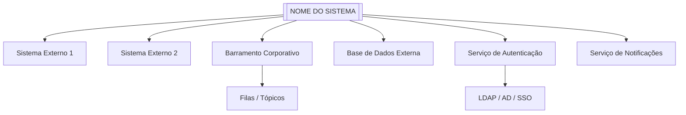
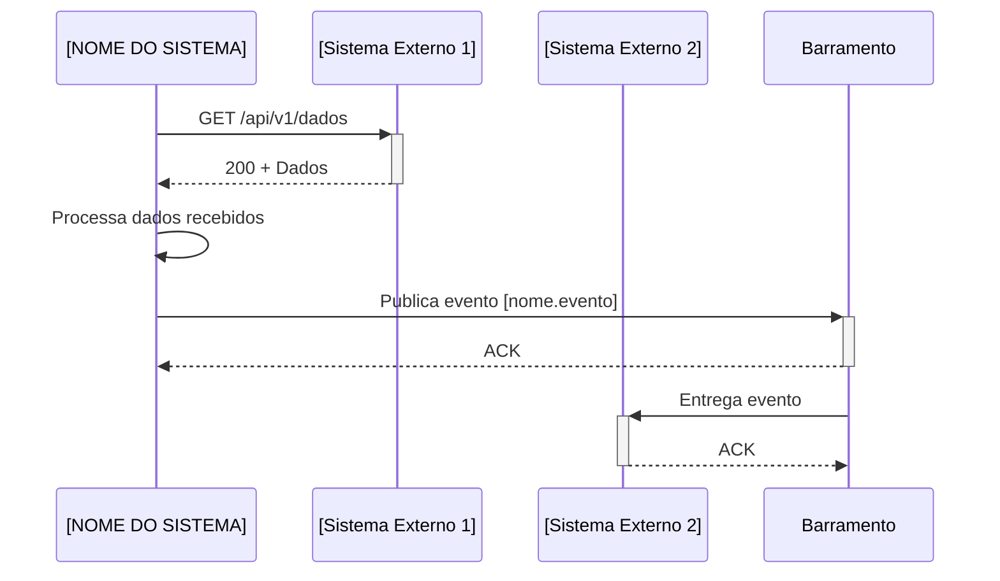

# Template — Catálogo de Integrações
## [NOME DO SISTEMA]
### Mapeamento de Sistemas Externos, APIs e Fluxos de Dados

**Versão:** [X.Y]  
**Data:** [dd/mm/aaaa]  
**Órgão/Unidade Demandante:** [nome da unidade]  
**Responsável pelo Documento:** [nome / cargo / área]

---

## 1. INTRODUÇÃO

### 1.1 Objetivo do Documento
Este documento cataloga todos os sistemas externos, APIs, bases de dados e serviços com os quais o **[NOME DO SISTEMA]** deverá se integrar. O documento serve como referência para:
- Definição da arquitetura de integração;
- Modelagem de contratos de API;
- Análise de dependências e riscos;
- Planejamento de sprints e ondas de desenvolvimento;
- Testes de integração e homologação.

### 1.2 Premissas
- As integrações devem respeitar padrões de segurança institucionais;
- Todos os contratos devem ser versionados e documentados;
- Ambientes de homologação devem estar disponíveis para testes;
- Toda integração deve possuir mecanismo de retry e circuit breaker.

---

## 2. VISÃO GERAL DAS INTEGRAÇÕES

### 2.1 Diagrama de Contexto



### 2.2 Resumo das Integrações

| ID | Sistema/Serviço | Tipo | Direção | Protocolo | Criticidade | Status |
|----|-----------------|------|---------|-----------|-------------|--------|
| INT-01 | [Nome do sistema] | [API REST / SOAP / GraphQL / Filas / SFTP / BD] | [Entrada / Saída / Bidirecional] | [HTTPS / AMQP / SFTP / JDBC] | [Crítica / Alta / Média / Baixa] | [Disponível / Em desenvolvimento / Planejada] |
| INT-02 | [Nome do sistema] | [Tipo] | [Direção] | [Protocolo] | [Criticidade] | [Status] |
| INT-03 | [Nome do sistema] | [Tipo] | [Direção] | [Protocolo] | [Criticidade] | [Status] |
| INT-04 | [Nome do sistema] | [Tipo] | [Direção] | [Protocolo] | [Criticidade] | [Status] |
| INT-05 | [Nome do sistema] | [Tipo] | [Direção] | [Protocolo] | [Criticidade] | [Status] |
| INT-06 | [Nome do sistema] | [Tipo] | [Direção] | [Protocolo] | [Criticidade] | [Status] |
| INT-07 | [Nome do sistema] | [Tipo] | [Direção] | [Protocolo] | [Criticidade] | [Status] |
| INT-08 | [Nome do sistema] | [Tipo] | [Direção] | [Protocolo] | [Criticidade] | [Status] |

---

## 3. DETALHAMENTO POR INTEGRAÇÃO

### INT-01: [Nome do Sistema / Serviço]

#### 3.1 Identificação
| Campo | Valor |
|-------|-------|
| **Nome oficial** | [Nome completo do sistema externo] |
| **Sigla** | [Sigla, se houver] |
| **Órgão/Unidade provedora** | [Quem mantém o sistema] |
| **Finalidade da integração** | [Por que o sistema precisa se integrar] |
| **Tipo de integração** | [API REST / SOAP / GraphQL / Mensageria / SFTP / Banco de Dados] |
| **Direção do fluxo** | [NOME DO SISTEMA] → [Sistema Externo] / [Sistema Externo] → [NOME DO SISTEMA] / Bidirecional |
| **Protocolo / Formato** | [HTTPS + JSON / SOAP/XML / AMQP / SFTP/CSV] |
| **Frequência** | [Tempo real / Batch diário / Sob demanda / Event-driven] |
| **Volume estimado** | [X requisições/dia, Y registros/lote] |
| **Criticidade** | [Crítica: sistema não funciona sem / Alta: funcionalidades centrais dependem / Média: funcionalidades acessórias / Baixa: conveniência] |

#### 3.2 Dependências de Negócio
- **Processos que dependem desta integração:**
  - [Processo 1]
  - [Processo 2]
- **Impacto da indisponibilidade:** [Alto / Médio / Baixo] — [Descrição do impacto]
- **Janela de indisponibilidade aceitável:** [X horas / X minutos]

#### 3.3 Contrato de Integração

##### Endpoints (se API REST)
| Método | Endpoint | Descrição | Autenticação | Rate Limit |
|--------|----------|-----------|-------------|------------|
| GET | `/api/v1/[recurso]` | [Descrição] | [Bearer Token / API Key / OAuth2] | [X req/min] |
| POST | `/api/v1/[recurso]` | [Descrição] | [Bearer Token / API Key / OAuth2] | [X req/min] |
| GET | `/api/v1/[recurso]/{id}` | [Descrição] | [Bearer Token / API Key / OAuth2] | [X req/min] |
| PUT | `/api/v1/[recurso]/{id}` | [Descrição] | [Bearer Token / API Key / OAuth2] | [X req/min] |

##### Payloads de Exemplo

**Requisição:**
```json
{
  "campo_1": "valor",
  "campo_2": 123,
  "campo_3": {
    "subcampo": "valor"
  }
}
```

**Resposta (200):**
```json
{
  "id": "uuid",
  "campo_1": "valor",
  "campo_2": 123,
  "created_at": "2026-01-01T00:00:00Z"
}
```

**Resposta de Erro (4xx/5xx):**
```json
{
  "error": {
    "code": "RESOURCE_NOT_FOUND",
    "message": "Descrição do erro"
  }
}
```

##### Códigos de Erro Esperados
| Código HTTP | Código de Erro | Significado | Ação Recomendada |
|-------------|----------------|-------------|------------------|
| 400 | `VALIDATION_ERROR` | Dados de entrada inválidos | Corrigir payload e reenviar |
| 401 | `UNAUTHORIZED` | Token inválido ou expirado | Renovar token |
| 403 | `FORBIDDEN` | Sem permissão para o recurso | Verificar permissões |
| 404 | `NOT_FOUND` | Recurso não localizado | Verificar ID |
| 429 | `RATE_LIMITED` | Limite de requisições excedido | Aguardar e retentar |
| 500 | `INTERNAL_ERROR` | Erro interno do provedor | Retentar com backoff |

#### 3.4 Mapeamento de Dados

| Dado no [NOME DO SISTEMA] | Campo de Origem/Destino | Sistema Externo | Transformação |
|---------------------------|------------------------|-----------------|---------------|
| `[campo_local]` | `[campo_externo]` | [Sistema] | [Nenhuma / Converter / Enriquecer] |
| `[campo_local]` | `[campo_externo]` | [Sistema] | [Nenhuma / Converter / Enriquecer] |
| `[campo_local]` | `[campo_externo]` | [Sistema] | [Nenhuma / Converter / Enriquecer] |

#### 3.5 Autenticação e Segurança
- **Método de autenticação:** [Bearer Token / OAuth2 Client Credentials / mTLS / API Key / Basic Auth]
- **Rotação de credenciais:** [A cada X dias / Sob demanda]
- **Certificados:** [Lista de certificados necessários]
- **IPs de origem (whitelist):** [Faixas de IP do sistema que acessa]
- **VPN / Rede privada:** [Sim / Não] — [Detalhes]
- **Dados sensíveis trafegados:** [Sim / Não] — [Quais]

#### 3.6 Resiliência e Tratamento de Falhas
- **Timeout de conexão:** [X segundos]
- **Timeout de leitura:** [X segundos]
- **Estratégia de retry:** [Exponential backoff / Retry fixo / Sem retry]
- **Máximo de tentativas:** [X tentativas]
- **Circuit breaker:** [Sim / Não] — Limiar: [X% falhas em Y segundos]
- **Fila de dead letter:** [Sim / Não] — [Detalhes]
- **Fallback:** [Descrição do comportamento alternativo quando a integração falha]

#### 3.7 Monitoramento
- **Health check endpoint:** `GET /health` ou `GET /api/v1/status`
- **Métrica de disponibilidade alvo:** [99.X%]
- **Métrica de latência alvo (p95):** [X ms]
- **Alertas configurados:** [Sim / Não] — [Quais condições disparam alerta]

#### 3.8 Ambientes
| Ambiente | URL Base | Disponibilidade | Observações |
|----------|----------|-----------------|-------------|
| Desenvolvimento | `https://dev.[sistema].org.br` | [24/7 / Horário comercial] | [Notas] |
| Homologação | `https://hom.[sistema].org.br` | [24/7 / Horário comercial] | [Notas] |
| Produção | `https://[sistema].org.br` | [24/7] | [Notas] |

<!-- Repetir seção 3 para cada integração (INT-02, INT-03, ...) -->

---

## 4. INTEGRAÇÕES ASSÍNCRONAS / MENSAGERIA

### 4.1 Filas e Tópicos

| ID | Nome da Fila/Tópico | Provedor | Padrão | Publicador | Consumidor | Formato | Retenção |
|----|---------------------|----------|--------|------------|------------|---------|----------|
| Q-01 | `[nome.fila.topico]` | [RabbitMQ / Kafka / SQS / SNS] | [Point-to-point / Pub-Sub] | [Sistema] | [NOME DO SISTEMA] | [JSON / Avro / Protobuf] | [X dias] |
| Q-02 | `[nome.fila.topico]` | [Provedor] | [Padrão] | [NOME DO SISTEMA] | [Sistema] | [JSON / Avro / Protobuf] | [X dias] |

### 4.2 Schemas de Mensagens

#### Evento: [Nome do Evento]
**Publicador:** [Sistema]  
**Consumidor:** [NOME DO SISTEMA]  
**Schema:**
```json
{
  "event_id": "uuid",
  "event_type": "[nome.do.evento]",
  "timestamp": "2026-01-01T00:00:00Z",
  "payload": {
    "campo_1": "valor",
    "campo_2": 123
  },
  "metadata": {
    "source": "[sistema]",
    "version": "1.0"
  }
}
```

---

## 5. INTEGRAÇÕES BATCH / ARQUIVOS

### 5.1 Transferências de Arquivo

| ID | Nome do Arquivo | Direção | Protocolo | Periodicidade | Layout/Formato | Tamanho Estimado |
|----|-----------------|---------|-----------|---------------|----------------|------------------|
| B-01 | `[nome_arquivo]` | [Entrada / Saída] | [SFTP / S3 / Rede] | [Diário / Semanal / Mensal] | [CSV / JSON / XML / PDF] | [X MB] |
| B-02 | `[nome_arquivo]` | [Entrada / Saída] | [SFTP / S3 / Rede] | [Diário / Semanal / Mensal] | [CSV / JSON / XML / PDF] | [X MB] |

### 5.2 Layout de Arquivos Batch

#### Arquivo: `[nome_arquivo]`
- **Delimitador:** [Vírgula / Ponto e vírgula / Tab / Pipe]
- **Encoding:** [UTF-8 / ISO-8859-1 / Windows-1252]
- **Cabeçalho:** [Sim / Não]
- **Colunas:**

| # | Campo | Tipo | Obrigatório | Descrição | Exemplo |
|---|-------|------|-------------|-----------|---------|
| 1 | `[campo_1]` | [String / Number / Date / Boolean] | [Sim / Não] | [Descrição] | `[exemplo]` |
| 2 | `[campo_2]` | [String / Number / Date / Boolean] | [Sim / Não] | [Descrição] | `[exemplo]` |
| 3 | `[campo_3]` | [String / Number / Date / Boolean] | [Sim / Não] | [Descrição] | `[exemplo]` |

---

## 6. MATRIZ DE DEPENDÊNCIAS ENTRE INTEGRAÇÕES

| Integração | Depende de | Bloqueia | Ordem de Implementação |
|------------|------------|----------|------------------------|
| INT-01 | — | INT-03, INT-05 | 1ª onda |
| INT-02 | — | INT-04 | 1ª onda |
| INT-03 | INT-01 | INT-06 | 2ª onda |
| INT-04 | INT-02 | — | 2ª onda |
| INT-05 | INT-01 | — | 3ª onda |
| INT-06 | INT-03 | — | 3ª onda |
| INT-07 | — | — | 4ª onda |
| INT-08 | INT-05, INT-06 | — | 4ª onda |

---

## 7. RISCOS DE INTEGRAÇÃO

| ID | Risco | Integração Afetada | Probabilidade | Impacto | Mitigação |
|----|-------|---------------------|---------------|---------|-----------|
| R-01 | Indisponibilidade do sistema provedor | INT-01, INT-02 | Alta | Crítico | Circuit breaker + fallback + fila de retry |
| R-02 | Mudança de contrato sem aviso | INT-03 | Média | Alto | Testes de contrato automatizados + comunicação com provedor |
| R-03 | Lentidão em horários de pico | INT-04 | Alta | Médio | Cache + timeout agressivo + alerta de latência |
| R-04 | Expiração de certificado | Todas com mTLS | Baixa | Crítico | Monitoramento de expiração + renovação automática |
| R-05 | Rate limit excedido | INT-01, INT-05 | Média | Médio | Controle de throttling local + backoff exponencial |
| R-06 | [Risco adicional] | [Integração] | [Probabilidade] | [Impacto] | [Mitigação] |

---

## 8. REQUISITOS NÃO FUNCIONAIS DE INTEGRAÇÃO

| ID | Requisito | Descrição | Integrações Afetadas |
|----|-----------|-----------|----------------------|
| RNF-INT-01 | Timeout máximo | Toda chamada externa deve ter timeout ≤ [X] segundos | Todas |
| RNF-INT-02 | Logging | Toda integração deve gerar logs com request/response (sem dados sensíveis) | Todas |
| RNF-INT-03 | Retry | Falhas transientes devem ser retentadas com backoff exponencial | Todas |
| RNF-INT-04 | Circuit Breaker | Após [X] falhas consecutivas, circuito deve abrir por [Y] segundos | INT-01 a INT-06 |
| RNF-INT-05 | Idempotência | Operações de escrita devem suportar idempotência via idempotency-key | INT-01, INT-03, INT-05 |
| RNF-INT-06 | Health Check | Health check deve verificar conectividade com integrações críticas | Críticas |
| RNF-INT-07 | Rastreamento | Trace ID deve ser propagado entre sistemas | Todas |

---

## 9. CRONOGRAMA DE INTEGRAÇÃO

| Onda | Integrações | Período Previsto | Dependências Externas | Status |
|------|-------------|------------------|------------------------|--------|
| Onda 1 | INT-01, INT-02 | [Mês/Ano] | [Dependências] | Planejada |
| Onda 2 | INT-03, INT-04 | [Mês/Ano] | [Dependências] | Planejada |
| Onda 3 | INT-05, INT-06 | [Mês/Ano] | [Dependências] | Planejada |
| Onda 4 | INT-07, INT-08 | [Mês/Ano] | [Dependências] | Planejada |

---

## 10. ANEXOS

### 10.1 Diagrama de Sequência — Fluxo de Integração Principal



### 10.2 Matriz de Responsabilidades
| Atividade | [NOME DO SISTEMA] | Sistema Externo | Barramento |
|-----------|-------------------|-----------------|------------|
| Prover endpoint health check | ❌ | ✅ | ✅ |
| Implementar retry e circuit breaker | ✅ | ❌ | ❌ |
| Versionar contrato de API | ✅ | ✅ | ❌ |
| Fornecer ambiente de homologação | ❌ | ✅ | ✅ |
| Garantir idempotência nas operações | ✅ | ✅ | ❌ |

---

## 11. CONTROLE DE VERSÃO

| Versão | Data | Autor | Alterações |
|--------|------|-------|------------|
| 1.0 | [dd/mm/aaaa] | [Autor] | Versão inicial |
| 1.1 | [dd/mm/aaaa] | [Autor] | [Descrição da alteração] |
