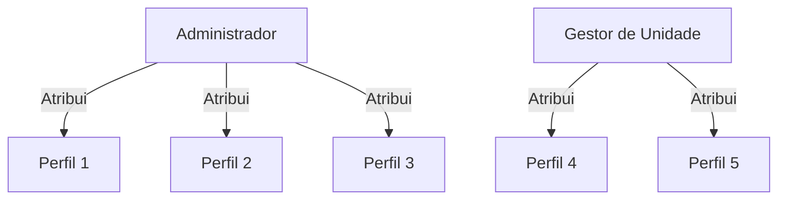
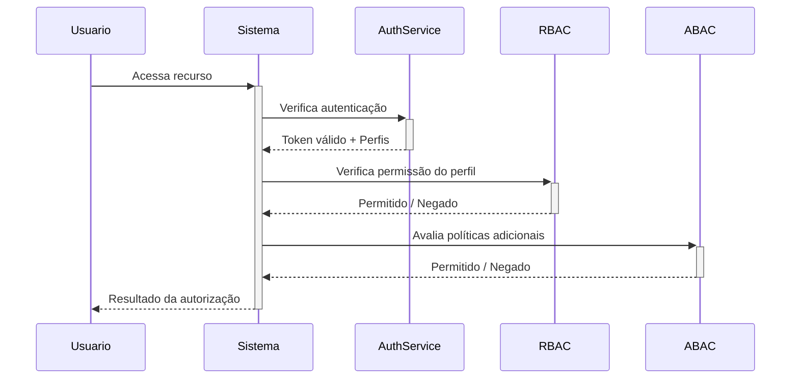

# Template — Perfis e Permissões
## [NOME DO SISTEMA]
### Matriz de Acesso e Controle de Autorização (RBAC/ABAC)

**Versão:** [X.Y]  
**Data:** [dd/mm/aaaa]  
**Órgão/Unidade Demandante:** [nome da unidade]  
**Responsável pelo Documento:** [nome / cargo / área]

---

## 1. INTRODUÇÃO

### 1.1 Objetivo do Documento
Este documento define os perfis de acesso, a matriz de permissões, as regras de autorização e o modelo de controle de acesso do **[NOME DO SISTEMA]**. O documento serve como referência para:
- Implementação do backend de autorização;
- Configuração de guards e middlewares;
- Auditoria e conformidade de acessos;
- Testes de segurança e regressão.

### 1.2 Modelo de Controle de Acesso
O sistema adota o modelo **[RBAC / ABAC / Híbrido]**, onde:
- **RBAC:** permissões são agrupadas em perfis atribuídos a usuários;
- **ABAC:** permissões são avaliadas com base em atributos do usuário, recurso, ação e contexto.

---

## 2. CATÁLOGO DE PERFIS

### 2.1 Resumo dos Perfis

| ID | Perfil | Descrição | Escopo | Usuários Esperados |
|----|--------|-----------|--------|--------------------|
| P01 | [Nome do Perfil] | [Descrição do papel e responsabilidades] | [Global / Unidade / Projeto] | [Número estimado] |
| P02 | [Nome do Perfil] | [Descrição do papel e responsabilidades] | [Global / Unidade / Projeto] | [Número estimado] |
| P03 | [Nome do Perfil] | [Descrição do papel e responsabilidades] | [Global / Unidade / Projeto] | [Número estimado] |
| P04 | [Nome do Perfil] | [Descrição do papel e responsabilidades] | [Global / Unidade / Projeto] | [Número estimado] |
| P05 | [Nome do Perfil] | [Descrição do papel e responsabilidades] | [Global / Unidade / Projeto] | [Número estimado] |
| P06 | [Nome do Perfil] | [Descrição do papel e responsabilidades] | [Global / Unidade / Projeto] | [Número estimado] |
| P07 | [Nome do Perfil] | [Descrição do papel e responsabilidades] | [Global / Unidade / Projeto] | [Número estimado] |
| P08 | [Nome do Perfil] | [Descrição do papel e responsabilidades] | [Global / Unidade / Projeto] | [Número estimado] |
| P09 | [Nome do Perfil] | [Descrição do papel e responsabilidades] | [Global / Unidade / Projeto] | [Número estimado] |
| P10 | [Nome do Perfil] | [Descrição do papel e responsabilidades] | [Global / Unidade / Projeto] | [Número estimado] |

### 2.2 Detalhamento por Perfil

#### P01 — [Nome do Perfil]
- **Função institucional:** [Papel desempenhado na organização]
- **Responsabilidades no sistema:** [O que este perfil pode e deve fazer]
- **Restrições:** [O que este perfil explicitamente NÃO pode fazer]
- **Pré-requisitos para ativação:** [Condições para receber este perfil]
- **Perfis incompatíveis:** [Perfis que não podem ser acumulados simultaneamente]
- **Nível de criticidade:** [Baixo / Médio / Alto / Crítico]

#### P02 — [Nome do Perfil]
- **Função institucional:** [Papel desempenhado na organização]
- **Responsabilidades no sistema:** [O que este perfil pode e deve fazer]
- **Restrições:** [O que este perfil explicitamente NÃO pode fazer]
- **Pré-requisitos para ativação:** [Condições para receber este perfil]
- **Perfis incompatíveis:** [Perfis que não podem ser acumulados simultaneamente]
- **Nível de criticidade:** [Baixo / Médio / Alto / Crítico]

<!-- Repetir para cada perfil -->

---

## 3. MATRIZ DE PERMISSÕES

### 3.1 Módulos x Perfis

Legenda:
- **C** = Criar / Inserir
- **R** = Ler / Consultar
- **U** = Atualizar / Editar
- **D** = Excluir / Inativar
- **E** = Executar ação especial (aprovar, publicar, exportar, assinar)
- **X** = Sem acesso
- **P** = Acesso parcial (condicionado a escopo, unidade ou atributo)
- **L** = Acesso limitado (somente registros próprios)

| Módulo / Funcionalidade | P01 | P02 | P03 | P04 | P05 | P06 | P07 | P08 | P09 | P10 |
|--------------------------|-----|-----|-----|-----|-----|-----|-----|-----|-----|-----|
| **[MÓDULO 1]** |||||||||||
| [Funcionalidade 1.1] | CRUD | R | X | CRUD | R | R | X | X | R | R |
| [Funcionalidade 1.2] | CRUD | R | X | CRUD | R | R | X | X | R | R |
| [Funcionalidade 1.3] | CRUD | R | X | R | X | X | X | X | R | R |
| **[MÓDULO 2]** |||||||||||
| [Funcionalidade 2.1] | R | CRUD | R | R | X | R | X | X | R | R |
| [Funcionalidade 2.2] | R | CRUD | R | R | X | X | X | X | R | R |
| [Funcionalidade 2.3] | E | R | X | X | X | X | X | X | X | X |
| **[MÓDULO 3]** |||||||||||
| [Funcionalidade 3.1] | R | R | CRUD | R | X | R | X | X | R | R |
| [Funcionalidade 3.2] | R | R | CRUD | R | X | R | X | X | R | R |
| **[MÓDULO 4]** |||||||||||
| [Funcionalidade 4.1] | CRUD | R | X | R | X | X | X | X | R | R |
| [Funcionalidade 4.2] | E | R | X | R | X | X | X | X | X | X |
| **[ADMINISTRAÇÃO]** |||||||||||
| Gerenciar usuários | CRUD | X | X | X | X | X | X | X | X | X |
| Atribuir perfis | CRUD | X | X | X | X | X | X | X | X | X |
| Visualizar logs de auditoria | R | X | X | X | X | X | X | X | X | X |
| Configurar parâmetros do sistema | CRUD | X | X | X | X | X | X | X | X | X |

### 3.2 Permissões Especiais

| ID | Permissão Especial | Descrição | Perfis Autorizados | Requer Aprovação? |
|----|--------------------|-----------|--------------------|--------------------|
| PE01 | [Nome da permissão] | [Descrição da ação especial] | P01, P05 | Sim — P01 |
| PE02 | [Nome da permissão] | [Descrição da ação especial] | P01 | Não |
| PE03 | [Nome da permissão] | [Descrição da ação especial] | P01, P03 | Sim — P01 |
| PE04 | [Nome da permissão] | [Descrição da ação especial] | P01, P02 | Sim — P01 |
| PE05 | [Nome da permissão] | [Descrição da ação especial] | P01 | Não |

---

## 4. REGRAS DE AUTORIZAÇÃO (ABAC)

### 4.1 Atributos de Usuário
| Atributo | Tipo | Descrição | Exemplo |
|----------|------|-----------|---------|
| `unidade_id` | UUID | Unidade organizacional do usuário | `a1b2c3d4-...` |
| `nivel_acesso` | Enum | `BASICO`, `INTERMEDIARIO`, `AVANCADO`, `TOTAL` | `INTERMEDIARIO` |
| `lotacao` | String | Código da lotação | `SEC-ADM-01` |
| `ativo` | Boolean | Se o usuário está ativo | `true` |
| `perfis` | Array | Lista de IDs de perfil atribuídos | `["P01", "P03"]` |

### 4.2 Atributos de Recurso
| Atributo | Tipo | Descrição | Exemplo |
|----------|------|-----------|---------|
| `classificacao` | Enum | `PUBLICO`, `INTERNO`, `RESTRITO`, `SIGILOSO` | `RESTRITO` |
| `unidade_id` | UUID | Unidade proprietária do recurso | `a1b2c3d4-...` |
| `status` | Enum | Estado atual do recurso | `RASCUNHO`, `EM_ANDAMENTO`, `CONCLUIDO` |
| `criado_por` | UUID | Usuário que criou o recurso | `u1b2c3d4-...` |

### 4.3 Atributos de Ambiente
| Atributo | Tipo | Descrição | Exemplo |
|----------|------|-----------|---------|
| `ip_rede` | String | Faixa de IP de origem da requisição | `10.0.0.0/8` |
| `horario` | Time | Horário permitido para ação | `08:00-18:00` |
| `dispositivo` | Enum | Tipo de dispositivo | `DESKTOP`, `MOBILE`, `VPN` |

### 4.4 Políticas ABAC

#### Política ABAC-001: [Nome da Política]
- **Descrição:** [O que a política controla]
- **Condição:** `[atributo] [operador] [valor] AND/OR [condição adicional]`
- **Efeito:** Permit / Deny
- **Prioridade:** [1-100]
- **Aplica-se a:** [Lista de funcionalidades ou módulos]

#### Política ABAC-002: [Nome da Política]
- **Descrição:** [O que a política controla]
- **Condição:** `[atributo] [operador] [valor]`
- **Efeito:** Permit / Deny
- **Prioridade:** [1-100]
- **Aplica-se a:** [Lista de funcionalidades ou módulos]

<!-- Repetir para cada política ABAC -->

---

## 5. REGRAS DE ESCALONAMENTO E DELEGAÇÃO

### 5.1 Substituição Temporária
| Cenário | Perfil Original | Perfil Substituto | Condição | Duração Máxima |
|---------|-----------------|-------------------|----------|-----------------|
| [Férias / Afastamento] | P01 | P02 | [Condição] | 30 dias |
| [Férias / Afastamento] | P03 | P04 | [Condição] | 30 dias |

### 5.2 Escalonamento Hierárquico
| Ação | Requer Perfil | Escalona para Perfil | Prazo de Escalonamento |
|------|---------------|----------------------|-------------------------|
| [Aprovação de documento] | P02 | P01 | 48h sem resposta |
| [Revisão de relatório] | P03 | P02 | 72h sem resposta |

---

## 6. SEGREGAÇÃO DE FUNÇÕES (SoD)

### 6.1 Conflitos de Separação de Funções

| ID | Conflito | Perfis Conflitantes | Risco | Mitigação |
|----|----------|---------------------|-------|-----------|
| SOD-01 | [Quem cria não pode aprovar] | P02 x P01 | Alto | Validação em tempo de execução |
| SOD-02 | [Quem executa não pode auditar] | P03 x P05 | Alto | Checagem na atribuição de perfil |
| SOD-03 | [Quem cadastra não pode excluir] | P04 x P01 | Médio | Workflow de exclusão com dupla aprovação |
| SOD-04 | [Conflito adicional] | [Perfis] | [Risco] | [Mitigação] |

### 6.2 Regras de Incompatibilidade
- **RIN-01:** Um usuário não pode acumular simultaneamente os perfis P01 e P05.
- **RIN-02:** Um usuário não pode acumular simultaneamente os perfis P02 e P03.
- **RIN-03:** [Regra adicional]

---

## 7. AUDITORIA E RASTREABILIDADE

### 7.1 Eventos Auditáveis
Os seguintes eventos devem ser registrados no log de auditoria:

| Evento | Descrição | Dados Registrados | Retenção |
|--------|-----------|-------------------|----------|
| LOGIN | Autenticação de usuário | user_id, ip, timestamp, sucesso/falha | [X] meses |
| LOGOUT | Encerramento de sessão | user_id, timestamp | [X] meses |
| PERM_CHANGE | Alteração de permissões | admin_id, target_user_id, perfis_antes, perfis_depois, timestamp | [X] anos |
| ACCESS_DENIED | Tentativa de acesso negada | user_id, recurso, acao, ip, timestamp | [X] meses |
| SOD_VIOLATION | Violação de segregação detectada | user_id, perfis_conflitantes, timestamp | [X] anos |
| DELEGATION | Delegação de responsabilidade | delegante_id, delegado_id, perfil, periodo, timestamp | [X] meses |

### 7.2 Revisão Periódica de Acessos
- **Periodicidade:** [Trimestral / Semestral / Anual]
- **Responsável:** [Perfil responsável pela revisão]
- **Procedimento:** [Descrição do fluxo de revisão e recertificação de acessos]

---

## 8. REQUISITOS DE SEGURANÇA ASSOCIADOS

### 8.1 Autenticação
- [ ] Mecanismo de autenticação: [SSO / OAuth2 / LDAP / Login+Senha]
- [ ] Autenticação multifator (MFA) para perfis: [P01, P02, P05]
- [ ] Bloqueio após [N] tentativas de login com falha
- [ ] Inatividade de sessão: timeout de [X] minutos

### 8.2 Senhas e Tokens
- [ ] Complexidade mínima de senha: [X] caracteres, [maiúsculas / minúsculas / números / símbolos]
- [ ] Rotação de senha a cada [X] dias
- [ ] Histórico de [N] senhas não pode ser reutilizado
- [ ] Tokens JWT com expiração de [X] minutos
- [ ] Refresh tokens com expiração de [X] horas

### 8.3 Criptografia
- [ ] Dados em trânsito: TLS [1.3]
- [ ] Dados em repouso: [AES-256]
- [ ] Dados sensíveis com criptografia em nível de aplicação: [Lista de campos]

---

## 9. ANEXOS

### 9.1 Diagrama de Atribuição de Perfis

### 9.2 Fluxo de Autorização

---

## 10. CONTROLE DE VERSÃO

| Versão | Data | Autor | Alterações |
|--------|------|-------|------------|
| 1.0 | [dd/mm/aaaa] | [Autor] | Versão inicial |
| 1.1 | [dd/mm/aaaa] | [Autor] | [Descrição da alteração] |
