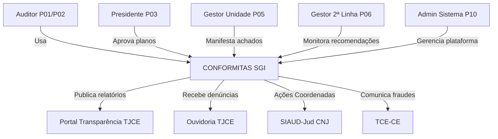
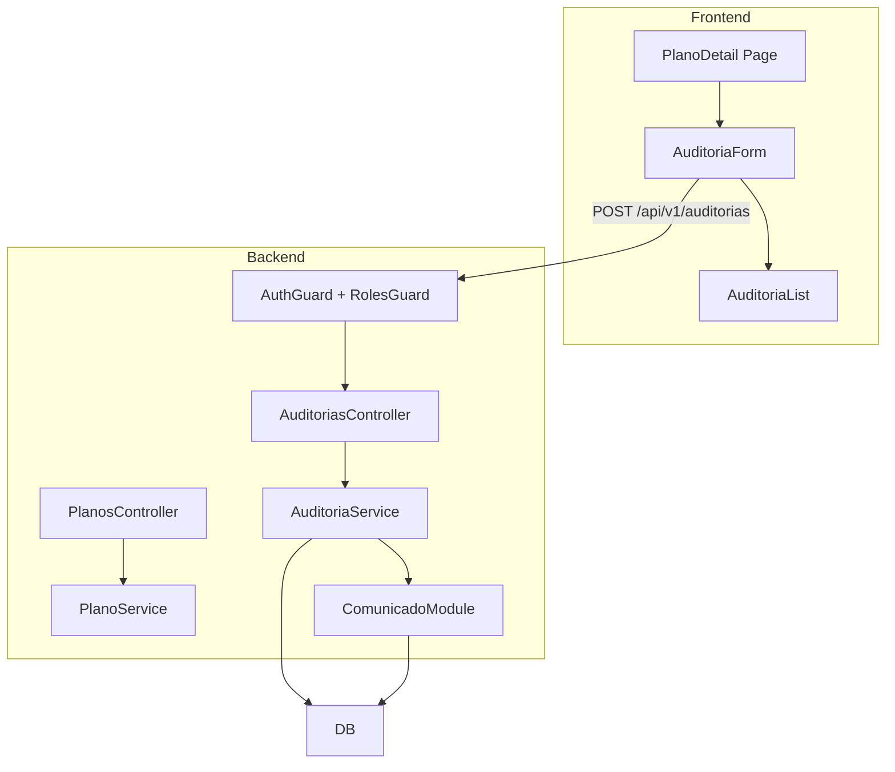
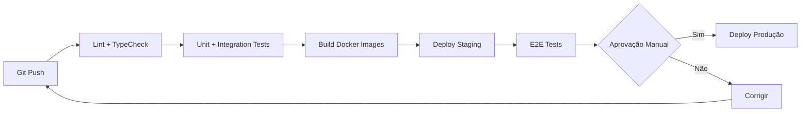

# Architecture Definition Document — CONFORMITAS 3.0

> **Versão:** 1.0 | **Data:** 2026-06-16 | **Status:** Gerado (Step 5)
> **Projeto:** CONFORMITAS 3.0 (SGI) | **Autor:** IA (Step 5)
> **Referências:** PRD Técnico, SPEC RNFs, Catálogo Integrações, Perfis, PLAN

---

## 1. Visão Geral da Arquitetura

### 1.1 Propósito
A arquitetura do CONFORMITAS é projetada como uma plataforma web corporativa para o TJCE, suportando o ciclo completo de auditoria interna governamental. A arquitetura é modular (15 módulos), API-first, com autenticação JWT+MFA, RBAC com 10 perfis e deploy on-premises na infraestrutura do TJCE.

### 1.2 Drivers Arquiteturais

| Driver | Prioridade | Descrição | Impacto |
|--------|------------|-----------|---------|
| Segurança de dados | Crítico | Dados sigilosos de auditoria, LGPD | TLS 1.3, AES-256, vault de credenciais, logs imutáveis |
| Multi-perfil RBAC | Crítico | 10 perfis com escopos diferentes | Middleware de autorização, políticas ABAC por unidade e sigilo |
| Retenção 10 anos | Alto | Papéis de trabalho e logs (CNJ 309 art. 44) | Política WORM, soft delete, backup incremental |
| Disponibilidade 99.5% | Alto | Horário comercial TJCE | Stateless API, PostgreSQL com replicação |
| Deploy on-premises | Alto | Infraestrutura corporativa TJCE | Docker, sem dependência de cloud externa |
| Integrações futuras | Médio | SIAUD-Jud, Ouvidoria, Portal Transparência | API-first, webhooks, circuit breaker |
| Custo | Baixo | Stack open-source, sem licenças | PostgreSQL, Node.js, React |

### 1.3 Restrições

| Tipo | Restrição | Mitigação |
|------|-----------|-----------|
| Infra | Deploy on-premises no datacenter TJCE | Containerizado (Docker), sem cloud lock-in |
| Legal | LGPD — dados pessoais de servidores | Criptografia, anonimização onde possível, soft delete |
| Normativa | CNJ 308/309 — retenção 10 anos papéis de trabalho | Backup incremental, política WORM |
| Técnica | Sem acesso a APIs externas inicialmente (Ouvidoria, SIAUD-Jud) | Stubs/mocks para integrações, conectores reais quando disponíveis |

---

## 2. Stack Tecnológico

### 2.1 Frontend Web

| Aspecto | Tecnologia | Justificativa | Alternativas descartadas |
|---------|-----------|---------------|------------------------|
| Framework | Angular 19 + TypeScript 5 | Padrão institucional TJCE, suporte corporativo | React (padrão não adotado pelo TJCE), Vue |
| Bundler | Angular CLI (esbuild/Vite) | Nativo do Angular, build otimizado | — |
| UI Library | Angular Material + TailwindCSS 4 | Componentes acessíveis, tema customizável | PrimeNG (menos consistente) |
| Estado | Angular Signals + NgRx (onde necessário) | Reativo nativo, sem boilerplate | RxJS puro (menos estruturado para estado global) |
| Cache/API | Angular HTTP Client + Interceptors | Nativo, suporta interceptors para JWT e refresh | — |
| Formulários | Angular Reactive Forms + Zod | Validação type-safe, schemas Zod compartilhados back↔front | Template-driven forms |
| Roteamento | Angular Router | Lazy loading, guards para RBAC | — |
| Testes | Jasmine + Karma (padrão Angular) | Padrão Angular, suporte CLI | Jest (menos integrado com Angular) |

### 2.2 Backend

| Aspecto | Tecnologia | Justificativa | Alternativas descartadas |
|---------|-----------|---------------|------------------------|
| Runtime | Node.js 22 LTS | Ecossistema JS unificado com frontend Angular | Python, Java (stack separado) |
| Framework | NestJS 11 | Modular, DI, guards para RBAC | Express (menos estruturado), Fastify |
| Linguagem | TypeScript 5 | Type safety ponta a ponta com Angular | JavaScript puro |
| ORM | Prisma 6 | Type-safe, migrations declarativas | TypeORM (menos maduro), Drizzle |
| Validação | Zod | Schemas reutilizáveis front (Angular) ↔ back | class-validator |
| Autenticação | Passport.js + JWT + TOTP + Keycloak (opcional) | Autenticação local padrão; Keycloak como opção institucional | NextAuth (foco Next.js) |
| Documentação | Swagger/OpenAPI 3.x (NestJS) | Geração automática | — |
| Testes | Jest + Supertest | Padrão NestJS | Vitest |
| Filas | BullMQ + Redis | Jobs assíncronos (notificações, alertas) | RabbitMQ (overkill) |
| Arquivos | Sistema de arquivos local + backup | Simplicidade on-premises | S3 (não disponível on-prem) |

### 2.3 Banco de Dados

| Aspecto | Tecnologia | Justificativa |
|---------|-----------|---------------|
| SGBD | PostgreSQL 16 | Robusto, JSONB para dados flexíveis, ACID |
| Migrations | Prisma Migrate | Type-safe, versionável |
| Backup | pg_dump incremental diário + completo semanal | Padrão TJCE |

### 2.4 Infraestrutura e Deploy

| Aspecto | Tecnologia | Justificativa |
|---------|-----------|---------------|
| Containers | Docker + Docker Compose | On-premises, sem Kubernetes necessário para MVP |
| CI/CD | GitHub Actions (self-hosted runner no TJCE) | Integração com Git, gratuito para self-hosted |
| Proxy reverso | Nginx | TLS termination, rate limiting |
| Monitoramento | Prometheus + Grafana (opcional) | Métricas de saúde |
| Logs | Winston + armazenamento em arquivo | Simplicidade, retenção 10 anos |

---

## 3. Diagramas C4

### 3.1 Level 1 — Contexto



### 3.2 Level 2 — Containers

```mermaid
graph TD
    subgraph TJCE Datacenter
        WEB[Web App - Angular SPA] -->|REST API| API[API - NestJS]
        API -->|JDBC| DB[(PostgreSQL 16)]
        API -->|BullMQ| REDIS[Redis]
        API -->|Arquivos| FS[Sistema de Arquivos]
        API -.->|OIDC (opcional)| KEYCLOAK[Keycloak SSO]
        NGINX[Nginx Reverse Proxy] --> WEB
        NGINX --> API
    end
    USER[Usuário] -->|HTTPS| NGINX
```

### 3.3 Level 3 — Componentes (Fluxo: Abertura de Auditoria)



---

## 4. Architecture Decision Records (ADRs)

### ADR-001: Angular + NestJS Fullstack TypeScript (2026-06-16)

**Decisão:** Adotar Angular no frontend e NestJS/TypeScript no backend.

**Contexto:** O TJCE padronizou Angular como framework frontend institucional. NestJS no backend compartilha TypeScript, padrões de DI e tipagem com Angular. Stack unificada em linguagem.

**Alternativas consideradas:**
- React + NestJS: Frontend em React não atende ao padrão institucional TJCE
- Python/Django + Angular: Stack separado, overhead de contexto entre times

**Consequências:** Stack TypeScript ponta a ponta reduz barreira entre front e back. Angular oferece estrutura opinativa adequada para 15 módulos corporativos.

### ADR-002: NestJS para Backend (2026-06-16)

**Decisão:** NestJS como framework backend.

**Contexto:** O sistema tem 15 módulos com interdependências. NestJS oferece injeção de dependência, módulos e guards nativos para implementar RBAC.

**Alternativas:** Express (menos estruturado para 15 módulos), Fastify (menos ecossistema de guards/auth).

### ADR-003: PostgreSQL (2026-06-16)

**Decisão:** PostgreSQL como banco relacional único.

**Contexto:** Dados estruturados de auditoria, necessidade de ACID, JSONB para campos flexíveis (equipe_ids, questoes_auditoria). On-premises, sem dependência de cloud.

**Alternativas:** MongoDB (menos adequado para dados relacionais de auditoria), MySQL (menos features JSON).

### ADR-004: RBAC + Políticas ABAC (2026-06-16)

**Decisão:** RBAC com 10 perfis predefinidos + políticas ABAC para restrições contextuais (unidade, sigilo).

**Contexto:** CNJ 308/309 exigem segregação de funções e controle de acesso por sigilo. 10 perfis cobrem todos os papéis institucionais.

**Alternativas:** RBAC puro (não cobre escopo por unidade), ABAC puro (mais complexo de configurar).

### ADR-005: API-First com OpenAPI (2026-06-16)

**Decisão:** Todos os módulos expõem APIs REST documentadas em OpenAPI 3.x. Frontend consome exclusivamente via API.

**Contexto:** 15 módulos, 4 ondas de desenvolvimento, necessidade de contratos estáveis entre front e back.

**Alternativas:** GraphQL (overkill para este domínio), RPC (menos interoperável).

### ADR-006: Autenticação JWT + MFA via TOTP + Keycloak (opcional) (2026-06-16)

**Decisão:** Autenticação local (email/senha) com bcrypt, JWT (access + refresh tokens) e MFA via TOTP. Suporte a Keycloak como provedor de identidade alternativo para ambientes com SSO institucional.

**Contexto:** Ambiente on-premises. Keycloak é o padrão de SSO adotado pelo TJCE. O sistema deve operar com autenticação local quando Keycloak não estiver disponível, mas permitir integração via OpenID Connect quando configurado.

**Implementação:** Passport.js com estratégia local (padrão) + estratégia OAuth2/OIDC (Keycloak). Configuração: `AUTH_PROVIDER=local|keycloak`. Ambos os modos emitem JWT para o backend.

**Alternativas:** Apenas Keycloak (dependência externa bloqueante), apenas local (sem SSO corporativo).

### ADR-007: Deploy Docker Compose (2026-06-16)

**Decisão:** Docker Compose para orquestração on-premises. Sem Kubernetes no MVP.

**Contexto:** Infraestrutura do TJCE suporta Docker. O sistema tem 4 containers (web, api, db, redis). Kubernetes seria overkill.

**Alternativas:** Kubernetes (complexidade desnecessária para este porte), VMs diretas (menos reprodutibilidade).

---

## 5. Segurança e Compliance

### 5.1 Autenticação e Autorização

| Camada | Medida |
|---------|--------|
| Rede | TLS 1.3 via Nginx, HTTPS obrigatório |
| Aplicação | JWT (30 min), refresh token (8h), bcrypt cost 12+ |
| Provedor primário | Autenticação local (email/senha + bcrypt) |
| Provedor opcional | Keycloak via OpenID Connect (OIDC). Configurável por `AUTH_PROVIDER` |
| MFA | TOTP obrigatório para P01, P02, P10 (modo local). No modo Keycloak, MFA é delegado ao provedor |
| Autorização | RBAC (middleware NestJS Guards) + ABAC (políticas por unidade e sigilo) |
| Sessão | Timeout 30 min inatividade, bloqueio após 5 falhas |

**Fluxo de autenticação (modo Keycloak):**
1. Usuário acessa `/login` → redirecionado ao Keycloak
2. Keycloak autentica (pode incluir MFA próprio)
3. Keycloak redireciona de volta com authorization code
4. Backend troca code por tokens, emite JWT próprio
5. Demais requisições usam JWT do backend (mesmo fluxo do modo local)

### 5.2 Proteção de Dados

| Camada | Medida |
|---------|--------|
| Trânsito | TLS 1.3 |
| Repouso | AES-256 para senhas (bcrypt), credenciais de integração em vault |
| Logs | Append-only, sem dados sensíveis |
| Exclusão | Soft delete em todas as entidades |
| Retenção | Papéis de trabalho e logs: 10 anos (CNJ 309 art. 44) |

### 5.3 Conformidade

- **LGPD:** Dados pessoais minimizados, soft delete, termo de confidencialidade
- **CNJ 308/309:** Segregação de funções, classificação de sigilo, trilha de auditoria
- **OWASP Top 10:** Validação de entrada (Zod), proteção contra XSS/CSRF, rate limiting

---

## 6. Estratégia de Deploy e CI/CD

### 6.1 Pipeline



### 6.2 Ambientes

| Ambiente | Finalidade | Atualização |
|----------|------------|-------------|
| Dev | Desenvolvimento local (Docker Compose) | Contínua |
| Staging | Homologação — dados mockados | Ao fim de cada onda |
| Produção | TJCE — AUDIN | Após aprovação do stakeholder |

### 6.3 Rollback

- Imagens Docker versionadas por tag (git SHA)
- Rollback: `docker compose up -d` com tag anterior
- Migrations de banco devem ser reversíveis (down script)

---

## 7. Cobertura de RNFs

| Categoria RNF | RNFs | Coberto por |
|---------------|------|-------------|
| Performance | PERF-001 a 005 | API stateless, PostgreSQL com índices, Redis cache |
| Disponibilidade | DISP-001 a 007 | Docker Compose + health checks, backup incremental |
| Segurança | SEGF-001 a 014 | ADR-006, §5 Segurança |
| Escalabilidade | ESCA-001 a 003 | API stateless, escalonamento horizontal |
| Interoperabilidade | INTE-001 a 008 | ADR-005 API-First, MOD-INT-001 conectores |
| Usabilidade | USAB-001 a 005 | React + TailwindCSS + WCAG 2.1 AA |
| Manutenibilidade | MANU-001 a 006 | NestJS modular, Docker, configurações parametrizáveis |
| Conformidade | CONF-001 a 005 | §5.3, LGPD, CNJ 308/309 |
| Auditoria | AUDI-001 a 005 | Logs append-only, soft delete, retenção 10 anos |
| Compatibilidade | COMP-001 a 004 | React SPA, export PDF/XLSX |

Todos os 60 RNFs endereçados. ✅

---

## 8. Riscos Arquiteturais

| Risco | Prob. | Impacto | Mitigação |
|-------|-------|---------|-----------|
| PostgreSQL single point of failure | Média | Alto | Backup incremental, replicação em staging |
| APIs externas (Ouvidoria, SIAUD-Jud) indisponíveis | Alta | Médio | Stubs/mocks, operação manual como fallback |
| Volume de arquivos de evidências crescer | Média | Médio | Política de retenção, compressão |
| Ambiente on-premises sem orquestração avançada | Baixa | Médio | Docker Compose suficiente para MVP, migrar para K8s se necessário |

---

**Versão:** 1.0 | **Data:** 2026-06-16
