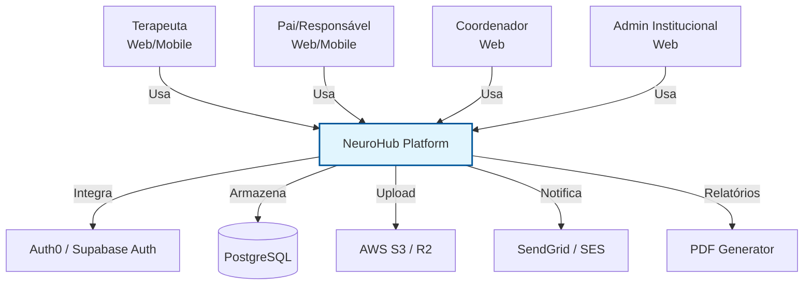
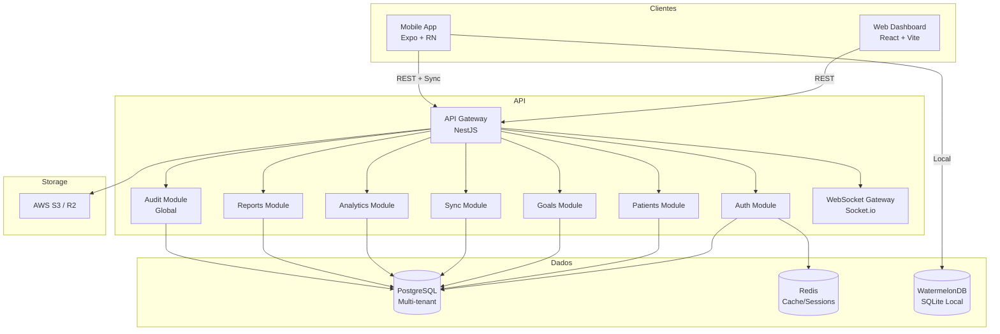
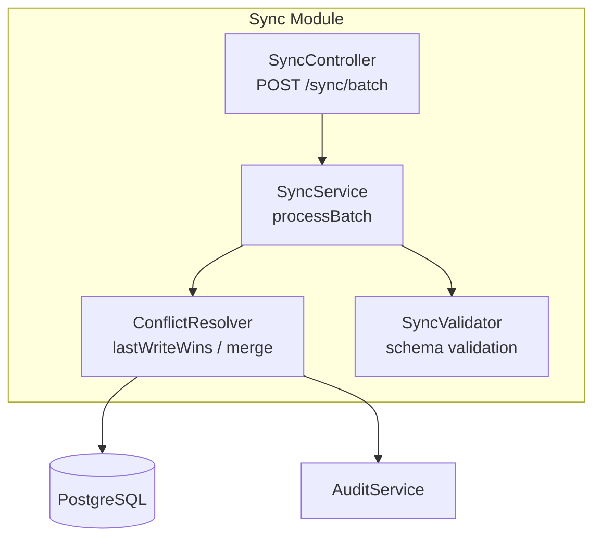
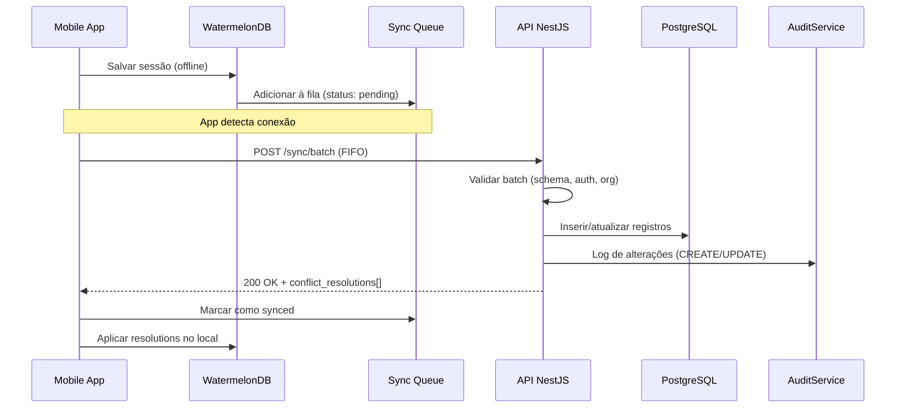
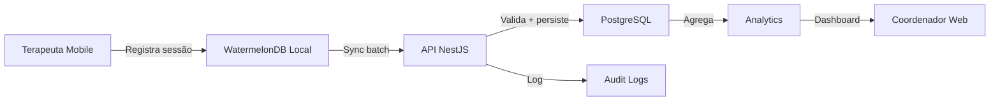

# Template de Definição de Arquitetura (ADD — Architecture Definition Document)

> **Versão:** {X.Y} | **Data:** {Mês/Ano} | **Status:** {Rascunho/Alinhado/Aprovado}
> **Projeto:** {Nome do Projeto} | **Codename:** {Opcional}
> **Autor:** {Arquiteto/Tech Lead} | **Revisores:** {Lista}
> **Referências:** `{PRD}`, `{SPEC}`, `{Design System}`

---

## 📋 Checklist Pré-Preenchimento

Antes de começar, certifique-se de que existem:
- [ ] Product Requirements Document (PRD) aprovado e versionado
- [ ] Estimativas de volume de dados e tráfego (DAU, registros/mês, tamanho de mídia)
- [ ] Definição de ambientes (dev/staging/prod) e orçamento de infra
- [ ] Análise de riscos de segurança e compliance (LGPD/GDPR/HIPAA/etc.)
- [ ] Decisões arquiteturais anteriores (ADRs) revisadas
- [ ] Time técnico alinhado sobre stack e padrões

---

## 1. Visão Geral da Arquitetura

### 1.1 Propósito
Descreva em 2-3 parágrafos:
- **O que** esta arquitetura entrega (sistema, plataforma, serviço)
- **Para quem** (clientes web, mobile, integrações de terceiros)
- **Restrições principais** (offline-first, multi-tenant, compliance, latência, etc.)
- **Diferencial arquitetural** (ex: "sincronização em tempo real com resolução de conflitos automática")

> **Exemplo (NeuroHub):** *"A arquitetura do NeuroHub é projetada para ser modular, escalável e segura, suportando múltiplos clientes (web e mobile) com sincronização em tempo real e capacidades offline-first."*

### 1.2 Drivers Arquiteturais

Liste os drivers que **justificam** cada decisão técnica. Estes são os requisitos não-funcionais que moldam a arquitetura:

| Driver | Prioridade | Descrição | Impacto na arquitetura |
|--------|------------|-----------|------------------------|
| Offline-first | Crítico | App mobile 100% funcional sem rede | WatermelonDB + sync FIFO + fila local |
| Multi-tenancy | Crítico | Isolamento de dados por organização | `organization_id` em todas as queries |
| LGPD/HIPAA | Alto | Compliance com proteção de dados | Criptografia, audit trail, anonimização |
| Latência UI | Alto | < 50ms interação, < 2s carregamento | Cache, SSR, otimização de bundle |
| Escalabilidade | Médio | 1000+ usuários simultâneos | Stateless API, PostgreSQL, horizontal scaling |
| Custo | Médio | Bootstrapping com recursos limitados | Serverless onde possível, Docker Compose inicial |

> **💡 Melhoria:** Classifique drivers como **Crítico/Alto/Médio/Baixo** e vincule cada um a uma decisão concreta. Isso evita debates cíclicos no futuro.

### 1.3 Restrições e Premissas

| Tipo | Restrição/Premissa | Origem | Mitigação |
|------|-------------------|--------|-----------|
| Técnica | Time conhece NestJS/TypeScript | Capacidade do time | Treinamento se necessário |
| Negócio | MVP em 4 meses | Deadline mercado | Escopo congelado, features pós-MVP |
| Legal | Dados de saúde de menores | LGPD + CFM | DPO designado, anonimização |
| Infra | Orçamento inicial < $500/mês | Bootstrapping | Vercel free tier + Railway hobby |

---

## 2. Stack Tecnológico

> **Princípio:** Para cada camada, justifique a escolha. Não liste apenas tecnologias — explique **por que** ela foi escolhida e quais alternativas foram descartadas.

### 2.1 Frontend Web

| Aspecto | Tecnologia | Versão | Justificativa | Alternativas descartadas | Por que descartamos |
|---------|-----------|--------|---------------|------------------------|---------------------|
| Framework | React | 19+ | Ecossistema maduro, SSR com Next.js | Vue, Svelte | Time tem expertise React |
| Bundler | Vite | 5+ | HMR rápido, configuração mínima | Webpack, Parcel | Velocidade de dev |
| Linguagem | TypeScript | 5+ | Type safety, DX | JavaScript puro | Escalabilidade de código |
| Estilização | TailwindCSS + Shadcn/UI | 3+ | Utility-first, acessibilidade built-in | Styled Components, MUI | Consistência + menos CSS custom |
| Estado Global | Zustand | 4+ | Minimalista, sem boilerplate | Redux, MobX | Simplicidade |
| Cache Server | TanStack Query | 5+ | Cache inteligente, stale-while-revalidate | SWR, Apollo | Melhor DX com REST |
| Rotas | TanStack Router | latest | Type-safe routing | React Router 7 | Tipagem de rotas |
| Formulários | React Hook Form + Zod | latest | Performance, validação type-safe | Formik, Yup | Rerender otimizado |
| Charts | Recharts / Visx | latest | Declarativo, D3-based | Chart.js, ApexCharts | Integração React |

**Padrões obrigatórios:**
- Componentes funcionais com hooks (nada de class components)
- Custom hooks para lógica de domínio (`usePatients`, `useGoals`)
- Feature-based folder structure (não por tipo de arquivo)

### 2.2 Mobile

| Aspecto | Tecnologia | Versão | Justificativa | Alternativas descartadas | Por que descartamos |
|---------|-----------|--------|---------------|------------------------|---------------------|
| Framework | React Native (Expo) | SDK 50+ | OTA updates, managed workflow | Flutter, Native | Reutilização de lógica web |
| Linguagem | TypeScript | 5+ | Consistência com web | JavaScript | Type safety |
| Estilização | NativeWind | latest | Tailwind para RN | Styled Components RN | Consistência com web |
| DB Local | WatermelonDB | latest | SQLite + sync robusto, relações | Realm, SQLite puro | Sync automático, performance |
| Navegação | Expo Router | latest | File-based routing | React Navigation | Padrão Expo, file-based |
| Sync | Custom REST + WebSockets | — | Controle total de conflitos | Firebase, Supabase | Compliance de dados sensíveis |

**Padrões obrigatórios:**
- Uma screen por fluxo de usuário (ex: `SessionScreen.tsx`)
- Models WatermelonDB com decorators (`@field`, `@relation`)
- Contexts para Auth e Sync (não use Redux no mobile)

> **💡 Melhoria:** O documento original menciona "WatermelonDB ou Realm". Escolha **uma** e documente por que. Ambiguidade em arquitetura gera dívidas técnicas.

### 2.3 Backend

| Aspecto | Tecnologia | Versão | Justificativa | Alternativas descartadas | Por que descartamos |
|---------|-----------|--------|---------------|------------------------|---------------------|
| Runtime | Node.js | LTS | Ecossistema npm, async I/O | Deno, Bun | Estabilidade, tooling |
| Framework | NestJS | 10+ | DI nativo, modular, enterprise-ready | Express puro, Fastify | Arquitetura opinativa |
| Linguagem | TypeScript | 5+ | Type safety, decorators | JavaScript | Manutenibilidade |
| Banco de Dados | PostgreSQL | 16+ | JSONB, extensões, ACID | MySQL, MongoDB | JSONB para flexibilidade, compliance |
| ORM | Prisma | 5+ | Type-safe, migrations automáticas | TypeORM, Drizzle | DX superior, validação de schema |
| API Style | REST + WebSockets | — | Simplicidade + real-time | GraphQL, gRPC | Time familiar, caching HTTP |
| Validação | Class-validator + Zod | latest | DTOs + schemas compartilhados | Joi, Yup | Integração NestJS + frontend |
| Documentação | Swagger / OpenAPI | 3.0 | Auto-gerado a partir de decorators | Postman manual | Sincronização automática |

**Padrões obrigatórios:**
- Módulos NestJS isolados por domínio (`auth/`, `patients/`, `goals/`)
- Repository pattern com PrismaService
- DTOs com `class-validator` para input validation
- Guards para autorização (`@Roles()`, `@Organization()`)

### 2.4 Infraestrutura e Serviços

| Serviço | Tecnologia | Uso | Justificativa | Alternativas | Por que descartamos |
|---------|-----------|-----|---------------|--------------|---------------------|
| Auth | Auth0 / Supabase Auth | JWT, MFA, SSO | Conforme PRD | Firebase Auth, Cognito | PRD especifica Auth0; Supabase como fallback acelerado |
| Storage | AWS S3 / Cloudflare R2 | Fotos, vídeos, PDFs | Escalabilidade, custo | MinIO self-hosted | Managed, menos ops |
| Realtime | Socket.io (NestJS Gateway) | Notificações, sync | Bidirecional, fallback HTTP | Supabase Realtime, Pusher | Controle + compliance |
| Cache | Redis | Sessions, rate limit | Performance | Memcached | Estruturas de dados ricas |
| Deploy Web | Vercel | Hosting Next.js | Edge network, preview deploys | Netlify, AWS Amplify | Melhor para Next.js |
| Deploy API | Railway / AWS ECS | Containers NestJS | Simplicidade + escalabilidade | Heroku, DigitalOcean | Preço/performance |
| CI/CD | GitHub Actions | Lint, test, build, deploy | Integração nativa | GitLab CI, CircleCI | Repositório no GitHub |
| Monitoramento | Datadog / Sentry | APM, error tracking | Observabilidade completa | New Relic, LogRocket | Preço/funcionalidade |

> **💡 Melhoria:** O documento original lista "Auth0 (Conforme PRD) ou Supabase Auth (Alternativa acelerada)". Isso é uma **decisão pendente**, não uma decisão arquitetural. Documente a escolha final com **data da decisão** e **quem decidiu**.

---

## 3. Diagrama de Arquitetura de Alto Nível

### 3.1 Diagrama C4 — Nível 1 (Contexto)

Mostre o sistema em relação a usuários e sistemas externos:



### 3.2 Diagrama C4 — Nível 2 (Containers)

Mostre as aplicações e bancos de dados:



### 3.3 Diagrama C4 — Nível 3 (Componentes — exemplo do Sync)



> **💡 Melhoria:** O documento original tem apenas um diagrama de alto nível. Use **C4 Model** (Contexto, Container, Componente, Código) para diferentes níveis de detalhe. Mantenha os diagramas como código (Mermaid) versionados no repo.

---

## 4. Estratégia Offline-First (se aplicável)

> **Se o projeto não precisa de offline, remova esta seção ou marque como N/A.**

### 4.1 Cenários de Uso Offline

| Cenário | Dados necessários | Ações permitidas | Ações bloqueadas |
|---------|-------------------|------------------|------------------|
| Terapeuta em sessão (sem WiFi) | Pacientes, PEI, templates de feedback | Registrar sessão, contadores, mood | Upload de fotos, envio de relatório |
| Pai preenchendo daily log | Pacientes, daily log template | Preencher log, salvar localmente | Ver analytics em tempo real |
| Coordenador em escola | Lista de pacientes, metas | Visualizar cobertura | Gerar relatório PDF |

### 4.2 Fluxo de Sincronização



### 4.3 Resolução de Conflitos

| Tipo de dado | Estratégia | Justificativa |
|---------------|------------|---------------|
| Dados brutos (sessão, contadores) | Last-Write-Wins (LWW) | Dados temporais, último valor é o mais relevante |
| Metas e lições (PEI) | Manual merge + flag | Alterações sensíveis, requer revisão humana |
| Perfil do paciente | LWW + audit trail | Rastreabilidade completa em audit_logs |
| Daily logs | LWW | Registro temporal, irreversível |

### 4.4 Estratégia de Cache Local

```markdown
| Entidade | Cacheado no login? | Atualização | Tamanho estimado |
|----------|-------------------|-------------|------------------|
| patients | Sim | Pull a cada 5 min | ~50KB por paciente |
| goals | Sim | Push/pull on change | ~20KB por meta |
| feedback_templates | Sim | Versão + download se mudou | ~100KB total |
| sessions | Não (criação local) | Push only | N/A |
| daily_logs | Sim (últimos 30 dias) | Push/pull | ~5KB por dia |
```

> **💡 Melhoria:** O documento original descreve o fluxo mas não quantifica. Adicione estimativas de tamanho de cache e estratégia de eviction (LRU, TTL).

---

## 5. Segurança e Compliance

### 5.1 Classificação de Dados

| Nível | Dados | Tratamento | Exemplos |
|-------|-------|------------|----------|
| **Crítico** | Dados de saúde, PII de menores | Criptografia + audit + consentimento | Diagnóstico, medicação, relatórios |
| **Sensível** | Dados pessoais adultos | Criptografia + audit | Email, telefone, endereço |
| **Interno** | Dados operacionais | Acesso controlado | Logs de sistema, métricas |
| **Público** | Informações gerais | Sem restrição | Landing page, documentação |

### 5.2 Medidas de Segurança por Camada

| Camada | Medida | Implementação | Verificação |
|--------|--------|---------------|-------------|
| **Transporte** | TLS 1.3 | Nginx / ALB / Cloudflare | SSL Labs A+ |
| **Repouso** | AES-256 | PostgreSQL TDE, S3 SSE | Configuração de infra |
| **Aplicação** | RBAC | NestJS Guards + Decorators | Testes E2E de autorização |
| **API** | Rate limiting | Redis + @Throttle() | Testes de carga |
| **Autenticação** | JWT + Refresh | Passport + httpOnly cookies | Pentest |
| **Input** | Sanitização | Zod + class-validator | Fuzzing |
| **Audit** | Immutable logs | AuditModule (append-only) | Query de integridade |

### 5.3 Compliance

| Regulamentação | Requisito | Implementação | Evidência |
|---------------|-----------|---------------|-----------|
| **LGPD** | Consentimento | Checkbox no cadastro + versionamento | Banco de consentimentos |
| **LGPD** | Direito ao esquecimento | Endpoint `DELETE /me` + anonymization | Script de anonimização |
| **LGPD** | Portabilidade | Exportação JSON/CSV | Teste de exportação |
| **LGPD** | DPO | Email do DPO no app + canal de contato | Página de privacidade |
| **HIPAA** (se aplicável) | Business Associate Agreement | Contrato com provedores de nuvem | Documentação legal |
| **HIPAA** | Access controls | RBAC + audit trail | Relatório de auditoria |

### 5.4 Anonimização para Analytics

```markdown
Pipeline de dados para analytics/reporting:
1. Extrair dados de produção (read replica)
2. Remover/Hash PII (nome, email, telefone, endereço)
3. Pseudonimizar patient_id (hash irreversível)
4. Agregar dados sensíveis (ex: idade em faixas, não data exata)
5. Armazenar em ambiente separado (schema analytics ou DW)
```

> **💡 Melhoria:** O documento original menciona "Anonimização" mas não detalha o pipeline. Especifique **quem** executa, **quando** e **onde** os dados anonimizados ficam.

---

## 6. Backend — Estrutura de Módulos

### 6.1 Módulos de Domínio

Para cada módulo, preencha:

```markdown
#### {nome} Module

**Responsabilidade:** {O que este módulo faz e o que NÃO faz}
**Entidades principais:** {Tabelas Prisma}
**Endpoints expostos:** {Lista de rotas}
**Dependências:** {Módulos que consome}
**Módulos que consomem:** {Quem depende dele}
**Padrão:** {CRUD simples, Aggregate, Saga, etc.}

| Arquivo | Responsabilidade |
|---------|------------------|
| `{nome}.module.ts` | Declaração de providers, imports, exports |
| `{nome}.controller.ts` | Rotas HTTP, DTOs de input/output |
| `{nome}.service.ts` | Regras de negócio, orquestração |
| `{nome}.repository.ts` | Acesso a dados (opcional, se não usar Prisma direto) |
| `dto/` | Create, Update, Response DTOs com class-validator |
| `entities/` | Interfaces/types (se não usar Prisma types) |
| `guards/` | Autorização específica do módulo |
| `{nome}.spec.ts` | Testes unitários |
| `{nome}.e2e-spec.ts` | Testes de integração |
```

### 6.2 Módulos Obrigatórios (checklist)

| Módulo | Descrição | Global? | Prioridade |
|--------|-----------|---------|------------|
| `auth` | JWT, Passport, guards, decorators | Sim (via exports) | Crítico |
| `users` | CRUD de usuários, perfis | Não | Crítico |
| `patients` | Cadastro de pacientes | Não | Crítico |
| `goals` | PEI — metas e lições | Não | Crítico |
| `daily-logs` | Diário e farmacologia | Não | Alto |
| `sync` | Sincronização offline mobile | Não | Alto |
| `analytics` | Agregação de dados | Não | Médio |
| `reports` | Geração de relatórios PDF | Não | Médio |
| `audit` | Log de auditoria imutável | **Sim** | Crítico |
| `invites` | Convites com token temporário | Não | Médio |
| `notifications` | WebSocket + push | Não | Médio |
| `files` | Upload/download de mídia | Não | Baixo |

### 6.3 AuditModule (Global)

```markdown
**Escopo:** Global — disponível em todos os módulos via `AuditService`
**Ações suportadas:** `CREATE`, `UPDATE`, `DELETE`, `EXPORT`, `LOGIN`
**Schema mínimo:**
- `id`: UUID
- `action`: enum
- `entity_type`: string (ex: "patient", "goal")
- `entity_id`: UUID
- `user_id`: UUID (quem fez)
- `organization_id`: UUID (escopo)
- `old_value`: JSON (para UPDATE/DELETE)
- `new_value`: JSON (para CREATE/UPDATE)
- `ip_address`: string
- `user_agent`: string
- `created_at`: timestamp

**Uso:**
```typescript
// Em qualquer service:
await this.auditService.log({
  action: AuditAction.UPDATE,
  entityType: 'patient',
  entityId: patient.id,
  oldValue: oldPatient,
  newValue: updatedPatient,
});
```

**Regras:**
- NUNCA deletar registros de audit_logs (append-only)
- Particionar por mês se volume > 1M registros/ano
- Índice em: `organization_id`, `entity_type`, `entity_id`, `created_at`
```

### 6.4 Multi-Tenancy

```markdown
**Estratégia:** Shared Database, Shared Schema (coluna `organization_id`)
**Justificativa:** Custo reduzido, simplicidade operacional, isolamento lógico suficiente para o domínio

**Implementação:**
1. PrismaService injeta `organization_id` no contexto (via middleware ou interceptor)
2. TODAS as queries incluem `WHERE organization_id = ?`
3. Decorator `@Organization()` extrai do JWT
4. Teste de cross-tenant leak em CI (obrigatório)

**Exceções:**
- `users` (superadmin pode ver todas as orgs)
- `audit_logs` (filtrado por org, mas superadmin tem acesso)
- `organizations` (tabela raiz, acessível por superadmin)

**Validação:**
```typescript
// Em todo controller:
@Get()
async findAll(@Organization() orgId: string) {
  return this.service.findAll({ organizationId: orgId });
}
```
```

> **💡 Melhoria:** O documento original menciona "PrismaService com repository pattern" mas não detalha. Especifique se é middleware, interceptor ou decorator. Inclua teste de cross-tenant leak como gate de CI.

---

## 7. Padrões de Código e Qualidade

### 7.1 Estrutura do Monorepo

```
{projeto}/
├── apps/
│   ├── api/                    # NestJS backend
│   │   ├── src/
│   │   │   ├── {modulo}/       # Um diretório por módulo
│   │   │   ├── prisma/         # Schema, migrations, seed
│   │   │   └── main.ts         # Bootstrap NestJS
│   │   ├── test/               # E2E tests
│   │   └── Dockerfile
│   ├── web/                    # React + Vite
│   │   ├── src/
│   │   │   ├── app/            # Rotas/pages
│   │   │   ├── components/     # Feature-based
│   │   │   ├── hooks/          # use{Domain}
│   │   │   └── lib/            # Utils, api client
│   │   └── e2e/                # Playwright
│   └── mobile/                 # Expo + React Native
│       ├── src/
│       │   ├── screens/        # Uma screen por fluxo
│       │   ├── database/       # WatermelonDB models
│       │   └── context/        # AuthContext, SyncContext
│       └── e2e/                # Detox
├── packages/
│   ├── shared-types/           # TypeScript types compartilhados
│   ├── eslint-config/          # Configuração unificada
│   ├── ts-config/              # tsconfig base
│   └── test-helpers/           # Factories, mocks
├── docker-compose.yml          # PostgreSQL, Redis, MinIO
├── turbo.json                  # Pipelines
└── .github/
    └── workflows/
        ├── ci.yml              # Lint, type-check, test, build
        └── deploy.yml          # Deploy staging/prod
```

### 7.2 Convenções de Código

| Aspecto | Padrão | Exemplo | Ferramenta |
|---------|--------|---------|------------|
| Commits | Conventional Commits | `feat(auth): add password reset` | commitlint |
| Branching | GitFlow simplificado | `feature/RF-1.1.4`, `hotfix/sync-crash` | — |
| Nomenclatura | PascalCase classes, camelCase vars | `PatientService`, `findById` | ESLint |
| Arquivos | kebab-case | `patient-form.tsx`, `auth.service.ts` | ESLint |
| Testes | `{nome}.spec.ts` (unit), `{nome}.e2e-spec.ts` | `auth.e2e-spec.ts` | Jest config |
| DTOs | Sufixo Dto, validação inline | `CreatePatientDto` | class-validator |

### 7.3 Estratégia de Testes

| Tipo | Ferramenta | Onde | Cobertura mínima | Quando roda |
|------|-----------|------|------------------|-------------|
| Unitário | Jest | `*.spec.ts` | 80% linhas | PR (CI) |
| Integração | Jest + TestContainers | `*.integration-spec.ts` | APIs principais | PR (CI) |
| E2E API | Supertest | `test/e2e/` | Fluxos críticos | Merge main |
| E2E Web | Playwright | `apps/web/e2e/` | Login, CRUD core | Nightly |
| E2E Mobile | Detox | `apps/mobile/e2e/` | Login, Sync, Session | Nightly |
| Performance | k6 | `tests/perf/` | APIs de leitura | Semanal |
| Segurança | OWASP ZAP | APIs expostas | — | Mensal |

### 7.4 Pipeline CI/CD

```yaml
# Resumo do pipeline (detalhar em .github/workflows/ci.yml)
estrutura:
  1. Lint: ESLint + Prettier + commitlint
  2. Type Check: TypeScript strict (noEmit)
  3. Unit Tests: Jest com coverage threshold (80%)
  4. Integration Tests: TestContainers + PostgreSQL
  5. Build: Turborepo cache (web + api + mobile)
  6. E2E Web: Playwright (staging)
  7. E2E Mobile: Detox (emulador)
  8. Security Scan: OWASP ZAP + dependency audit
  9. Deploy Staging: Auto (merge main)
  10. Deploy Prod: Manual (tag v*.*.*) + smoke tests
```

> **💡 Melhoria:** O documento original menciona "Jest (Unit), Supertest (E2E API), Maestro (E2E Mobile), Playwright (E2E Web)" mas não define cobertura mínima nem quando cada teste roda. Defina gates de qualidade claros.

---

## 8. Decisões Arquiteturais (ADRs)

> **Documente cada decisão importante.** Use o formato ADR (Architecture Decision Record).

| ID | Data | Decisão | Contexto | Consequências | Status |
|----|------|---------|----------|---------------|--------|
| ADR-001 | {Data} | WatermelonDB ao invés de Realm | Sync nativo, relações, performance | Curva de aprendizado, documentação menor | Aprovado |
| ADR-002 | {Data} | PostgreSQL ao invés de MongoDB | Dados estruturados + JSONB, ACID | Menos flexível para schema evolution | Aprovado |
| ADR-003 | {Data} | Auth0 primário, Supabase fallback | PRD especifica Auth0, mas custo pode ser alto | Dupla configuração inicial | Pendente |
| ADR-004 | {Data} | REST ao invés de GraphQL | Time familiar, caching HTTP simples | Overfetching em alguns endpoints | Aprovado |
| ADR-005 | {Data} | Monorepo Turborepo | Compartilhamento de types, CI unificado | Complexidade inicial, build cache | Aprovado |

> **💡 Melhoria:** O documento original não tem ADRs. Cada "ou" (Auth0 ou Supabase, WatermelonDB ou Realm) é uma decisão pendente que deve ser registrada com data e responsável.

---

## 9. Riscos Arquiteturais

| ID | Risco | Probabilidade | Impacto | Mitigação | Owner | Status |
|----|-------|---------------|---------|-----------|-------|--------|
| ARK-01 | WatermelonDB não escala para > 10k registros locais | Média | Alto | Spike de performance em 3º mês; fallback paginação | Tech Lead | Monitorado |
| ARK-02 | Auth0 custo inesperado com crescimento | Média | Médio | Implementar Supabase Auth como fallback; monitorar MAU | Product | Monitorado |
| ARK-03 | PostgreSQL single instance vira gargalo | Baixa | Alto | Read replicas em 6 meses; connection pooling (PgBouncer) | DevOps | Planejado |
| ARK-04 | Sync conflito em dados sensíveis (PEI) | Média | Alto | ConflictResolver manual + flag; notificação coordenador | Tech Lead | Mitigado |
| ARK-05 | Expo managed workflow limita native modules | Baixa | Médio | EAS Build + config plugin; manter eject como último recurso | Mobile Lead | Monitorado |
| ARK-06 | Monorepo build lento com 3 apps | Média | Médio | Turborepo remote cache; paralelização em CI | Tech Lead | Mitigado |

> **💡 Melhoria:** Seção inteiramente nova. Riscos arquiteturais devem ser revisados em cada sprint review.

---

## 10. Performance e Escalabilidade

### 10.1 Estimativas de Volume

| Métrica | Valor atual | 6 meses | 12 meses | Fonte |
|---------|-------------|---------|----------|-------|
| Usuários ativos (DAU) | 50 | 500 | 2000 | Projeção negócio |
| Pacientes cadastrados | 200 | 2000 | 10000 | Projeção negócio |
| Sessões/dia | 100 | 1000 | 5000 | Projeção negócio |
| Fotos/vídeos/mês | 500 | 5000 | 25000 | Projeção negócio |
| Tamanho médio mídia | 5MB | 5MB | 5MB | Benchmark |
| Audit logs/mês | 10K | 100K | 500K | Estimativa técnica |

### 10.2 Estratégia de Escalabilidade

| Fase | Gatilho | Ação | Custo estimado |
|------|---------|------|----------------|
| 1. Vertical | CPU > 70% por 1h | Upgrade de instância | +$50/mês |
| 2. Horizontal | DAU > 1000 | Load balancer + 2+ containers API | +$100/mês |
| 3. Read Replica | Queries lentas > 10% | PostgreSQL read replica | +$80/mês |
| 4. CDN | Assets > 100GB/mês | Cloudflare R2 + CDN | +$20/mês |
| 5. Cache | API P95 > 500ms | Redis cluster + query cache | +$50/mês |
| 6. Shard | Patient > 100K | Particionamento por organization_id | +$200/mês |

> **💡 Melhoria:** O documento original não quantifica. Sem estimativas, decisões de infra são reativas, não proativas.

---

## 11. Monitoramento e Observabilidade

### 11.1 Métricas de Negócio (Business Metrics)

| Métrica | Ferramenta | Dashboard | Alerta |
|---------|-----------|-----------|--------|
| DAU/MAU | Amplitude/Mixpanel | Growth | — |
| Taxa de conversão (trial → pago) | Amplitude | Revenue | Slack #revenue |
| Tempo médio de sessão | Amplitude | Engagement | — |
| Taxa de sync bem-sucedido | Custom metric | Mobile Health | PagerDuty se < 95% |
| Tempo médio de sync | Custom metric | Mobile Health | Slack #mobile |

### 11.2 Métricas Técnicas (SLIs/SLOs)

| SLI | SLO | Janela | Como medir | Alerta |
|-----|-----|--------|------------|--------|
| API Availability | 99.9% | 30 dias | Health check / Sentry | PagerDuty |
| API Latency P95 | < 500ms | 1 dia | Datadog APM | Slack #alerts |
| Error Rate | < 0.1% | 1 dia | Sentry | PagerDuty |
| DB Connection Pool | < 80% | 1 hora | PostgreSQL metrics | Slack #infra |
| Mobile Crash Rate | < 0.5% | 1 dia | Sentry RN | Slack #mobile |
| Sync Queue Size | < 100 | 5 min | Custom metric | Slack #mobile |

### 11.3 Logging

| Camada | Nível padrão | Estrutura | Retenção |
|--------|-------------|-----------|----------|
| Aplicação | INFO | JSON: `{timestamp, level, message, trace_id, user_id, org_id}` | 30 dias |
| Erros | ERROR | JSON + stack trace + contexto | 90 dias |
| Audit | INFO | Tabela PostgreSQL (append-only) | 7 anos (LGPD) |
| Acesso | INFO | Nginx access log | 30 dias |

> **💡 Melhoria:** O documento original não cobre observabilidade. Sem SLIs/SLOs, não há como saber se a arquitetura está saudável.

---

## 12. Anexos

### Anexo A: Diagrama de Fluxo de Dados (DFD)


### Anexo B: Matriz de Comunicação entre Módulos

| Módulo | Consome | Publica eventos | Síncrono/Assíncrono |
|--------|---------|-----------------|---------------------|
| auth | — | `user.created` | Síncrono (REST) |
| patients | auth, audit | `patient.created` | Síncrono |
| goals | patients, auth, audit | — | Síncrono |
| sync | patients, goals, daily-logs, audit | `sync.completed` | Síncrono (REST) + Assíncrono (fila) |
| analytics | patients, goals, feedbacks | — | Assíncrono (job) |
| reports | patients, goals, analytics | — | Assíncrono (job) |

### Anexo C: Inventário de APIs Externas

| Serviço | API | Dados enviados | Dados recebidos | Frequência | SLA |
|---------|-----|---------------|-----------------|------------|-----|
| Auth0 | Management API | User profile | Tokens, roles | Cada login | 99.9% |
| SendGrid | Mail API | Email, template | Status delivery | Event-driven | 99.9% |
| S3/R2 | Object API | Fotos, PDFs | URLs assinadas | On-demand | 99.99% |
| Stripe | REST API | Subscription, customer | Invoice, webhook | Event-driven | 99.9% |

> **💡 Melhoria:** O documento original não tem anexos técnicos. A matriz de comunicação evita acoplamentos ocultos.

---

## 📌 Revisões

| Versão | Data | Autor | Mudanças |
|--------|------|-------|----------|
| 0.1 | {Data} | {Autor} | Rascunho inicial |
| 0.2 | {Data} | {Autor} | Adicionado ADR-003 (Auth0 vs Supabase) |
| 1.0 | {Data} | {Autor} | Aprovado para implementação |

---

## ✅ Checklist de Aprovação

- [ ] Tech Lead validou stack e justificativas
- [ ] Arquiteto de Software revisou decisões (ADRs)
- [ ] Security revisou requisitos de compliance
- [ ] DevOps validou estimativas de infra e custo
- [ ] Mobile Lead validou estratégia offline-first
- [ ] QA validou estratégia de testes e cobertura
- [ ] Product Manager alinhou drivers de negócio
- [ ] DPO (se aplicável) revisou LGPD/GDPR/HIPAA

---

> **Nota:** Este template é um documento vivo. Atualize sempre que houver mudança de stack, decisão arquitetural ou identificação de novo risco. A versão no repositório (`docs/ARCHITECTURE.md`) é a fonte da verdade.
