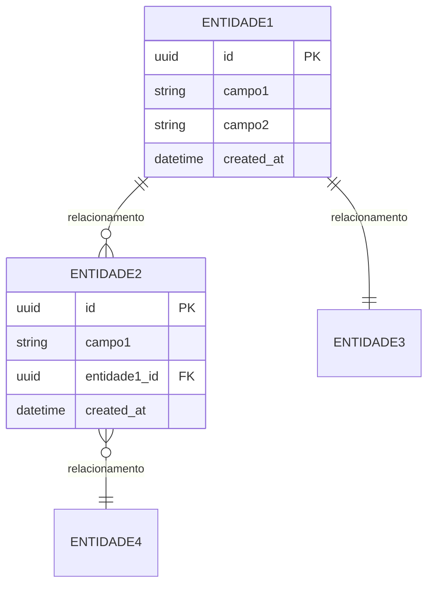
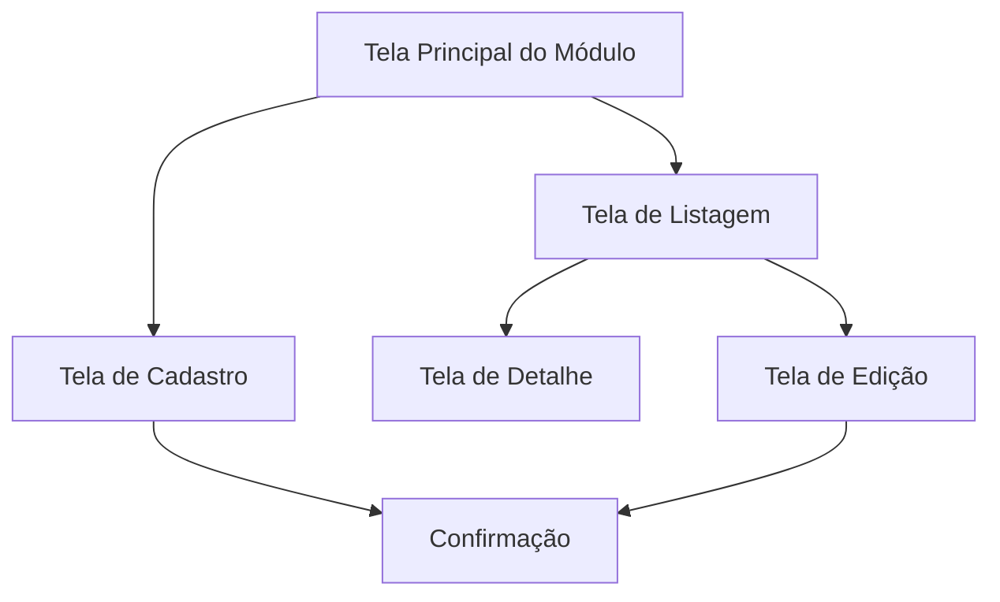
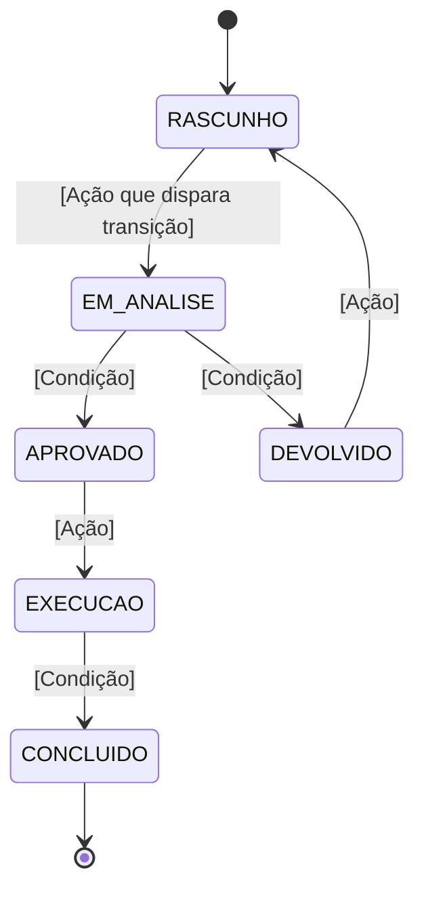

# Template — Especificação de Módulo
## [NOME DO SISTEMA]
### MOD-[SIGLA]-[NNN] [NOME DO MÓDULO]

**Versão:** [X.Y]  
**Data:** [dd/mm/aaaa]  
**Autor:** [Gerado por IA / Validado por Humano]  
**Status:** [Rascunho / Em Validação / Aprovado]

---

## 1. IDENTIFICAÇÃO DO MÓDULO

| Campo | Valor |
|-------|-------|
| **ID do Módulo** | MOD-[SIGLA]-[NNN] |
| **Nome do Módulo** | [Nome completo e descritivo] |
| **Domínio Funcional** | [Macrodomínio ao qual pertence] |
| **Prioridade** | [Must / Should / Could / Won't] |
| **Complexidade** | [Baixa / Média / Alta / Crítica] |
| **Onda de Implementação** | [1 / 2 / 3 / 4 / 5 / 6] |
| **Dependências** | MOD-[XXX], MOD-[YYY] |
| **Estimativa (homem-dia)** | [X] dias |

---

## 2. OBJETIVO E CONTEXTO

### 2.1 Propósito do Módulo
[Descrever em 2-3 parágrafos qual problema este módulo resolve, seu papel no sistema e o valor que entrega ao usuário/instituição.]

### 2.2 Alinhamento Estratégico
- **Objetivo Estratégico relacionado:** [OE-01 / OE-02 / ...]
- **Macroprocesso atendido:** [Qual macroprocesso da unidade este módulo suporta]
- **Capacidade de negócio viabilizada:** [Qual capacidade institucional este módulo entrega]

### 2.3 Escopo do Módulo

#### Dentro do Escopo
- [Funcionalidade ou responsabilidade 1]
- [Funcionalidade ou responsabilidade 2]
- [Funcionalidade ou responsabilidade 3]
- [Funcionalidade ou responsabilidade 4]
- [Funcionalidade ou responsabilidade 5]

#### Fora do Escopo
- [O que este módulo explicitamente NÃO faz 1]
- [O que este módulo explicitamente NÃO faz 2]

---

## 3. REQUISITOS FUNCIONAIS

### 3.1 Lista de Funcionalidades

| ID | Funcionalidade | Descrição | Prioridade | Status |
|----|---------------|-----------|------------|--------|
| RF-MOD-001 | [Nome da funcionalidade] | [Descrição sucinta do que faz] | Must / Should / Could | Pendente |
| RF-MOD-002 | [Nome da funcionalidade] | [Descrição sucinta do que faz] | Must / Should / Could | Pendente |
| RF-MOD-003 | [Nome da funcionalidade] | [Descrição sucinta do que faz] | Must / Should / Could | Pendente |
| RF-MOD-004 | [Nome da funcionalidade] | [Descrição sucinta do que faz] | Must / Should / Could | Pendente |
| RF-MOD-005 | [Nome da funcionalidade] | [Descrição sucinta do que faz] | Must / Should / Could | Pendente |
| RF-MOD-006 | [Nome da funcionalidade] | [Descrição sucinta do que faz] | Must / Should / Could | Pendente |
| RF-MOD-007 | [Nome da funcionalidade] | [Descrição sucinta do que faz] | Must / Should / Could | Pendente |
| RF-MOD-008 | [Nome da funcionalidade] | [Descrição sucinta do que faz] | Must / Should / Could | Pendente |

### 3.2 Casos de Uso (Gherkin)

#### RF-MOD-001: [Nome da Funcionalidade]

**Cenário Principal:**
```gherkin
Dado que [contexto inicial / pré-condição]
Quando [ação do usuário ou evento do sistema]
Então [resultado esperado]
```

**Cenário Alternativo — [Situação]:**
```gherkin
Dado que [contexto alternativo]
Quando [ação ou condição diferente]
Então [resultado alternativo esperado]
```

**Cenário de Erro — [Situação]:**
```gherkin
Dado que [contexto de erro]
Quando [condição que gera erro]
Então [mensagem ou comportamento de erro]
```

<!-- Repetir para cada RF crítico do módulo -->

### 3.3 Regras de Negócio do Módulo

| ID | Regra | Descrição | Gatilho | Ação |
|----|-------|-----------|---------|------|
| RN-MOD-001 | [Nome da regra] | [Descrição da restrição ou política] | [Quando se aplica] | [O que o sistema deve fazer] |
| RN-MOD-002 | [Nome da regra] | [Descrição da restrição ou política] | [Quando se aplica] | [O que o sistema deve fazer] |
| RN-MOD-003 | [Nome da regra] | [Descrição da restrição ou política] | [Quando se aplica] | [O que o sistema deve fazer] |
| RN-MOD-004 | [Nome da regra] | [Descrição da restrição ou política] | [Quando se aplica] | [O que o sistema deve fazer] |
| RN-MOD-005 | [Nome da regra] | [Descrição da restrição ou política] | [Quando se aplica] | [O que o sistema deve fazer] |

---

## 4. MODELO DE DADOS DO MÓDULO

### 4.1 Entidades Principais

#### [Nome da Entidade 1]
| Campo | Tipo | Obrigatório | Descrição | Restrições |
|-------|------|-------------|-----------|------------|
| `id` | UUID | Sim | Identificador único | PK |
| `[campo_1]` | [String / Number / Date / Boolean / Enum] | Sim / Não | [Descrição] | [Restrições] |
| `[campo_2]` | [String / Number / Date / Boolean / Enum] | Sim / Não | [Descrição] | [Restrições] |
| `[campo_3]` | [String / Number / Date / Boolean / Enum] | Sim / Não | [Descrição] | [Restrições] |
| `created_at` | DateTime | Sim | Data de criação | Auto |
| `updated_at` | DateTime | Sim | Data de atualização | Auto |

#### [Nome da Entidade 2]
| Campo | Tipo | Obrigatório | Descrição | Restrições |
|-------|------|-------------|-----------|------------|
| `id` | UUID | Sim | Identificador único | PK |
| `[campo_1]` | [Tipo] | Sim / Não | [Descrição] | [Restrições] |
| `[campo_2]` | [Tipo] | Sim / Não | [Descrição] | [Restrições] |

### 4.2 Relacionamentos

| Entidade A | Cardinalidade | Entidade B | Descrição |
|------------|---------------|------------|-----------|
| [Entidade 1] | 1:N | [Entidade 2] | [Descrição do relacionamento] |
| [Entidade 1] | N:M | [Entidade 3] | [Descrição do relacionamento] |
| [Entidade 2] | 1:1 | [Entidade 4] | [Descrição do relacionamento] |

### 4.3 Diagrama Entidade-Relacionamento (Módulo)



---

## 5. INTERFACES E INTERAÇÕES

### 5.1 APIs do Módulo

| Método | Endpoint | Descrição | Autenticação | Perfis Autorizados |
|--------|----------|-----------|-------------|---------------------|
| GET | `/api/v1/[modulo]/[recurso]` | [Descrição] | Bearer Token | [P01, P02, P03] |
| POST | `/api/v1/[modulo]/[recurso]` | [Descrição] | Bearer Token | [P01, P03] |
| GET | `/api/v1/[modulo]/[recurso]/{id}` | [Descrição] | Bearer Token | [P01, P02, P03] |
| PUT | `/api/v1/[modulo]/[recurso]/{id}` | [Descrição] | Bearer Token | [P01, P03] |
| DELETE | `/api/v1/[modulo]/[recurso]/{id}` | [Descrição] | Bearer Token | [P01] |

### 5.2 Telas e Componentes de UI

| Tela / Componente | Descrição | Perfis com Acesso | Estados |
|--------------------|-----------|--------------------|---------|
| `[NomeDaTela]` | [Descrição do que a tela apresenta] | [P01, P02] | Carregando, Vazio, Dados, Erro |
| `[NomeDoComponente]` | [Descrição do componente] | [P01, P02, P03] | Carregando, Habilitado, Desabilitado, Erro |
| `[NomeDaTela]` | [Descrição] | [P01] | Carregando, Vazio, Dados, Erro |

### 5.3 Fluxos de Navegação



### 5.4 Integrações com Outros Módulos

| Módulo de Origem/Destino | Dado Compartilhado | Direção | Mecanismo |
|--------------------------|--------------------|---------|-----------|
| MOD-[XXX] | [Dado ou evento compartilhado] | Entrada / Saída | [API / Evento / BD] |
| MOD-[YYY] | [Dado ou evento compartilhado] | Entrada / Saída | [API / Evento / BD] |

---

## 6. WORKFLOWS E BPMN DO MÓDULO

### 6.1 Estados e Transições

**Entidade principal:** [Nome da entidade que possui workflow]



### 6.2 Regras de Transição

| Transição | Gatilho | Perfil Autorizado | Condições | Efeitos |
|-----------|---------|--------------------|-----------|---------|
| RASCUNHO → EM_ANALISE | [Botão "Enviar para Análise"] | P02 | Campos obrigatórios preenchidos | Status muda, notificação enviada |
| EM_ANALISE → APROVADO | [Botão "Aprovar"] | P01 | Parecer preenchido | Status muda, próximo passo liberado |
| EM_ANALISE → DEVOLVIDO | [Botão "Devolver"] | P01 | Justificativa obrigatória | Status muda, notificação ao autor |

---

## 7. REQUISITOS NÃO FUNCIONAIS DO MÓDULO

| ID | Requisito | Descrição | Métrica Alvo |
|----|-----------|-----------|--------------|
| RNF-MOD-001 | Performance — Listagem | Tempo de resposta da listagem principal | p95 < 500ms |
| RNF-MOD-002 | Performance — Cadastro | Tempo de resposta do POST | p95 < 800ms |
| RNF-MOD-003 | Disponibilidade | Uptime do módulo | 99.5% |
| RNF-MOD-004 | Escalabilidade | Capacidade de usuários simultâneos | [X] usuários |
| RNF-MOD-005 | Segurança — Dados | Classificação dos dados do módulo | [Público / Interno / Restrito / Sigiloso] |
| RNF-MOD-006 | Auditoria | Eventos que devem ser logados | [Lista de eventos] |

---

## 8. TESTES DO MÓDULO

### 8.1 Estratégia de Testes

| Camada | Tipo | Ferramenta | Cobertura Alvo |
|--------|------|------------|----------------|
| Backend — Services | Unitários | Jest | ≥ 80% |
| Backend — Controllers | Integração | Jest + Supertest | ≥ 70% |
| Frontend — Componentes | Unitários | Vitest + RTL | ≥ 80% |
| Fluxos críticos | E2E | Playwright / Cypress | Cenários-chave |

### 8.2 Cenários de Teste Críticos

| ID | Cenário | Tipo | Descrição |
|----|---------|------|-----------|
| TST-MOD-001 | [Nome do cenário] | Unitário | [O que valida] |
| TST-MOD-002 | [Nome do cenário] | Integração | [O que valida] |
| TST-MOD-003 | [Nome do cenário] | E2E | [O que valida] |
| TST-MOD-004 | [Nome do cenário] | E2E | [O que valida] |

---

## 9. RISCOS E DEPENDÊNCIAS

### 9.1 Riscos

| ID | Risco | Probabilidade | Impacto | Mitigação |
|----|-------|---------------|---------|-----------|
| R-MOD-001 | [Descrição do risco] | Alta / Média / Baixa | Alto / Médio / Baixo | [Estratégia de mitigação] |
| R-MOD-002 | [Descrição do risco] | Alta / Média / Baixa | Alto / Médio / Baixo | [Estratégia de mitigação] |
| R-MOD-003 | [Descrição do risco] | Alta / Média / Baixa | Alto / Médio / Baixo | [Estratégia de mitigação] |

### 9.2 Dependências

| Dependência | Tipo | Impacto se Indisponível | Plano de Contingência |
|-------------|------|-------------------------|------------------------|
| MOD-[XXX] | Bloqueante | [Descrição do impacto] | [Contingência] |
| INT-[YYY] | Bloqueante / Parcial | [Descrição do impacto] | [Contingência] |
| [Sistema Externo] | Parcial | [Descrição do impacto] | [Contingência] |

---

## 10. DEFINIÇÃO DE PRONTO (DoD) DO MÓDULO

- [ ] Todos os requisitos funcionais implementados e testados
- [ ] Cobertura de testes ≥ 80% (unitários)
- [ ] Cobertura de testes de integração ≥ 70%
- [ ] Testes E2E para fluxos críticos passando
- [ ] Lint e type-check sem erros
- [ ] Documentação de API atualizada (Swagger/OpenAPI)
- [ ] Design System compliance verificado
- [ ] Acessibilidade WCAG 2.1 AA verificada (se aplicável)
- [ ] Security review aprovado (sem vulnerabilidades críticas ou altas)
- [ ] Performance dentro das metas estabelecidas
- [ ] PR revisado e aprovado por QA Agent
- [ ] Documentado no changelog do módulo

---

## 11. REGISTRO DE DECISÕES DO MÓDULO

| Data | Decisão | Motivo | Impacto | Decidido por |
|------|---------|--------|---------|-------------|
| [dd/mm] | [Descrição da decisão técnica ou de negócio] | [Justificativa] | [Consequências] | [IA / Humano / Ambos] |
| [dd/mm] | [Descrição da decisão] | [Justificativa] | [Consequências] | [IA / Humano / Ambos] |

---

## 12. CONTROLE DE VERSÃO

| Versão | Data | Autor | Alterações |
|--------|------|-------|------------|
| 1.0 | [dd/mm/aaaa] | [IA / Humano] | Versão inicial gerada a partir da visão estratégica |
| 1.1 | [dd/mm/aaaa] | [Humano] | [Descrição da alteração após validação] |
