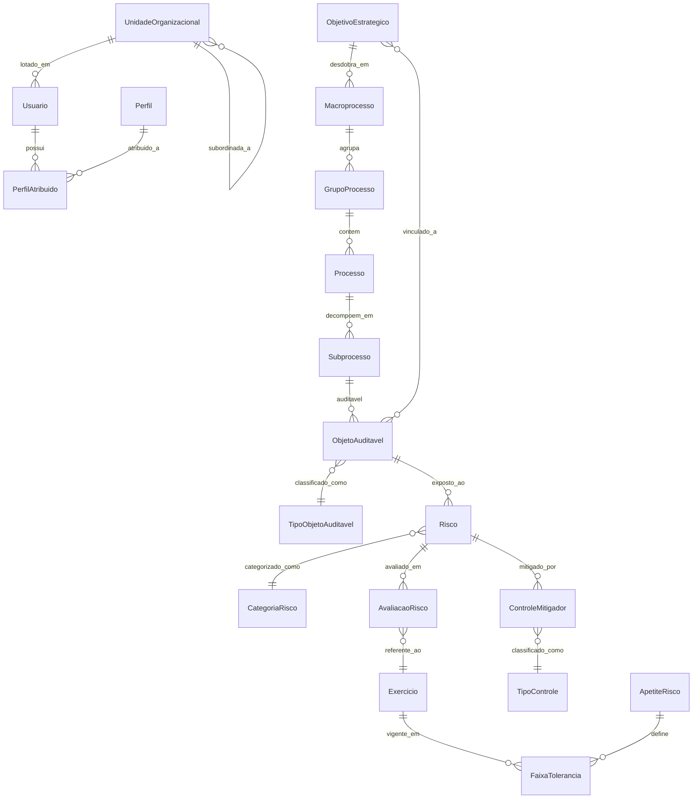
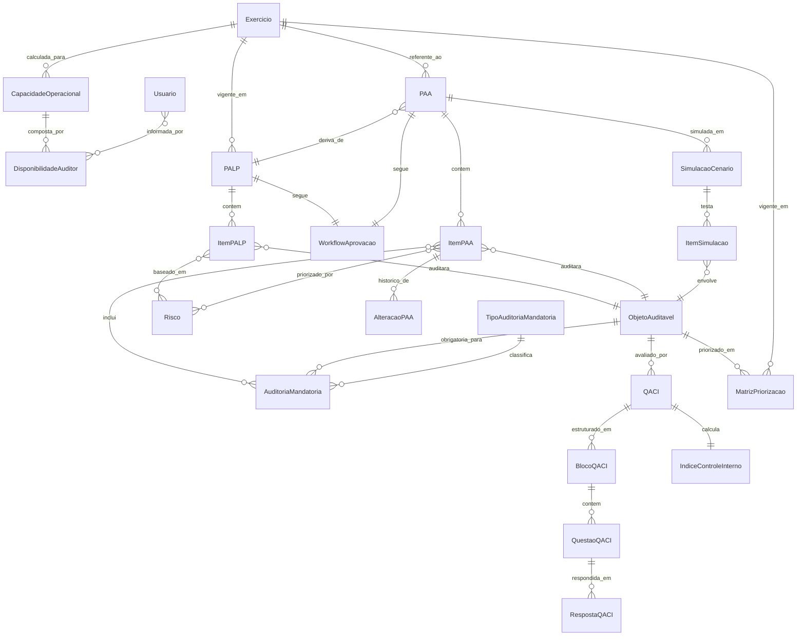
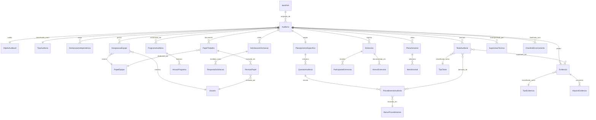
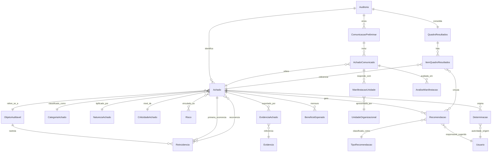
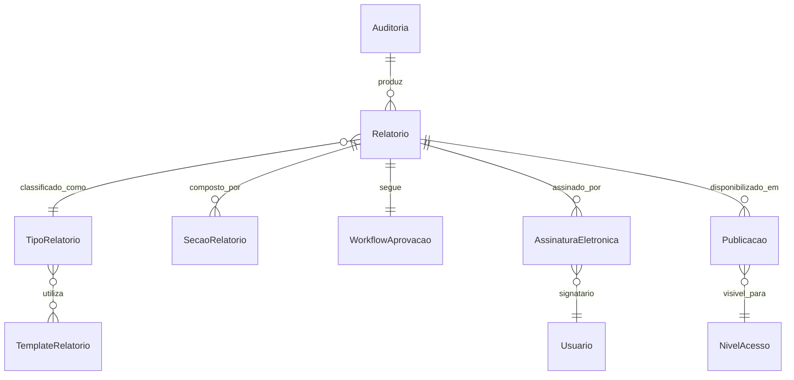
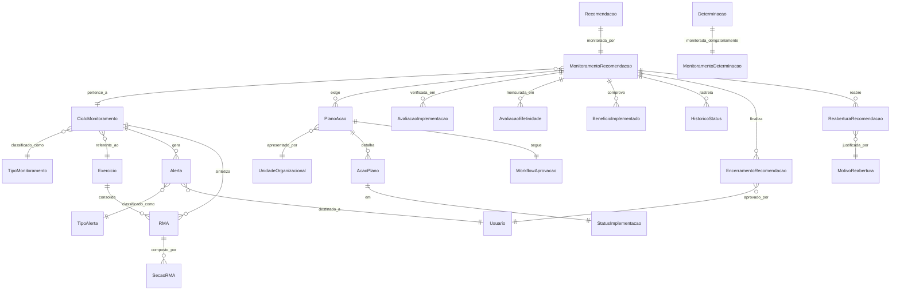
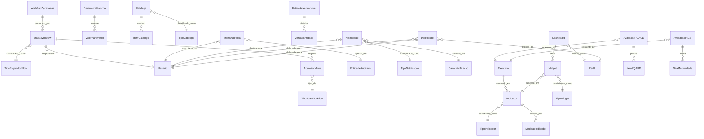

# CONFORMITAS 3.0 — Conceptual Data Model Design

**Date:** 2026-06-04  
**Status:** Approved  
**Approach:** Full Conceptual ER (Approach A)

---

## 1. Objective

Define the complete conceptual entity-relationship model for CONFORMITAS 3.0 — the Integrated Internal Audit, Internal Control & Risk Management platform for TJCE's AUDIN. This model identifies all entities, relationships, cardinalities, and key attributes across all 7 functional domains without implementation details (no column types, no indexes, no DB-specific features).

This is the structural backbone from which all other design artifacts derive: physical database schema, API contracts, workflow state machines, and UI screens.

---

## 2. Scope

The model covers ~102 entities across 7 domains:

| # | Domain | Entities | Description |
|---|--------|----------|-------------|
| 1 | Foundation + Risk | 19 | Users, roles, org structure, auditable universe hierarchy, risk assessment, controls |
| 2 | Planning | 13 | PALP, PAA, capacity, mandatory audits, QACI, simulations, prioritization matrix |
| 3 | Execution | 17 | Audit engagements, teams, independence, work programs, papers, evidence, tests, interviews, sampling |
| 4 | Findings & Results | 15 | Findings (7 mandatory fields), recommendations, determinations, benefits, contradictory, results table, recurrence |
| 5 | Reports & Communication | 8 | Reports, templates, sections, signatures, publication, access levels |
| 6 | Monitoring | 10 | Recommendation monitoring, action plans, implementation assessment, effectiveness, RMA, alerts, closure/reopening |
| 7 | Cross-cutting + Quality/BI | 20 | Workflow engine, audit trail, versioning, catalogs, parameters, notifications, indicators, dashboards, PQAUD, IA-CM, delegation |

---

## 3. Design Principles

1. **Polymorphic workflow**: Single `WorkflowAprovacao` engine serves all approvable entities (PALP, PAA, Reports, Action Plans) via `entidade_tipo` + `entidade_id`
2. **Polymorphic versioning**: Single `VersaoEntidade` table stores JSON snapshots for all versionable entities
3. **Immutable audit trail**: `TrilhaAuditoria` is append-only — no update/delete operations permitted
4. **Logical deletion only**: All entities use soft-delete (`status = inativo` or `excluido`). No physical deletion of records
5. **Generic catalogs**: `Catalogo` + `ItemCatalogo` pattern handles all parametrizable lists, reducing table proliferation
6. **Risk-based feedback loop**: Data flows from Risk → Planning → Execution → Findings → Monitoring → back to Risk
7. **Aggregate root identification**: Each module has clear aggregate roots that define transaction boundaries

---

## 4. Domain 1: Foundation + Auditable Universe + Risk Management

### 4.1 ER Diagram



### 4.2 Entity Definitions

#### Usuario
System user, authenticated via AD/LDAP/SSO or local contingency login.

| Attribute | Description |
|-----------|-------------|
| nome | Full name |
| email | Corporate email |
| matricula | Employee ID |
| status | ativo / inativo / suspenso |
| unidade_lotacao_id | FK to UnidadeOrganizacional |
| tipo_autenticacao | LDAP / SSO / local |
| nivel_sigilo | Maximum classification level accessible |

#### Perfil
RBAC role definition. Maps to PRD profiles: Administrador, Secretário, Coordenador, Supervisor, Auditor Líder, Auditor, Especialista, Revisor de Qualidade, Presidência, Unidade Auditada, Avaliador Externo, Comitê.

| Attribute | Description |
|-----------|-------------|
| nome | Role name |
| descricao | Role description |
| permissoes | JSON array of permission keys |

#### PerfilAtribuido
Junction table linking users to profiles with ABAC attributes.

| Attribute | Description |
|-----------|-------------|
| usuario_id | FK to Usuario |
| perfil_id | FK to Perfil |
| unidade_escopo | Organizational unit scope for this attribution |
| nivel_sigilo | Classification level for this attribution |
| data_inicio | Attribution start |
| data_fim | Attribution end (null = active) |

#### UnidadeOrganizacional
Hierarchical organizational structure. Self-referencing for tree structure.

| Attribute | Description |
|-----------|-------------|
| nome | Unit name |
| sigla | Unit acronym |
| tipo | Secretaria, Departamento, Coordenação, Divisão, Seção |
| pai_id | FK to parent UnidadeOrganizacional (null = root) |
| nivel | Hierarchy level (1 = top) |
| nivel_sigilo | Default classification level |
| status | ativa / inativa |

#### ObjetivoEstrategico
Institutional strategic objectives. Linked to auditable objects and audits.

| Attribute | Description |
|-----------|-------------|
| nome | Objective name |
| descricao | Detailed description |
| periodo_inicio | Start of validity period |
| periodo_fim | End of validity period |
| status | ativo / encerrado / revisado |

#### Macroprocesso → GrupoProcesso → Processo → Subprocesso → ObjetoAuditavel
Hierarchical decomposition of the auditable universe per PRD section 3.1.

All levels share common attributes:
- nome, descricao, codigo, status, nivel

**ObjetoAuditavel** (leaf level):
| Attribute | Description |
|-----------|-------------|
| nome | Object name |
| codigo | Unique code |
| tipo_objeto_id | FK to TipoObjetoAuditavel |
| criticidade | alta / media / baixa |
| data_ultima_auditoria | Date of last audit covering this object |
| data_ultima_revisao | Date of last universe review |
| status | ativo / inativo / em_revisao |

#### TipoObjetoAuditavel
Catalog: Processo, Sistema, Projeto, Contratação, Programa, Unidade Organizacional, Tema Estratégico.

#### Risco
Risk associated to an auditable object. Time-bound via AvaliacaoRisco.

| Attribute | Description |
|-----------|-------------|
| nome | Risk name |
| descricao | Detailed description |
| categoria_risco_id | FK to CategoriaRisco |
| objeto_auditavel_id | FK to ObjetoAuditavel |
| responsavel_id | FK to Usuario (institutional risk owner) |
| status | identificado / em_analise / tratado / monitorado / encerrado |

#### AvaliacaoRisco
Time-scoped risk assessment. Supports inherent and residual risk levels.

| Attribute | Description |
|-----------|-------------|
| risco_id | FK to Risco |
| exercicio_id | FK to Exercicio |
| probabilidade_inerente | 1-5 scale |
| impacto_inerente | 1-5 scale |
| nivel_inerente | Calculated: probabilidade × impacto |
| probabilidade_residual | 1-5 scale (after controls) |
| impacto_residual | 1-5 scale (after controls) |
| nivel_residual | Calculated: probabilidade × impacto |
| justificativa | Assessment rationale |
| avaliador_id | FK to Usuario |

#### ControleMitigador
Controls that mitigate risks. Referenced by findings and QACI.

| Attribute | Description |
|-----------|-------------|
| nome | Control name |
| descricao | Control description |
| tipo_controle_id | FK to TipoControle |
| risco_id | FK to Risco |
| eficacia | alta / media / baixa / sem_eficacia |
| status | ativo / inativo / em_implementacao |

#### ApetiteRisco + FaixaTolerancia
Institutional risk tolerance per exercise. Defines green/yellow/red bands for the risk heatmap.

**ApetiteRisco**: descricao, exercicio_id, status
**FaixaTolerancia**: limite_inferior, limite_superior, cor (verde/amarelo/vermelho), descricao

#### CategoriaRisco
Catalog: Estratégico, Operacional, Financeiro, Conformidade, TI, Integridade.

#### Exercicio
Fiscal/audit year reference.

| Attribute | Description |
|-----------|-------------|
| ano | Year (e.g., 2026) |
| status | aberto / fechado / em_encerramento |

---

## 5. Domain 2: Planning Module

### 5.1 ER Diagram



### 5.2 Entity Definitions

#### PALP (Plano de Auditoria de Longo Prazo)
Quadrennial audit plan with full approval workflow.

| Attribute | Description |
|-----------|-------------|
| periodo_inicio | Start of quadrennial period |
| periodo_fim | End of quadrennial period |
| status | rascunho / revisao_tecnica / aprovado_audin / aprovado_presidencia / publicado |
| versao | Version number |
| exercicio_id | FK to Exercicio |

**Business rules:**
- PALP must follow WorkflowAprovacao (rascunho → revisão → aprovação AUDIN → aprovação Presidência → publicação)
- All versions preserved in VersaoEntidade

#### ItemPALP
Individual audit entry in the long-term plan.

| Attribute | Description |
|-----------|-------------|
| palp_id | FK to PALP |
| objeto_auditavel_id | FK to ObjetoAuditavel |
| exercicio_previsto | Target year for execution |
| prioridade | alta / media / baixa |
| justificativa | Why this audit is planned |
| origem | risk_based / mandatoria / demanda_institucional |

#### PAA (Plano Anual de Auditoria)
Annual audit plan, derived from PALP.

| Attribute | Description |
|-----------|-------------|
| exercicio_id | FK to Exercicio |
| palp_id | FK to parent PALP |
| status | Same workflow as PALP |
| capacidade_disponivel | Total available auditor-days |
| versao | Version number |

**Business rules:**
- PAA cannot exceed available operational capacity
- All changes require formal justification via AlteracaoPAA
- Mandatory audits must be auto-included

#### ItemPAA
Individual audit in the annual plan.

| Attribute | Description |
|-----------|-------------|
| paa_id | FK to PAA |
| objeto_auditavel_id | FK to ObjetoAuditavel |
| item_palp_id | FK to ItemPALP (nullable if extraordinary) |
| cronograma_inicio | Planned start date |
| cronograma_fim | Planned end date |
| equipe_prevista | JSON with expected team composition |
| origem | palp / mandatoria / extraordinaria |
| status | planejada / em_execucao / concluida / cancelada |

#### AlteracaoPAA
Formal change history. PRD mandate: "toda alteração do PAA deverá possuir justificativa formal e manter histórico."

| Attribute | Description |
|-----------|-------------|
| item_paa_id | FK to ItemPAA |
| tipo_alteracao | inclusao / exclusao / reescalonamento / alteracao_escopo |
| justificativa | Required text |
| data | Change date |
| solicitante_id | FK to Usuario |
| aprovador_id | FK to Usuario |

#### CapacidadeOperacional
AUDIN capacity per exercise, composed of individual auditor availability.

| Attribute | Description |
|-----------|-------------|
| exercicio_id | FK to Exercicio |
| auditores_disponiveis | Count |
| dias_uteis | Working days in year |
| horas_disponiveis | Total available hours |
| reserva_tecnica_percent | Percentage reserved |
| compromissos_institucionais | Days allocated to non-audit activities |

#### DisponibilidadeAuditor
Per-auditor availability breakdown.

| Attribute | Description |
|-----------|-------------|
| capacidade_id | FK to CapacidadeOperacional |
| auditor_id | FK to Usuario |
| dias_ferias | Vacation days |
| dias_licencas | License days |
| dias_capacitacao | Training days |
| dias_compromissos | Other commitments |
| dias_uteis_liquidos | Net available days |

#### AuditoriaMandatoria
Mandatory audits auto-included in PAA.

| Attribute | Description |
|-----------|-------------|
| tipo_mandatoria_id | FK to TipoAuditoriaMandatoria |
| objeto_auditavel_id | FK to ObjetoAuditavel |
| base_legal | Legal/regulatory foundation |
| periodicidade | anual / bienal / quadrienal |
| obrigatoriedade | obrigatória |

#### TipoAuditoriaMandatoria
Catalog: Prestação de contas, Auditoria coordenada CNJ, Monitoramento pendente, Obrigação normativa, Demanda institucional.

#### SimulacaoCenario + ItemSimulacao
What-if planning. Test scenarios without mutating actual PAA.

**SimulacaoCenario**: nome, tipo (otimista/realista/restritivo), recursos_disponiveis, paa_id
**ItemSimulacao**: simulacao_id, objeto_auditavel_id, incluido (boolean), impacto_capacidade

#### QACI + BlocoQACI + QuestaoQACI + RespostaQACI + IndiceControleInterno
Internal Control Assessment Questionnaire per PRD section 3.2.

- **QACI**: objeto_auditavel_id, exercicio_id, status
- **BlocoQACI**: nome (Ambiente de controle, Riscos, Atividades de controle, Informação e comunicação, Monitoramento)
- **QuestaoQACI**: enunciado, peso, bloco_id
- **RespostaQACI**: questao_id, resposta (1-5), evidencia, respondido_por
- **IndiceControleInterno**: qaci_id, valor (0-100), nivel (forte/moderado/fraco)

#### MatrizPriorizacao
Priority scoring per auditable object per exercise.

| Attribute | Description |
|-----------|-------------|
| objeto_auditavel_id | FK |
| exercicio_id | FK |
| materialidade | Score 1-5 |
| relevancia | Score 1-5 |
| criticidade | Score 1-5 |
| risco_residual | Score from AvaliacaoRisco |
| score_final | Calculated weighted score |

---

## 6. Domain 3: Audit Execution Module

### 6.1 ER Diagram



### 6.2 Entity Definitions

#### Auditoria
The audit engagement — central entity of the execution module.

| Attribute | Description |
|-----------|-------------|
| codigo | Unique audit code (auto-generated) |
| item_paa_id | FK to ItemPAA (nullable for extraordinary) |
| objeto_auditavel_id | FK to ObjetoAuditavel |
| tipo_auditoria_id | FK to TipoAuditoria |
| objeto | Audit object description |
| objetivo | Audit objectives |
| escopo | Audit scope |
| justificativa | Justification |
| origem | paa / mandatoria / extraordinaria / demanda |
| prioridade | critica / alta / media / baixa |
| status | planejamento / em_execucao / encerramento / concluida / cancelada |
| data_inicio | Actual start date |
| data_fim | Actual end date |

**Business rules:**
- Every audit must be linked to an auditable object
- Every audit must have an associated risk
- Every audit requires Auditor Líder and Supervisor designated
- Independence declaration required before team members can act

#### TipoAuditoria
Catalog: Conformidade, Operacional, Financeira, TI, Integrada, Coordenada, Extraordinária, Consultoria.

#### DeclaracaoIndependencia
Mandatory conflict-of-interest questionnaire per team member per audit.

| Attribute | Description |
|-----------|-------------|
| auditoria_id | FK |
| usuario_id | FK to team member |
| vinculo | Relationship with audited unit (yes/no) |
| conflito_interesse | Conflict of interest (yes/no) |
| participacao_previa | Previous involvement (yes/no) |
| impedimentos | Description of any impediments |
| status | pendente / declarada / impedida |

**Business rule:** System must validate independence before allowing team member to act on the audit.

#### DesignacaoEquipe
Team composition per audit.

| Attribute | Description |
|-----------|-------------|
| auditoria_id | FK |
| usuario_id | FK to Usuario |
| papel_equipe_id | FK to PapelEquipe |
| data_inicio | Assignment start |
| data_fim | Assignment end (null = current) |
| status | designado / ativo / removido |

#### PapelEquipe
Catalog: Auditor Líder, Auditor, Supervisor, Especialista, Revisor de Qualidade.

#### PlanejamentoEspecifico
Detailed audit planning document.

| Attribute | Description |
|-----------|-------------|
| auditoria_id | FK (1:1) |
| objeto_detalhado | Detailed object description |
| objetivos | JSON array of objectives |
| escopo_detalhado | Detailed scope |
| criterios | Audit criteria |
| metodologia | Methodology description |
| cronograma | JSON with timeline |
| versao | Version number |
| status | rascunho / em_revisao / aprovado |

#### QuestaoAuditoria
Structured audit questions.

| Attribute | Description |
|-----------|-------------|
| planejamento_id | FK to PlanejamentoEspecifico |
| enunciado | Question text |
| criterio | Audit criterion |
| risco | Associated risk |
| objetivo | Audit objective |
| metodologia | Method |
| fontes_informacao | Information sources |

#### ProcedimentoAuditoria
Procedures linked to audit questions.

| Attribute | Description |
|-----------|-------------|
| questao_id | FK to QuestaoAuditoria |
| banco_procedimento_id | FK to BancoProcedimentos (reusable templates) |
| objetivo | Procedure objective |
| tipo_teste | Type of test to perform |
| prazo | Deadline |
| responsavel_id | FK to team member |
| evidencia_esperada | Expected evidence description |
| status | pendente / em_execucao / concluido / nao_aplicavel |

#### BancoProcedimentos
Reusable procedure templates. Part of the "Base Metodológica" (PRD section 3.1) — the institutional knowledge base of audit procedures, stored in the Foundation domain but referenced by Execution.

| Attribute | Description |
|-----------|-------------|
| nome | Procedure name |
| descricao | Description |
| objetivo | Objective |
| tipo | Generic categorization |
| area_conhecimento | Subject area (for classification) |
| ativo | boolean |

**Note:** BancoProcedimentos and BancoQuestoes (question bank) are Foundation-domain entities that serve the Execution module. They should be stored alongside catalogs in the Foundation schema.

#### ProgramaAuditoria + VersaoPrograma
Versioned audit program.

**ProgramaAuditoria**: auditoria_id, versao, status, descricao_alteracao
**VersaoPrograma**: programa_id, versao, conteudo (JSON), data, autor_id

#### SolicitacaoInformacao + RespostaSolicitacao
Information requests to audited units.

**SolicitacaoInformacao**: auditoria_id, destinatario_unidade_id, assunto, descricao, prazo, status (pendente/respondida/validada/vencida)
**RespostaSolicitacao**: solicitacao_id, conteudo, data_resposta, respondido_por, arquivos[]

#### PapelTrabalho + RevisaoPapel
Working papers with review workflow.

**PapelTrabalho**: auditoria_id, titulo, conteudo, tipo (memorando/analise/planilha/fluxograma/outro), status (elaboracao/revisao/aprovado/rejeitado/arquivado), versao, classificacao_sigilo, autor_id (FK to Usuario — the team member who authored the paper), papel_equipe_id (FK to PapelEquipe — the role the author held in this audit)

**RevisaoPapel**: papel_id, revisor_id (FK to Usuario — must be different from autor_id), tipo (aprovacao/rejeicao/devolucao), observacao, data

**Business rule:** revisor_id must differ from PapelTrabalho.autor_id — author cannot approve their own working paper (segregação de funções).

#### Evidencia + ArquivoEvidencia + TipoEvidencia
Evidence management with immutability guarantee.

**Evidencia**: auditoria_id, descricao, tipo_evidencia_id, data_coleta, coletor_id, status (coletada/validada/aprovada/arquivada), classificacao_sigilo
**ArquivoEvidencia**: evidencia_id, nome_arquivo, tipo_mime, tamanho_bytes, hash, caminho_armazenamento
**TipoEvidencia**: Catalog — Documental, Física, Eletrônica, Analítica, Testemunhal, Fotográfica, Audiovisual

**Business rule:** Approved evidence cannot be removed (logical archival only).

#### Entrevista + ParticipanteEntrevista + AnexoEntrevista
Formal interview records.

**Entrevista**: auditoria_id, data, local, assunto, ata, assinatura_eletronica_disponivel
**ParticipanteEntrevista**: entrevista_id, participante_id, papel (entrevistador/entrevistado/testemunha)
**AnexoEntrevista**: entrevista_id, nome, arquivo

#### PlanoAmostral + ItemAmostral
Sampling documentation.

**PlanoAmostral**: auditoria_id, metodo (aleatorio/estratificado/julgamento/etc), criterio, tamanho_amostra, tamanho_universo, justificativa
**ItemAmostral**: plano_id, identificacao, descricao, selecionado (boolean)

#### TesteAuditoria
Individual audit tests executed.

| Attribute | Description |
|-----------|-------------|
| auditoria_id | FK |
| tipo_teste_id | FK to TipoTeste |
| procedimento_id | FK to ProcedimentoAuditoria (nullable) |
| descricao | Test description |
| resultado | Result description |
| conclusao | Conclusion |
| status | pendente / em_execucao / concluido |

#### TipoTeste
Catalog: Observância, Substantivo, Analítico, Conformidade.

#### SupervisaoTecnica
Technical supervision records.

| Attribute | Description |
|-----------|-------------|
| auditoria_id | FK |
| tipo_revisao | planejamento / papel_trabalho / evidencia / conclusao / achado |
| observacoes | Reviewer notes |
| revisado_por | FK to Usuario |
| data | Review date |
| status | pendente / concluida |

#### ChecklistEncerramento
Execution closure verification.

| Attribute | Description |
|-----------|-------------|
| auditoria_id | FK (1:1) |
| todos_procedimentos_concluidos | boolean |
| papeis_aprovados | boolean |
| evidencias_vinculadas | boolean |
| supervisao_registrada | boolean |
| achados_formalizados | boolean |
| data_encerramento | timestamp |
| encerrado_por | FK to Usuario |

**Business rule:** Audit cannot be marked as concluded until all checklist items are true.

---

## 7. Domain 4: Findings, Results & Contradictory

### 7.1 ER Diagram



### 7.2 Entity Definitions

#### Achado
Audit finding with 7 mandatory methodological fields.

| Attribute | Description |
|-----------|-------------|
| auditoria_id | FK to Auditoria |
| objeto_auditavel_id | FK to ObjetoAuditavel |
| categoria_id | FK to CategoriaAchado |
| natureza_id | FK to NaturezaAchado |
| criticidade_id | FK to CriticidadeAchado |
| criterio | **Mandatory** — What should be (standard, norm, policy) |
| condicao | **Mandatory** — What was found (actual situation) |
| causa | **Mandatory** — Root cause |
| efeito | **Mandatory** — Consequence or potential impact |
| resumo_executivo | Executive summary |
| conclusao | Conclusion |
| materialidade | alta / media / baixa |
| relevancia | alta / media / baixa |
| status | identificado / validado / comunicado / consolidado |

**Business rules:**
- Every finding MUST have: critério, condição, causa, efeito, risco, evidência, recomendação
- No finding can be consolidated without at least one linked evidence (EvidenciaAchado)
- Critical findings generate automatic alert to AUDIN chief
- Recurring findings must be automatically highlighted

#### CategoriaAchado
Catalog: Não conformidade, Fragilidade de controle, Oportunidade de melhoria, Ineficiência operacional, Risco elevado, Boa prática.

#### NaturezaAchado
Catalog: Estratégica, Tática, Operacional, Financeira, TI, Integridade, Conformidade.

#### CriticidadeAchado
Catalog: Crítica, Alta, Média, Baixa. Each level defines whether automatic alerts are generated.

#### EvidenciaAchado
Junction table enforcing mandatory evidence linkage.

| Attribute | Description |
|-----------|-------------|
| achado_id | FK to Achado |
| evidencia_id | FK to Evidencia |

**Business rule:** Achado cannot be consolidated without at least one EvidenciaAchado record.

#### Recomendacao
Corrective/preventive measure derived from a finding.

| Attribute | Description |
|-----------|-------------|
| achado_id | FK to Achado (each recommendation linked to exactly one finding) |
| codigo | Auto-generated code |
| tipo_recomendacao_id | FK to TipoRecomendacao |
| descricao | Recommendation text |
| beneficio_esperado | Expected benefit description |
| prazo_sugerido | Suggested deadline |
| responsavel_sugerido_id | FK to Usuario |
| status | proposta / aceita / modificada / rejeitada |

**Business rules:**
- Each recommendation linked to exactly one finding (1:N from Achado's perspective)
- Every recommendation must have responsible, deadline, and history

#### TipoRecomendacao
Catalog: Corretiva, Preventiva, Detectiva, Compensatória, Estrutural.

#### Determinacao
Mandatory order from authority.

| Attribute | Description |
|-----------|-------------|
| achado_id | FK to Achado |
| codigo | Auto-generated code |
| origem | Source authority |
| autoridade_id | FK to Usuario (issuing authority) |
| fundamentacao | Legal/methodological foundation |
| prazo | Mandatory deadline |
| responsavel_id | FK to Usuario (responsible party) |

**Business rule:** All determinations require mandatory monitoring.

#### BeneficioEsperado
Financial and non-financial benefits from findings.

| Attribute | Description |
|-----------|-------------|
| achado_id | FK to Achado |
| tipo | financeiro / nao_financeiro |
| descricao | Benefit description |
| valor_estimado | Estimated monetary value (nullable for non-financial) |

#### ComunicacaoPreliminar + AchadoComunicado + ManifestacaoUnidade + AnaliseManifestacao
Contradictory (contraditório) process — sending findings to audited unit for response before final report.

**ComunicacaoPreliminar**: auditoria_id, data_envio, prazo_manifestacao, status (enviada/respondida/analise_concluida)
**AchadoComunicado**: comunicacao_id, achado_id
**ManifestacaoUnidade**: achado_comunicado_id, unidade_id, conteudo, data, tipo (aceita_integral/aceita_parcial/rejeita/complementa), arquivos[]
**AnaliseManifestacao**: manifestacao_id, decisao (aceita_integral/aceita_parcial/rejeita/exige_complementacao), justificativa, auditor_id, data

**Business rule:** All findings must go through contradictory before final report, except formally justified exceptions.

#### QuadroResultados + ItemQuadroResultados
Auto-generated results summary.

**QuadroResultados**: auditoria_id, data_geracao (auto-populated from Achado + Recomendacao data)
**ItemQuadroResultados**: quadro_id, achado_id, recomendacao_id, criticidade, responsavel, prazo, status

#### Reincidencia
Recurrence tracking across audits and exercises.

| Attribute | Description |
|-----------|-------------|
| tipo | primeira_ocorrencia / reincidencia / reincidencia_cronica |
| objeto_auditavel_id | FK |
| primeira_ocorrencia_id | FK to first Achado |
| recorrencia_id | FK to recurring Achado |
| causa_comum | Whether root cause is the same |
| detectado_em | Detection date |

---

## 8. Domain 5: Reports & Communication

### 8.1 ER Diagram



### 8.2 Entity Definitions

#### Relatorio
Audit report with full lifecycle workflow.

| Attribute | Description |
|-----------|-------------|
| auditoria_id | FK to Auditoria |
| tipo_relatorio_id | FK to TipoRelatorio |
| titulo | Report title |
| versao | Version number |
| status | rascunho / em_revisao / em_supervisao / aprovado / ciencia_unidade / publicado |
| data_elaboracao | Draft date |
| data_publicacao | Publication date |

**Workflow:** rascunho → revisão técnica → supervisão → aprovação AUDIN → ciência unidade → publicação

#### TipoRelatorio
Catalog: Preliminar, Final, Executivo, Nota Técnica, Parecer, Memorando.

#### TemplateRelatorio
Parametrizable report templates by audit type.

| Attribute | Description |
|-----------|-------------|
| nome | Template name |
| tipo_relatorio_id | FK |
| conteudo_html | HTML template with variable placeholders |
| variaveis | JSON array of variable names available in template |
| ativo | boolean |

#### SecaoRelatorio
Auto-generated report sections.

| Attribute | Description |
|-----------|-------------|
| relatorio_id | FK |
| tipo | capa / sumario / introducao / objetivos / escopo / metodologia / limitacoes / achados / recomendacoes / beneficios / conclusao / anexos |
| conteudo | Generated content (text/HTML) |
| ordem | Display order |

#### AssinaturaEletronica
Digital signatures with ICP-Brasil integration support.

| Attribute | Description |
|-----------|-------------|
| relatorio_id | FK |
| signatario_id | FK to Usuario |
| tipo_assinatura | icp_brasil / institucional / token |
| data_assinatura | Timestamp |
| hash | Document hash at signing time |
| certificado | Certificate details (JSON) |

#### Publicacao
Access-controlled distribution.

| Attribute | Description |
|-----------|-------------|
| relatorio_id | FK |
| nivel_acesso_id | FK to NivelAcesso |
| data_publicacao | Publication date |
| unidade_destino_id | FK (nullable = all authorized users) |
| status | publicada / restrita / revogada |

#### NivelAcesso
Catalog: Interno, Restrito, Público, Sigiloso.

---

## 9. Domain 6: Monitoring & Action Plans

### 9.1 ER Diagram



### 9.2 Entity Definitions

#### MonitoramentoRecomendacao
Tracks a recommendation through its entire monitoring lifecycle.

| Attribute | Description |
|-----------|-------------|
| recomendacao_id | FK to Recomendacao (1:1) |
| ciclo_monitoramento_id | FK to CicloMonitoramento |
| status | nao_iniciada / em_planejamento / em_implementacao / implementada / parcialmente_implementada / nao_implementada / cancelada |
| codigo | Auto-generated monitoring code |
| prioridade | critica / alta / media / baixa |
| responsavel_id | FK to Usuario |
| unidade_id | FK to UnidadeOrganizacional |
| prazo | Deadline |
| data_ultima_avaliacao | Last assessment date |

**Business rules:**
- Critical recommendations past deadline generate automatic alert to AUDIN chief
- Overdue determinations highlighted in executive dashboards
- Cannot close recommendation without validated implementation + effectiveness assessment

#### CicloMonitoramento
Monitoring period/cycle.

| Attribute | Description |
|-----------|-------------|
| tipo_monitoramento_id | FK to TipoMonitoramento |
| exercicio_id | FK to Exercicio |
| periodicidade | mensal / trimestral / semestral / anual |
| data_inicio | Cycle start |
| data_fim | Cycle end |
| status | aberto / em_andamento / encerrado |

#### TipoMonitoramento
Catalog: Periódico, Contínuo, Extraordinário.

#### PlanoAcao
Action plan submitted by audited unit.

| Attribute | Description |
|-----------|-------------|
| monitoramento_id | FK to MonitoramentoRecomendacao |
| unidade_id | FK to UnidadeOrganizacional |
| status | elaboracao / analise_audin / aprovado / em_execucao / validado / rejeitado |
| data_apresentacao | Submission date |
| data_validacao | AUDIN validation date |

**Workflow:** elaboração → análise AUDIN → aprovação → execução → validação

#### AcaoPlano
Individual action within a plan.

| Attribute | Description |
|-----------|-------------|
| plano_id | FK to PlanoAcao |
| descricao | Action description |
| responsavel_id | FK to Usuario |
| prazo | Action deadline |
| recursos_necessarios | Required resources |
| indicador | Success indicator |
| evidencia_prevista | Expected evidence of completion |
| status_implementacao_id | FK to StatusImplementacao |

#### StatusImplementacao
Catalog: Não iniciada, Em planejamento, Em implementação, Implementada, Parcialmente implementada, Não implementada, Cancelada.

#### AvaliacaoImplementacao
Verification that the action was actually executed.

| Attribute | Description |
|-----------|-------------|
| monitoramento_id | FK |
| evidencia_apresentada | Evidence description |
| validacao_tecnica | Technical validation result |
| consistencia | Consistency assessment |
| abrangencia | Completeness assessment |
| resultado | implementada / parcial / nao_implementada |
| avaliador_id | FK to Usuario |
| data | Assessment date |

#### AvaliacaoEfetividade
Verification that the risk was actually mitigated.

| Attribute | Description |
|-----------|-------------|
| monitoramento_id | FK |
| risco_mitigado | boolean |
| controle_implantado | boolean |
| melhoria_processo | boolean |
| beneficio_obtido | boolean |
| justificativa | Assessment rationale |
| avaliador_id | FK to Usuario |
| data | Assessment date |

#### BeneficioImplementado
Actual realized benefits.

| Attribute | Description |
|-----------|-------------|
| monitoramento_id | FK |
| tipo | financeiro / nao_financeiro |
| descricao | Benefit description |
| valor | Actual monetary value |
| exercicio_id | FK to Exercicio |

#### EncerramentoRecomendacao
Formal closure record.

| Attribute | Description |
|-----------|-------------|
| monitoramento_id | FK |
| aprovado_por | FK to Usuario |
| justificativa | Closure rationale |
| data_encerramento | Closure date |

**Business rule:** Only after implementation validated + effectiveness assessed + approval recorded.

#### ReaberturaRecomendacao
Reopening with mandatory justification.

| Attribute | Description |
|-----------|-------------|
| monitoramento_id | FK |
| motivo_id | FK to MotivoReabertura |
| justificativa | Required justification text |
| reaberto_por | FK to Usuario |
| data | Reopening date |

#### MotivoReabertura
Catalog: Evidência insuficiente, Falha identificada posteriormente, Reincidência, Novo risco.

#### MonitoramentoDeterminacao
Mandatory monitoring for determinations. Same structure as MonitoramentoRecomendacao but mandatory — cannot be opted out.

#### RMA + SecaoRMA
Relatório de Monitoramento de Auditoria — auto-generated.

**RMA**: exercicio_id, ciclo_monitoramento_id, data_geracao, status
**SecaoRMA**: rma_id, tipo (estatisticas / graficos / indicadores / quadros), conteudo (JSON), ordem

#### Alerta
System notifications tied to monitoring events.

| Attribute | Description |
|-----------|-------------|
| tipo_alerta_id | FK to TipoAlerta |
| ciclo_monitoramento_id | FK |
| destinatario_id | FK to Usuario |
| titulo | Alert title |
| conteudo | Alert message |
| prazo_referencia | Related deadline |
| status | pendente / visualizado / tratado |
| data_criacao | Creation timestamp |

#### TipoAlerta
Catalog: Prazo próximo do vencimento, Vencimento, Manifestação pendente, Plano de ação pendente, Validação pendente, Encerramento pendente, Recomendação crítica vencida, Determinação vencida.

---

## 10. Domain 7: Cross-cutting + Quality/BI

### 10.1 ER Diagram



### 10.2 Entity Definitions

#### WorkflowAprovacao
Polymorphic approval engine. Serves PALP, PAA, Reports, Action Plans.

| Attribute | Description |
|-----------|-------------|
| entidade_tipo | Entity type (PALP / PAA / Relatorio / PlanoAcao) |
| entidade_id | Entity ID |
| status | pendente / em_revisao / aprovado / rejeitado |

#### EtapaWorkflow
Individual workflow step.

| Attribute | Description |
|-----------|-------------|
| workflow_id | FK to WorkflowAprovacao |
| tipo_etapa_id | FK to TipoEtapaWorkflow |
| sequencia | Step order |
| responsavel_id | FK to Usuario |
| status | pendente / concluida / rejeitada |
| data | Completion date |

#### TipoEtapaWorkflow
Catalog: Rascunho, Revisão técnica, Supervisão, Aprovação AUDIN, Aprovação Presidência, Ciência unidade, Publicação.

#### AcaoWorkflow
Action taken at a workflow step.

| Attribute | Description |
|-----------|-------------|
| etapa_id | FK to EtapaWorkflow |
| tipo_acao_id | FK to TipoAcaoWorkflow |
| observacao | Action comment |
| data | Action timestamp |

#### TipoAcaoWorkflow
Catalog: Submeter, Aprovar, Rejeitar, Devolver, Comentar.

#### ParametroSistema + ValorParametro
System-wide configurable parameters.

**ParametroSistema**: chave, descricao, tipo_dado (string/integer/boolean/json/date)
**ValorParametro**: parametro_id, valor, exercicio_id (nullable for global), ativo

#### Catalogo + ItemCatalogo + TipoCatalogo
Generic catalog system.

**Catalogo**: nome, tipo_catalogo_id, descricao
**ItemCatalogo**: catalogo_id, codigo, nome, descricao, ativo, ordem
**TipoCatalogo**: nome (Tipos de Auditoria, Tipos de Risco, Tipos de Evidência, etc.)

#### TrilhaAuditoria
Immutable, append-only audit log.

| Attribute | Description |
|-----------|-------------|
| data_hora | Timestamp |
| usuario_id | FK to Usuario |
| ip | Client IP |
| operacao | CREATE / READ / UPDATE / DELETE / APPROVE / REJECT |
| entidade_tipo | Entity type name |
| entidade_id | Entity ID |
| dados_anteriores | JSON snapshot before change |
| dados_posteriores | JSON snapshot after change |

**Business rules:**
- INSERT only — no UPDATE or DELETE permitted
- All sensitive operations must generate a log entry
- Logs are permanent and immutable

#### EntidadeVersionavel + VersaoEntidade
Polymorphic versioning for PALP, PAA, Programs, Working Papers, Reports, Action Plans.

**Note:** `EntidadeVersionavel` is not a concrete table — it is a conceptual pattern. Any entity that requires version history uses the `VersaoEntidade` table with `entidade_tipo` + `entidade_id` as a polymorphic reference. The application layer enforces which entity types are versionable.

**VersaoEntidade**: entidade_tipo (string — e.g., "PALP", "ProgramaAuditoria", "PapelTrabalho", "Relatorio", "PlanoAcao"), entidade_id (integer), versao (integer, auto-incremented per entity), dados (JSON snapshot of full entity state), data (timestamp), usuario_id (FK to Usuario — who created this version)

**Versionable entities (per PRD):** PALP, PAA, ProgramaAuditoria, PapelTrabalho, Relatorio, PlanoAcao, PlanejamentoEspecifico

#### Notificacao + TipoNotificacao + CanalNotificacao
Multi-channel notification system.

**Notificacao**: tipo_id, destinatario_id, titulo, conteudo, lida (boolean), data, canal_id
**TipoNotificacao**: Catalog — Prazo, Aprovação, Alerta, Sistema
**CanalNotificacao**: Catalog — Sistema, Email, Push

#### Indicador + MedicaoIndicador + TipoIndicador
KPI framework.

**Indicador**: nome, formula, unidade, tipo_id, exercicio_id, descricao
**MedicaoIndicador**: indicador_id, valor, data_referencia, data_medicao
**TipoIndicador**: Catalog — Operacional, Tático, Estratégico

**Mandatory indicators (per PRD):**
- Cobertura do PALP
- Cobertura do universo auditável
- Taxa de implementação
- Taxa de implementação tempestiva
- Taxa de efetividade
- Índice PQAUD
- Nível IA-CM

#### Dashboard + Widget + TipoWidget
Configurable dashboards per user profile.

**Dashboard**: nome, perfil_id, layout (JSON), ativo
**Widget**: dashboard_id, tipo_widget_id, indicador_id, configuracao (JSON), posicao
**TipoWidget**: Catalog — Gráfico barras, Pizza, Linha, Tabela, KPI card, Heatmap

#### AvaliacaoPQAUD + ItemPQAUD
Quality assessment per exercise.

**AvaliacaoPQAUD**: exercicio_id, nota_global, status
**ItemPQAUD**: avaliacao_id, criterio, peso, nota, evidencia

#### AvaliacaoIACM + NivelMaturidade
Maturity model assessment per exercise.

**AvaliacaoIACM**: exercicio_id, nivel_global (1-5), status
**NivelMaturidade**: nivel (1-5), descricao

#### Delegacao
Temporary role delegation with time bounds.

| Attribute | Description |
|-----------|-------------|
| delegante_id | FK to Usuario (delegating) |
| delegado_id | FK to Usuario (receiving) |
| perfil_id | FK to Perfil (scope of delegation) |
| data_inicio | Delegation start |
| data_fim | Delegation end |
| ativa | boolean |

---

## 11. Data Flow: Risk-Based Feedback Loop

The system implements a continuous risk-based feedback cycle:

```
Risk Assessment
    ↓
Matriz Priorização (scoring)
    ↓
PAA (annual plan)
    ↓
Auditoria (execution)
    ↓
Achado (findings with 7 mandatory fields)
    ↓
Recomendação/Determinação
    ↓
Monitoramento (tracking implementation)
    ↓
AvaliacaoEfetividade (did it work?)
    ↓
Risk Assessment (updated risk levels feed next cycle)
```

This cycle ensures:
- Planning is always risk-based
- Execution produces structured findings
- Monitoring feeds back into risk assessment
- The system improves institutional audit maturity over time

---

## 12. Aggregate Roots & Module Boundaries

For future decomposition into bounded contexts:

| Module | Aggregate Root | Key Child Entities |
|--------|---------------|-------------------|
| Foundation | ObjetoAuditavel | Risco, AvaliacaoRisco, ControleMitigador |
| Planning | PAA | ItemPAA, CapacidadeOperacional, QACI, MatrizPriorizacao |
| Execution | Auditoria | PlanejamentoEspecifico, PapelTrabalho, Evidencia, TesteAuditoria |
| Findings | Achado | Recomendacao, Determinacao, EvidenciaAchado |
| Reports | Relatorio | SecaoRelatorio, AssinaturaEletronica, Publicacao |
| Monitoring | MonitoramentoRecomendacao | PlanoAcao, AvaliacaoImplementacao, AvaliacaoEfetividade |
| Cross-cutting | WorkflowAprovacao | EtapaWorkflow, TrilhaAuditoria, Indicador |

---

## 13. Open Items & Next Steps

1. **Physical schema design**: Convert conceptual model to DB-specific DDL (PostgreSQL recommended for audit trail and JSON support)
2. **Workflow state machines**: Define formal BPMN/state diagrams for each entity lifecycle
3. **API contracts**: Design REST/GraphQL endpoints per module
4. **UI wireframes**: Navigation structure and key screen designs
5. **Tech stack decision**: Framework, database, hosting, CI/CD
6. **Module prioritization**: Define implementation waves with dependency ordering
7. **Volume XIX fix**: Current content describes Continuous Audit, not Conceptual Data Model — this spec fills that gap
