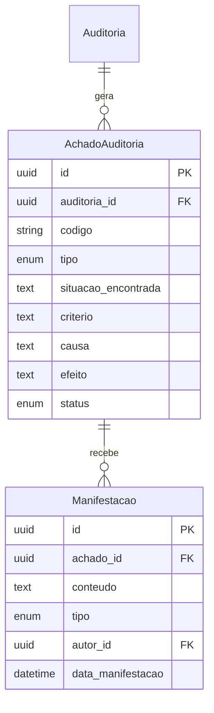
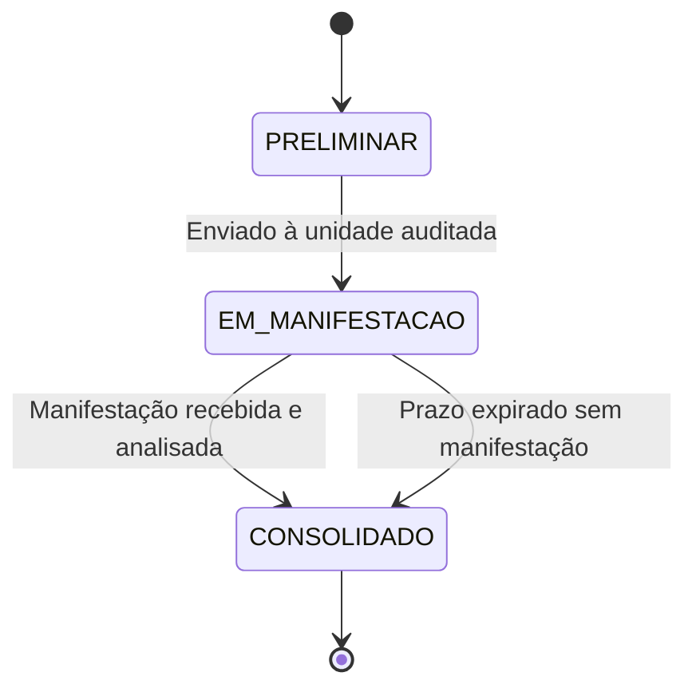

# CONFORMITAS (SGI)
## MOD-ACH-001 — Achados e Resultados

**Versão:** 1.0
**Data:** 16/06/2026
**Autor:** Gerado por IA
**Status:** Rascunho

---

## 1. IDENTIFICAÇÃO DO MÓDULO

| Campo | Valor |
|-------|-------|
| **ID do Módulo** | MOD-ACH-001 |
| **Nome do Módulo** | Achados e Resultados |
| **Domínio Funcional** | Achados e Resultados |
| **Prioridade** | Must |
| **Complexidade** | Alta |
| **Onda de Implementação** | 1 |
| **Dependências** | MOD-EXE-001 |
| **Estimativa (homem-dia)** | 10 dias |

---

## 2. OBJETIVO E CONTEXTO

### 2.1 Propósito do Módulo
Gerencia a identificação, documentação e qualificação dos achados de auditoria conforme a DIRAUD-Jud (CNJ 309/2020, arts. 46-49). Cada achado é estruturado nos quatro atributos essenciais (situação encontrada, critério, causa e efeito), podendo ser positivo (conformidade) ou negativo (não conformidade). O módulo também gerencia as manifestações da unidade auditada sobre os achados preliminares.

### 2.2 Alinhamento Estratégico
- **Objetivo Estratégico relacionado:** OE-03 — Garantir rastreabilidade integral do ciclo de auditoria
- **Macroprocesso atendido:** Gestão de Achados e Resultados
- **Capacidade de negócio viabilizada:** Execução Metodológica de Auditoria

### 2.3 Escopo do Módulo

#### Dentro do Escopo
- Identificação e registro de achados (positivos e negativos)
- Registro dos quatro atributos: situação, critério, causa e efeito
- Vinculação de achados às evidências do módulo de execução
- Manifestações da unidade auditada sobre achados preliminares
- Consolidação de achados para relatórios

#### Fora do Escopo
- Emissão de relatórios (MOD-REL-001)
- Recomendações e planos de ação (MOD-REL-001)

---

## 3. REQUISITOS FUNCIONAIS

### 3.1 Lista de Funcionalidades

| ID | Funcionalidade | Descrição | Prioridade | Status |
|----|---------------|-----------|------------|--------|
| RF-ACH-001 | Registro de Achado | Criar achado com situação, critério, causa e efeito | Must | Pendente |
| RF-ACH-002 | Vinculação a Evidências | Associar achado às evidências que o suportam | Must | Pendente |
| RF-ACH-003 | Classificação do Achado | Positivo (conformidade) ou Negativo (não conformidade) | Must | Pendente |
| RF-ACH-004 | Manifestação da Unidade Auditada | Registrar resposta do gestor sobre achado preliminar | Must | Pendente |
| RF-ACH-005 | Quadro de Achados | Visualização consolidada dos achados da auditoria | Must | Pendente |
| RF-ACH-006 | Revisão de Achados | Auditor responsável revisa e aprova achados da equipe | Should | Pendente |

### 3.2 Casos de Uso (Gherkin)

#### RF-ACH-001: Registro de Achado

**Cenário Principal:**
```gherkin
Dado que uma auditoria está em execução com evidências coletadas
Quando o auditor registra um achado informando situação, critério, causa e efeito
E vincula evidências de suporte
Então o achado é salvo com status "PRELIMINAR"
E aparece no quadro de achados da auditoria
```

**Cenário de Erro — Campos obrigatórios:**
```gherkin
Dado que o auditor tenta salvar um achado sem preencher o critério
Quando clica em "Salvar"
Então o sistema exibe erro "Critério é obrigatório para qualificar o achado"
```

#### RF-ACH-004: Manifestação da Unidade Auditada

**Cenário Principal:**
```gherkin
Dado que existe um achado preliminar enviado à unidade auditada
Quando o gestor da unidade auditada registra manifestação
Então o sistema vincula a manifestação ao achado
E notifica o auditor responsável
```

### 3.3 Regras de Negócio do Módulo

| ID | Regra | Descrição | Gatilho | Ação |
|----|-------|-----------|---------|------|
| RN-ACH-001 | Quatro atributos obrigatórios | Todo achado deve ter situação encontrada, critério, causa e efeito (art. 46) | Criação de achado | Validação de preenchimento |
| RN-ACH-002 | Manifestação incorporada | Esclarecimentos da unidade auditada devem ser incorporados como elemento do achado (art. 46, §5º) | Registro de manifestação | Vinculação automática |
| RN-ACH-003 | Prazo de manifestação | Prazo mínimo de 5 dias úteis para manifestação da unidade auditada (art. 54, §3º) | Envio de achado preliminar | Cálculo automático de prazo |

---

## 4. MODELO DE DADOS DO MÓDULO

### 4.1 Entidades Principais

#### AchadoAuditoria
| Campo | Tipo | Obrigatório | Descrição | Restrições |
|-------|------|-------------|-----------|------------|
| `id` | UUID | Sim | Identificador único | PK |
| `auditoria_id` | UUID | Sim | Auditoria associada | FK → Auditoria |
| `codigo` | String | Sim | Código sequencial (ACH-001, ACH-002...) | — |
| `tipo` | Enum | Sim | POSITIVO, NEGATIVO | — |
| `situacao_encontrada` | Text | Sim | Descrição da situação (condição) | — |
| `criterio` | Text | Sim | Norma, padrão ou referência violada/atendida | — |
| `causa` | Text | Sim | Causa raiz da situação | — |
| `efeito` | Text | Sim | Consequência ou impacto | — |
| `status` | Enum | Sim | PRELIMINAR, EM_MANIFESTACAO, CONSOLIDADO | — |
| `evidencia_ids` | JSON | Não | IDs das evidências de suporte | — |
| `autor_id` | UUID | Sim | Auditor que identificou o achado | FK → Usuario |
| `created_at` | DateTime | Sim | Data de criação | Auto |
| `updated_at` | DateTime | Sim | Data de atualização | Auto |

#### Manifestacao
| Campo | Tipo | Obrigatório | Descrição | Restrições |
|-------|------|-------------|-----------|------------|
| `id` | UUID | Sim | Identificador único | PK |
| `achado_id` | UUID | Sim | Achado ao qual se refere | FK → AchadoAuditoria |
| `conteudo` | Text | Sim | Texto da manifestação | — |
| `tipo` | Enum | Sim | ESCLARECIMENTO, JUSTIFICATIVA, CONCORDANCIA, DISCORDANCIA | — |
| `autor_id` | UUID | Sim | Gestor da unidade auditada | FK → Usuario |
| `data_manifestacao` | DateTime | Sim | Data da manifestação | — |

### 4.2 Relacionamentos

| Entidade A | Cardinalidade | Entidade B | Descrição |
|------------|---------------|------------|-----------|
| Auditoria | 1:N | AchadoAuditoria | Uma auditoria gera vários achados |
| AchadoAuditoria | 1:N | Manifestacao | Um achado pode receber múltiplas manifestações |

### 4.3 Diagrama Entidade-Relacionamento (Módulo)



---

## 5. INTERFACES E INTERAÇÕES

### 5.1 APIs do Módulo

| Método | Endpoint | Descrição | Autenticação | Perfis Autorizados |
|--------|----------|-----------|-------------|---------------------|
| GET | `/api/v1/auditorias/{id}/achados` | Listar achados da auditoria | Bearer Token | Auditor, Auditor-Chefe |
| POST | `/api/v1/auditorias/{id}/achados` | Criar novo achado | Bearer Token | Auditor |
| PUT | `/api/v1/achados/{id}` | Editar achado | Bearer Token | Auditor |
| POST | `/api/v1/achados/{id}/manifestacoes` | Registrar manifestação | Bearer Token | Gestor Unidade Auditada |
| GET | `/api/v1/achados/{id}/manifestacoes` | Listar manifestações | Bearer Token | Auditor, Gestor |

### 5.2 Telas e Componentes de UI

| Tela / Componente | Descrição | Perfis com Acesso | Estados |
|--------------------|-----------|--------------------|---------|
| `QuadroAchados` | Tabela/kanban com achados e status | Auditor, Auditor-Chefe | Carregando, Vazio, Dados |
| `AchadoForm` | Formulário de registro com 4 campos textuais | Auditor | Carregando, Editando, Erro |
| `ManifestacaoForm` | Formulário para gestor responder a achado | Gestor Unidade Auditada | Carregando, Editando, Erro |

### 5.3 Integrações com Outros Módulos

| Módulo de Origem/Destino | Dado Compartilhado | Direção | Mecanismo |
|--------------------------|--------------------|---------|-----------|
| MOD-EXE-001 | Evidências para fundamentar achados | Entrada | API |
| MOD-REL-001 | Achados consolidados para relatórios | Saída | API |

---

## 6. WORKFLOWS E BPMN DO MÓDULO

### 6.1 Estados e Transições

**Entidade principal:** AchadoAuditoria



### 6.2 Regras de Transição

| Transição | Gatilho | Perfil Autorizado | Condições | Efeitos |
|-----------|---------|--------------------|-----------|---------|
| PRELIMINAR → EM_MANIFESTACAO | Envio para unidade auditada | Auditor | 4 atributos preenchidos | Prazo de resposta iniciado |
| EM_MANIFESTACAO → CONSOLIDADO | Manifestação recebida | Automático | Manifestação registrada | Achado consolidado com resposta |
| EM_MANIFESTACAO → CONSOLIDADO | Prazo expirado | Automático | Prazo de 5 dias úteis vencido | Achado consolidado com ressalva "sem manifestação" |

---

## 7. REQUISITOS NÃO FUNCIONAIS DO MÓDULO

| ID | Requisito | Descrição | Métrica Alvo |
|----|-----------|-----------|--------------|
| RNF-ACH-001 | Performance — Quadro | Carregamento do quadro de achados | p95 < 1s |
| RNF-ACH-002 | Segurança — Dados | Classificação dos dados do módulo | Restrito / Sigiloso |
| RNF-ACH-003 | Auditoria | Eventos logados: criação, alteração, envio, manifestação | Todos os eventos |

---

## 8. TESTES DO MÓDULO

### 8.1 Estratégia de Testes

| Camada | Tipo | Ferramenta | Cobertura Alvo |
|--------|------|------------|----------------|
| Backend — Services | Unitários | Jest | ≥ 80% |
| Backend — Controllers | Integração | Jest + Supertest | ≥ 70% |
| Frontend — Componentes | Unitários | Vitest + RTL | ≥ 80% |

### 8.2 Cenários de Teste Críticos

| ID | Cenário | Tipo | Descrição |
|----|---------|------|-----------|
| TST-ACH-001 | Registro de achado com 4 atributos | Unitário | Validar obrigatoriedade dos 4 campos |
| TST-ACH-002 | Fluxo de manifestação | E2E | Achado → envio → manifestação → consolidação |
| TST-ACH-003 | Consolidação por prazo expirado | Integração | Prazo de 5 dias vence, achado consolida automaticamente |

---

## 9. RISCOS E DEPENDÊNCIAS

### 9.1 Riscos

| ID | Risco | Probabilidade | Impacto | Mitigação |
|----|-------|---------------|---------|-----------|
| R-ACH-001 | Achados sem fundamentação adequada | Média | Alto | Validação de vínculo com evidências |

### 9.2 Dependências

| Dependência | Tipo | Impacto se Indisponível | Plano de Contingência |
|-------------|------|-------------------------|------------------------|
| MOD-EXE-001 | Bloqueante | Sem evidências, achados não têm fundamentação | — |

---

## 10. DEFINIÇÃO DE PRONTO (DoD) DO MÓDULO

- [ ] Todos os requisitos funcionais implementados e testados
- [ ] Cobertura de testes ≥ 80% (unitários), ≥ 70% (integração)
- [ ] Validação dos 4 atributos obrigatórios
- [ ] Workflow de manifestação com contagem de prazo
- [ ] Documentação de API atualizada (Swagger/OpenAPI)
- [ ] PR revisado e aprovado por QA Agent

---

## 11. CONTROLE DE VERSÃO

| Versão | Data | Autor | Alterações |
|--------|------|-------|------------|
| 1.0 | 16/06/2026 | IA | Versão inicial |
