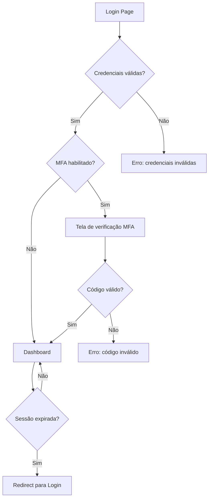

# CONFORMITAS (SGI)
## MOD-ADM-001 — Administração e Segurança

**Versão:** 1.1
**Data:** 16/06/2026
**Autor:** Gerado por IA / Revisado após Gate 1
**Status:** Rascunho

---

## 1. IDENTIFICAÇÃO DO MÓDULO

| Campo | Valor |
|-------|-------|
| **ID do Módulo** | MOD-ADM-001 |
| **Nome do Módulo** | Administração e Segurança |
| **Domínio Funcional** | Administração e Segurança |
| **Prioridade** | Must |
| **Complexidade** | Crítica |
| **Onda de Implementação** | 1 |
| **Dependências** | — |
| **Estimativa (homem-dia)** | 15 dias |

---

## 2. OBJETIVO E CONTEXTO

### 2.1 Propósito do Módulo
Gerencia os aspectos transversais de administração do sistema: cadastro de usuários, perfis de acesso (RBAC), autenticação, autorização, configurações gerais do sistema, logs de auditoria do sistema e trilhas de acesso. É o módulo fundacional — todos os demais dependem dele para controle de acesso e identificação de usuários.

### 2.2 Escopo do Módulo
- Cadastro e gestão de usuários (10 perfis — ver §2.2.1)
- Autenticação (login, senha, MFA) com JWT
- Autorização RBAC por perfil × endpoint/recurso
- Gestão de mandatos do dirigente da AUDIN (CNJ 308, art. 6º)
- Configurações gerais do sistema (parâmetros, prazos, notificações)
- Logs de auditoria do sistema (eventos de segurança e acesso)
- Gestão de sessões, tokens e expiração
- Integração com SSO corporativo do TJCE (se disponível)

### 2.2.1 Matriz de Perfis de Acesso

| # | Perfil | Descrição | Base Normativa | Escopo |
|---|--------|-----------|----------------|--------|
| P01 | **Auditor-Chefe** | Titular da AUDIN. Supervisiona auditorias, aprova relatórios, submete PAA/PALP, gere qualidade | CNJ 308 art. 4-6; CNJ 309 art. 27-28 | Irrestrito na AUDIN |
| P02 | **Auditor** | Servidor em exercício na AUDIN. Executa auditorias, registra evidências, achados e papéis de trabalho | CNJ 309 art. 29, 47 | Auditorias designadas |
| P03 | **Presidente** | Presidente do TJCE. Aprova PAA/PALP, recebe comunicações de obstrução e fraudes | CNJ 308 art. 4º, II | Leitura estratégica + aprovações |
| P04 | **Órgão Colegiado** | Órgão colegiado competente. Recebe e delibera sobre relatório anual da AUDIN | CNJ 308 art. 4º, I; art. 5º | Leitura do relatório anual |
| P05 | **Gestor de Unidade Auditada** | Gestor de unidade da 1ª linha. Recebe comunicados, manifesta-se sobre achados, implementa recomendações | CNJ 309 art. 46 §5º, 53-54 | Sua unidade |
| P06 | **Gestor de 2ª Linha** | Secretaria-Geral Administrativa / Núcleo de Controle Interno. Monitora implementação de recomendações, supervisiona conformidade | Lei 18.561/2023 art. 10-13 | Visão consolidada de recomendações |
| P07 | **Avaliador Externo** | Avaliador independente ou de outra AUDIN. Conduz avaliações externas do PQAUD | CNJ 309 art. 67 | Acesso temporário e restrito ao escopo da avaliação |
| P08 | **Comitê SIAUD-Jud** | Membro do Comitê de Governança e Coordenação do SIAUD-Jud. Propõe ações coordenadas, diretrizes, notas técnicas | CNJ 308 art. 15-18 | Leitura de indicadores e relatórios |
| P09 | **CPA** | Membro da Comissão Permanente de Auditoria do CNJ. Aprova Ações Coordenadas, emite recomendações | CNJ 308 art. 13-14 | Leitura de relatórios de ações coordenadas |
| P10 | **Administrador do Sistema** | Responsável técnico pela plataforma. Gerencia usuários, perfis, configurações e logs do sistema | — | Acesso técnico (sem dados de auditoria) |

---

## 3. REQUISITOS FUNCIONAIS

| ID | Funcionalidade | Descrição | Prioridade |
|----|---------------|-----------|------------|
| RF-ADM-001 | Cadastro de Usuários | CRUD de usuários com dados funcionais (nome, email, matrícula, cargo, unidade, lotação) | Must |
| RF-ADM-002 | Gestão de Perfis | Criar/editar perfis com permissões granulares (recurso × ação). 10 perfis base | Must |
| RF-ADM-003 | Atribuição de Perfis | Vincular usuários a perfis, com escopo de unidade quando aplicável (ex: Gestor Unidade X) | Must |
| RF-ADM-004 | Autenticação | Login com senha + MFA (TOTP). Política de complexidade e expiração de senha | Must |
| RF-ADM-005 | Controle de Acesso (RBAC) | Middleware de autorização por perfil × endpoint. Bloquear acesso não autorizado | Must |
| RF-ADM-006 | Gestão de Mandatos | Registrar mandato do Auditor-Chefe (2 anos, até 2 reconduções, máx. 6 anos — CNJ 308 art. 6º) | Should |
| RF-ADM-007 | Gestão de Sessões | Controle de sessões ativas, expiração por inatividade, refresh token | Should |
| RF-ADM-008 | Configurações do Sistema | Parâmetros globais: prazos padrão manifestação (5 dias), meta horas capacitação (40h/ano), períodos PALP | Should |
| RF-ADM-009 | Log de Auditoria do Sistema | Registrar eventos: login/logout, CRUD de usuários, alterações de permissão, acessos a dados sigilosos | Must |
| RF-ADM-010 | Notificações do Sistema | Central de notificações: prazos, aprovações pendentes, alertas de vencimento | Should |
| RF-ADM-011 | Acesso Temporário | Conceder acesso temporário a Avaliador Externo com escopo e prazo definidos | Should |

---

## 4. REGRAS DE NEGÓCIO

| ID | Regra | Descrição |
|----|-------|-----------|
| RN-ADM-001 | Senhas fortes | Mínimo 8 caracteres, maiúscula, minúscula, número e símbolo. Expiração a cada 90 dias |
| RN-ADM-002 | Sessão expirável | Inatividade de 30 minutos encerra sessão. Refresh token válido por 8h |
| RN-ADM-003 | Segregação de funções | Usuário não pode ter simultaneamente: Auditor-Chefe + outro perfil; Auditor + Gestor da mesma unidade; Admin Sistema + qualquer perfil de negócio |
| RN-ADM-004 | Mandato do Auditor-Chefe | 2 anos, máximo 2 reconduções (6 anos total). Interstício de 1 ano para novo mandato. Destituição apenas por decisão colegiada (CNJ 308 art. 6º) |
| RN-ADM-005 | Vedação de designação | Não cadastrar/ativar como Auditor pessoas condenadas por TCE, punidas em PAD, ou condenadas por improbidade (CNJ 308 art. 7º) |
| RN-ADM-006 | Escopo do Gestor | Gestor de Unidade Auditada só acessa dados da sua própria unidade |
| RN-ADM-007 | Acesso Avaliador Externo | Acesso concedido por prazo determinado, apenas leitura, apenas ao escopo da avaliação |

---

## 5. MODELO DE DADOS DO MÓDULO

#### Usuario
| Campo | Tipo | Obrigatório | Descrição | Restrições |
|-------|------|-------------|-----------|------------|
| `id` | UUID | Sim | Identificador único | PK |
| `nome` | String | Sim | Nome completo | — |
| `email` | String | Sim | Email institucional | Unique |
| `matricula` | String | Não | Matrícula funcional | — |
| `cargo` | String | Não | Cargo/função | — |
| `unidade` | String | Não | Lotação | — |
| `senha_hash` | String | Sim | Hash da senha (bcrypt) | — |
| `mfa_enabled` | Boolean | Sim | MFA habilitado | Default false |
| `mfa_secret` | String | Não | Segredo TOTP | — |
| `ativo` | Boolean | Sim | Usuário ativo | Default true |
| `data_desativacao` | DateTime | Não | Data de desativação (vedações art. 7º) | — |
| `created_at` | DateTime | Sim | Data de criação | Auto |
| `updated_at` | DateTime | Sim | Data de atualização | Auto |

#### Perfil
| Campo | Tipo | Obrigatório | Descrição | Restrições |
|-------|------|-------------|-----------|------------|
| `id` | UUID | Sim | Identificador único | PK |
| `codigo` | String | Sim | Código curto | Unique (P01-P10) |
| `nome` | String | Sim | Nome do perfil | — |
| `descricao` | String | Sim | Descrição do perfil e base normativa | — |
| `permissoes` | JSON | Sim | Lista de permissões [{recurso, acoes[]}] | — |
| `nivel_acesso` | Enum | Sim | INTERNO, EXTERNO, TECNICO, PUBLICO | — |

#### UsuarioPerfil
| Campo | Tipo | Obrigatório | Descrição | Restrições |
|-------|------|-------------|-----------|------------|
| `id` | UUID | Sim | Identificador único | PK |
| `usuario_id` | UUID | Sim | Usuário | FK → Usuario |
| `perfil_id` | UUID | Sim | Perfil | FK → Perfil |
| `unidade_escopo` | String | Não | Escopo da unidade (para Gestores) | — |
| `data_inicio` | Date | Sim | Início da vigência | — |
| `data_fim` | Date | Não | Fim da vigência (acessos temporários) | — |
| `ativo` | Boolean | Sim | Vínculo ativo | Default true |

#### MandatoAuditorChefe
| Campo | Tipo | Obrigatório | Descrição | Restrições |
|-------|------|-------------|-----------|------------|
| `id` | UUID | Sim | Identificador único | PK |
| `usuario_id` | UUID | Sim | Auditor-Chefe | FK → Usuario |
| `numero_mandato` | Integer | Sim | 1º, 2º ou 3º mandato | 1-3 |
| `data_inicio` | Date | Sim | Início do mandato | — |
| `data_fim_prevista` | Date | Sim | Término previsto (2 anos) | — |
| `data_fim_real` | Date | Não | Término real (se destituição) | — |
| `ato_designacao` | String | Sim | Número do ato de designação | — |
| `status` | Enum | Sim | ATIVO, ENCERRADO, DESTITUIDO | — |

#### LogAuditoriaSistema
| Campo | Tipo | Obrigatório | Descrição | Restrições |
|-------|------|-------------|-----------|------------|
| `id` | UUID | Sim | Identificador único | PK |
| `usuario_id` | UUID | Não | Usuário (se autenticado) | FK → Usuario |
| `acao` | Enum | Sim | LOGIN, LOGOUT, CREATE, UPDATE, DELETE, ACCESS, EXPORT | — |
| `entidade_tipo` | String | Sim | Tipo da entidade afetada | — |
| `entidade_id` | UUID | Não | ID da entidade afetada | — |
| `detalhes` | JSON | Não | Detalhes da operação | — |
| `ip` | String | Sim | Endereço IP | — |
| `user_agent` | String | Não | User agent | — |
| `created_at` | DateTime | Sim | Timestamp | Auto |

#### ConfiguracaoSistema
| Campo | Tipo | Obrigatório | Descrição | Restrições |
|-------|------|-------------|-----------|------------|
| `chave` | String | Sim | Chave da configuração | PK |
| `valor` | String | Sim | Valor | — |
| `descricao` | String | Sim | Descrição | — |
| `editavel` | Boolean | Sim | Se pode ser alterada via UI | Default true |

### Configurações padrão do sistema

| Chave | Valor Padrão | Descrição |
|-------|-------------|-----------|
| `prazo_manifestacao_dias_uteis` | 5 | Prazo mínimo para manifestação da unidade auditada (CNJ 309 art. 54 §3º) |
| `meta_horas_capacitacao_ano` | 40 | Meta anual de horas de capacitação por auditor (CNJ 309 art. 72) |
| `periodo_palp_anos` | 4 | Período do PALP em anos (CNJ 309 art. 32) |
| `prazo_publicacao_dias_uteis` | 15 | Prazo para publicação de planos após aprovação (CNJ 309 art. 32 §2º) |
| `prazo_sessao_inatividade_min` | 30 | Minutos de inatividade para expiração de sessão |
| `prazo_comunicacao_fraude_tce_dias` | 60 | Dias sem resposta do superior para comunicação ao TCE (CNJ 309 art. 13) |
| `retencao_papeis_trabalho_anos` | 10 | Anos de retenção de papéis de trabalho (CNJ 309 art. 44) |

---

## 6. INTERFACES E INTERAÇÕES

### 6.1 APIs do Módulo

| Método | Endpoint | Descrição | Perfis Autorizados |
|--------|----------|-----------|---------------------|
| POST | `/api/v1/auth/login` | Login | Público |
| POST | `/api/v1/auth/refresh` | Refresh token | Autenticado |
| POST | `/api/v1/auth/logout` | Logout | Autenticado |
| GET | `/api/v1/usuarios` | Listar usuários | P10 |
| POST | `/api/v1/usuarios` | Criar usuário | P10 |
| PUT | `/api/v1/usuarios/{id}` | Editar usuário | P10 |
| GET | `/api/v1/perfis` | Listar perfis | P01, P10 |
| GET | `/api/v1/usuarios/{id}/perfis` | Perfis do usuário | P10 |
| POST | `/api/v1/usuarios/{id}/perfis` | Atribuir perfil | P10 |
| DELETE | `/api/v1/usuarios/{id}/perfis/{perfilId}` | Remover perfil | P10 |
| GET | `/api/v1/mandatos` | Listar mandatos | P01, P03, P04 |
| GET | `/api/v1/configuracoes` | Listar configurações | P10 |
| PUT | `/api/v1/configuracoes/{chave}` | Atualizar configuração | P10 |
| GET | `/api/v1/logs-sistema` | Consultar logs de auditoria | P01, P10 |
| GET | `/api/v1/me` | Dados do usuário logado | Autenticado |

### 6.2 Telas e Componentes de UI

| Tela / Componente | Descrição | Perfis com Acesso | Estados |
|--------------------|-----------|--------------------|---------|
| `LoginPage` | Tela de login com MFA | Público | Padrão, Erro, MFA |
| `UsuarioList` | Lista de usuários com busca e filtros | P10 | Carregando, Vazio, Dados, Erro |
| `UsuarioForm` | CRUD de usuário com dados funcionais e vedações | P10 | Carregando, Editando, Erro |
| `PerfilList` | Lista de perfis com matriz de permissões | P01, P10 | Carregando, Dados |
| `UsuarioPerfilForm` | Atribuição/remoção de perfis com escopo de unidade | P10 | Carregando, Editando, Erro |
| `MandatoList` | Histórico de mandatos do Auditor-Chefe | P01, P03, P04 | Carregando, Dados |
| `ConfiguracaoList` | Parâmetros do sistema editáveis | P10 | Carregando, Dados |
| `LogSistemaList` | Consulta de logs com filtros por período, usuário, ação | P01, P10 | Carregando, Vazio, Dados |

### 6.3 Fluxo de Autenticação

---

## 7. DEFINIÇÃO DE PRONTO (DoD) DO MÓDULO

- [ ] Todos os RFs implementados e testados
- [ ] Autenticação com JWT (access + refresh token)
- [ ] MFA via TOTP funcional
- [ ] RBAC com 10 perfis, middleware de autorização em todos os endpoints
- [ ] Gestão de mandatos do Auditor-Chefe com validação de regras (CNJ 308 art. 6º)
- [ ] Log de auditoria do sistema (eventos de segurança) com consulta
- [ ] Segregação de funções validada na atribuição de perfis
- [ ] Acesso temporário para Avaliador Externo
- [ ] Cobertura de testes ≥ 80% (unitários), ≥ 70% (integração)
- [ ] Security review específico aprovado (OWASP Top 10:2021)
- [ ] Testes de penetração em autenticação e autorização
- [ ] PR revisado e aprovado por QA Agent e Security Agent

---

## 8. CONTROLE DE VERSÃO

| Versão | Data | Autor | Alterações |
|--------|------|-------|------------|
| 1.0 | 16/06/2026 | IA | Versão inicial com 5 perfis |
| 1.1 | 16/06/2026 | IA (pós-Gate 1) | 10 perfis completos (P01-P10), gestão de mandatos, acesso temporário, configurações padrão, matriz de permissões, segregação de funções |
