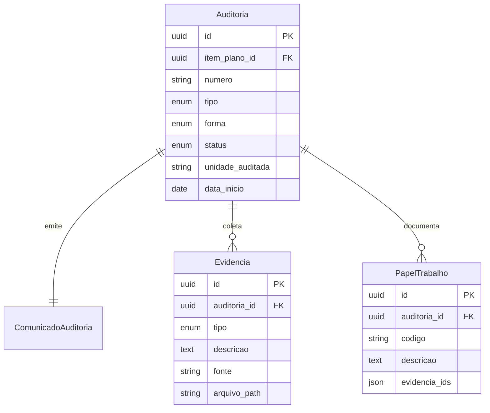
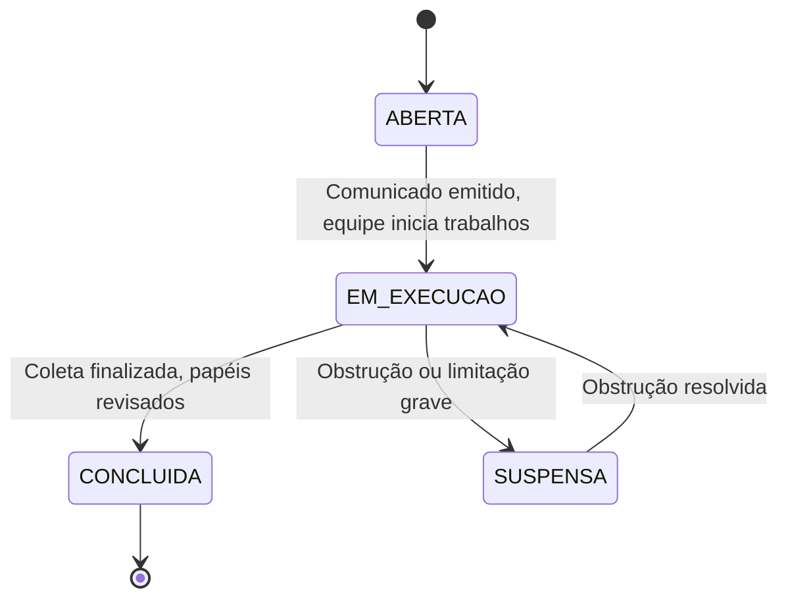

# CONFORMITAS (SGI)
## MOD-EXE-001 — Execução de Auditoria

**Versão:** 1.0
**Data:** 16/06/2026
**Autor:** Gerado por IA
**Status:** Rascunho

---

## 1. IDENTIFICAÇÃO DO MÓDULO

| Campo | Valor |
|-------|-------|
| **ID do Módulo** | MOD-EXE-001 |
| **Nome do Módulo** | Execução de Auditoria |
| **Domínio Funcional** | Execução |
| **Prioridade** | Must |
| **Complexidade** | Crítica |
| **Onda de Implementação** | 1 |
| **Dependências** | MOD-PLN-001, MOD-ADM-001 |
| **Estimativa (homem-dia)** | 20 dias |

---

## 2. OBJETIVO E CONTEXTO

### 2.1 Propósito do Módulo
Este módulo gerencia a execução propriamente dita das auditorias internas, do comunicado de abertura até a coleta de evidências e registro de papéis de trabalho, conforme a DIRAUD-Jud (CNJ 309/2020, Seção VII, arts. 45-50). O módulo suporta todos os tipos de auditoria (conformidade, operacional, financeira, gestão e especial) e todas as formas de execução (direta, integrada, indireta e terceirizada).

### 2.2 Alinhamento Estratégico
- **Objetivo Estratégico relacionado:** OE-03 — Garantir rastreabilidade integral do ciclo de auditoria
- **Macroprocesso atendido:** Execução de Auditorias
- **Capacidade de negócio viabilizada:** Execução Metodológica de Auditoria

### 2.3 Escopo do Módulo

#### Dentro do Escopo
- Abertura formal de auditoria com emissão de Comunicado de Auditoria (art. 30)
- Programa de Auditoria com testes e procedimentos (arts. 41-42)
- Registro de evidências e papéis de trabalho (arts. 43-44)
- Coleta de informações e requisições à unidade auditada
- Registro de acesso, obstruções e limitações
- Classificação por tipo (conformidade, operacional, financeira, gestão, especial)
- Classificação por forma (direta, integrada, indireta, terceirizada)

#### Fora do Escopo
- Identificação e documentação de achados (MOD-ACH-001)
- Emissão de relatórios (MOD-REL-001)

---

## 3. REQUISITOS FUNCIONAIS

### 3.1 Lista de Funcionalidades

| ID | Funcionalidade | Descrição | Prioridade | Status |
|----|---------------|-----------|------------|--------|
| RF-EXE-001 | Abertura de Auditoria | Criar auditoria a partir de item do PAA, emitir Comunicado | Must | Pendente |
| RF-EXE-002 | Programa de Auditoria | Registrar escopo, questões, testes, procedimentos e cronograma | Must | Pendente |
| RF-EXE-003 | Registro de Evidências | Upload e catalogação de documentos, planilhas e mídias | Must | Pendente |
| RF-EXE-004 | Papéis de Trabalho | Documentar verificações, testes, fontes de informação | Must | Pendente |
| RF-EXE-005 | Requisições Formais | Emitir requisições de documentos/informações à unidade auditada | Must | Pendente |
| RF-EXE-006 | Registro de Acessos e Obstruções | Registrar livre acesso, limitações ou obstruções | Must | Pendente |
| RF-EXE-007 | Matriz de Testes | Associar testes do programa às evidências coletadas | Should | Pendente |
| RF-EXE-008 | Cronograma de Execução | Acompanhar etapas, prazos e status da auditoria | Should | Pendente |

### 3.2 Casos de Uso (Gherkin)

#### RF-EXE-001: Abertura de Auditoria

**Cenário Principal:**
```gherkin
Dado que existe um PAA aprovado com itens de auditoria planejados
Quando o Auditor-Chefe aciona "Abrir Auditoria" em um item do plano
Então o sistema cria a auditoria com status "ABERTA"
E gera o Comunicado de Auditoria com objetivo, unidade auditada, equipe e fases
E notifica a unidade auditada
```

**Cenário de Erro — PAA não aprovado:**
```gherkin
Dado que o PAA está em rascunho
Quando o Auditor-Chefe tenta abrir uma auditoria
Então o sistema bloqueia com "PAA precisa estar aprovado para abertura de auditorias"
```

#### RF-EXE-003: Registro de Evidências

**Cenário Principal:**
```gherkin
Dado que uma auditoria está em execução
Quando o auditor faz upload de um documento como evidência
Então o sistema registra o arquivo com metadados (tipo, fonte, data, relevância)
E vincula a evidência ao teste/procedimento do programa de auditoria
```

### 3.3 Regras de Negócio do Módulo

| ID | Regra | Descrição | Gatilho | Ação |
|----|-------|-----------|---------|------|
| RN-EXE-001 | Auditoria vinculada ao PAA | Só é possível abrir auditoria para itens do PAA aprovado | Abertura de auditoria | Validação de vínculo |
| RN-EXE-002 | Registro de obstruções | Qualquer obstrução deve ser comunicada imediatamente ao Auditor-Chefe (art. 45, §2º) | Registro de obstrução | Notificação ao Auditor-Chefe |
| RN-EXE-003 | Prazo de guarda de papéis | Papéis de trabalho devem permanecer acessíveis por no mínimo 10 anos (art. 44) | — | Arquivamento automático |
| RN-EXE-004 | Requisições com prazo | Requisições à unidade auditada devem fixar prazo de resposta (art. 46, §4º) | Emissão de requisição | Campo prazo obrigatório |

---

## 4. MODELO DE DADOS DO MÓDULO

### 4.1 Entidades Principais

#### Auditoria
| Campo | Tipo | Obrigatório | Descrição | Restrições |
|-------|------|-------------|-----------|------------|
| `id` | UUID | Sim | Identificador único | PK |
| `item_plano_id` | UUID | Sim | Origem no PAA/PALP | FK → ItemPlano |
| `numero` | String | Sim | Número sequencial da auditoria | Unique, formato AUD-YYYY-NNN |
| `tipo` | Enum | Sim | CONFORMIDADE, OPERACIONAL, FINANCEIRA, GESTAO, ESPECIAL | — |
| `forma` | Enum | Sim | DIRETA, INTEGRADA, INDIRETA, TERCEIRIZADA | — |
| `status` | Enum | Sim | ABERTA, EM_EXECUCAO, SUSPENSA, CONCLUIDA | — |
| `unidade_auditada` | String | Sim | Unidade administrativa sob auditoria | — |
| `objetivo` | Text | Sim | Objetivo da auditoria | — |
| `escopo` | Text | Sim | Escopo detalhado | — |
| `data_inicio` | Date | Sim | Data de início | — |
| `data_fim_prevista` | Date | Não | Data prevista de conclusão | — |
| `data_fim_real` | Date | Não | Data real de conclusão | — |
| `created_at` | DateTime | Sim | Data de criação | Auto |
| `updated_at` | DateTime | Sim | Data de atualização | Auto |

#### ComunicadoAuditoria
| Campo | Tipo | Obrigatório | Descrição | Restrições |
|-------|------|-------------|-----------|------------|
| `id` | UUID | Sim | Identificador único | PK |
| `auditoria_id` | UUID | Sim | Auditoria associada | FK → Auditoria |
| `numero` | String | Sim | Número do comunicado | — |
| `data_emissao` | Date | Sim | Data de emissão | — |
| `conteudo` | Text | Sim | Texto do comunicado | — |
| `assinado_por` | UUID | Sim | Auditor-Chefe | FK → Usuario |

#### Evidencia
| Campo | Tipo | Obrigatório | Descrição | Restrições |
|-------|------|-------------|-----------|------------|
| `id` | UUID | Sim | Identificador único | PK |
| `auditoria_id` | UUID | Sim | Auditoria associada | FK → Auditoria |
| `tipo` | Enum | Sim | DOCUMENTO, PLANILHA, IMAGEM, EMAIL, SISTEMA, ENTREVISTA, OUTRO | — |
| `descricao` | Text | Sim | Descrição da evidência | — |
| `fonte` | String | Sim | Origem da evidência | — |
| `data_obtencao` | Date | Sim | Data de obtenção | — |
| `arquivo_path` | String | Não | Caminho do arquivo | — |
| `atributos` | JSON | Não | Atributos: autenticidade, confiabilidade, exatidão | — |
| `created_at` | DateTime | Sim | Data de criação | Auto |

#### PapelTrabalho
| Campo | Tipo | Obrigatório | Descrição | Restrições |
|-------|------|-------------|-----------|------------|
| `id` | UUID | Sim | Identificador único | PK |
| `auditoria_id` | UUID | Sim | Auditoria associada | FK → Auditoria |
| `codigo` | String | Sim | Código do papel de trabalho | — |
| `descricao` | Text | Sim | Metodologia, verificações e conclusões | — |
| `evidencia_ids` | JSON | Não | Evidências de suporte | — |
| `autor_id` | UUID | Sim | Auditor responsável | FK → Usuario |
| `created_at` | DateTime | Sim | Data de criação | Auto |

### 4.2 Relacionamentos

| Entidade A | Cardinalidade | Entidade B | Descrição |
|------------|---------------|------------|-----------|
| Auditoria | 1:1 | ComunicadoAuditoria | Cada auditoria emite um comunicado |
| Auditoria | 1:N | Evidencia | Evidências coletadas durante a auditoria |
| Auditoria | 1:N | PapelTrabalho | Papéis de trabalho da auditoria |
| Evidencia | N:M | PapelTrabalho | Evidências referenciadas nos papéis |

### 4.3 Diagrama Entidade-Relacionamento (Módulo)



---

## 5. INTERFACES E INTERAÇÕES

### 5.1 APIs do Módulo

| Método | Endpoint | Descrição | Autenticação | Perfis Autorizados |
|--------|----------|-----------|-------------|---------------------|
| GET | `/api/v1/auditorias` | Listar auditorias | Bearer Token | Auditor, Auditor-Chefe |
| POST | `/api/v1/auditorias` | Abrir nova auditoria | Bearer Token | Auditor-Chefe |
| GET | `/api/v1/auditorias/{id}` | Detalhes da auditoria | Bearer Token | Auditor, Auditor-Chefe |
| PUT | `/api/v1/auditorias/{id}` | Atualizar auditoria | Bearer Token | Auditor, Auditor-Chefe |
| POST | `/api/v1/auditorias/{id}/comunicado` | Emitir comunicado | Bearer Token | Auditor-Chefe |
| GET | `/api/v1/auditorias/{id}/evidencias` | Listar evidências | Bearer Token | Auditor, Auditor-Chefe |
| POST | `/api/v1/auditorias/{id}/evidencias` | Registrar evidência | Bearer Token | Auditor |
| GET | `/api/v1/auditorias/{id}/papeis-trabalho` | Listar papéis de trabalho | Bearer Token | Auditor |
| POST | `/api/v1/auditorias/{id}/papeis-trabalho` | Criar papel de trabalho | Bearer Token | Auditor |

### 5.2 Telas e Componentes de UI

| Tela / Componente | Descrição | Perfis com Acesso | Estados |
|--------------------|-----------|--------------------|---------|
| `AuditoriaList` | Lista de auditorias com filtros por status, tipo, ano | Auditor, Auditor-Chefe | Carregando, Vazio, Dados, Erro |
| `AuditoriaDetail` | Dashboard da auditoria com abas (programa, evidências, papéis) | Auditor, Auditor-Chefe | Carregando, Dados, Erro |
| `AuditoriaForm` | Formulário de abertura de auditoria com dados do PAA | Auditor-Chefe | Carregando, Editando, Erro |
| `ComunicadoForm` | Geração de Comunicado de Auditoria | Auditor-Chefe | Carregando, Visualizando, Erro |
| `EvidenciaUpload` | Upload e catalogação de evidências | Auditor | Carregando, Vazio, Upload, Erro |
| `PapelTrabalhoEditor` | Editor de papel de trabalho com referência a evidências | Auditor | Carregando, Editando, Erro |

### 5.3 Integrações com Outros Módulos

| Módulo de Origem/Destino | Dado Compartilhado | Direção | Mecanismo |
|--------------------------|--------------------|---------|-----------|
| MOD-PLN-001 | Item do PAA vira auditoria aberta | Entrada | Evento "abrir auditoria" |
| MOD-ACH-001 | Evidências e papéis alimentam achados | Saída | API |
| MOD-REL-001 | Dados da execução alimentam relatórios | Saída | API |

---

## 6. WORKFLOWS E BPMN DO MÓDULO

### 6.1 Estados e Transições

**Entidade principal:** Auditoria



### 6.2 Regras de Transição

| Transição | Gatilho | Perfil Autorizado | Condições | Efeitos |
|-----------|---------|--------------------|-----------|---------|
| ABERTA → EM_EXECUCAO | Início dos trabalhos | Auditor | Comunicado emitido | Status muda, data de início registrada |
| EM_EXECUCAO → CONCLUIDA | Conclusão da coleta | Auditor-Chefe | Papéis de trabalho revisados | Status muda, dados disponíveis para achados |
| EM_EXECUCAO → SUSPENSA | Obstrução grave | Auditor-Chefe | Justificativa documentada | Status muda, notificação ao Presidente |

---

## 7. REQUISITOS NÃO FUNCIONAIS DO MÓDULO

| ID | Requisito | Descrição | Métrica Alvo |
|----|-----------|-----------|--------------|
| RNF-EXE-001 | Performance — Upload | Upload de evidências | Até 25MB por arquivo, p95 < 3s |
| RNF-EXE-002 | Armazenamento | Guarda de papéis de trabalho | Retenção mínima 10 anos |
| RNF-EXE-003 | Segurança — Dados | Classificação dos dados do módulo | Restrito / Sigiloso |
| RNF-EXE-004 | Auditoria | Eventos logados: abertura, alterações, uploads, conclusão | Todos os eventos |

---

## 8. TESTES DO MÓDULO

### 8.1 Estratégia de Testes

| Camada | Tipo | Ferramenta | Cobertura Alvo |
|--------|------|------------|----------------|
| Backend — Services | Unitários | Jest | ≥ 80% |
| Backend — Controllers | Integração | Jest + Supertest | ≥ 70% |
| Frontend — Componentes | Unitários | Vitest + RTL | ≥ 80% |
| Fluxo de upload de evidências | E2E | Playwright | Cenário-chave |

### 8.2 Cenários de Teste Críticos

| ID | Cenário | Tipo | Descrição |
|----|---------|------|-----------|
| TST-EXE-001 | Abertura de auditoria a partir do PAA | E2E | Item do PAA → auditoria aberta com comunicado |
| TST-EXE-002 | Upload e vinculação de evidência | Integração | Upload de arquivo e vinculação a papel de trabalho |
| TST-EXE-003 | Registro de obstrução | Integração | Registrar obstrução e verificar notificação ao Auditor-Chefe |

---

## 9. RISCOS E DEPENDÊNCIAS

### 9.1 Riscos

| ID | Risco | Probabilidade | Impacto | Mitigação |
|----|-------|---------------|---------|-----------|
| R-EXE-001 | Grande volume de evidências pode sobrecarregar armazenamento | Média | Alto | Política de retenção e compressão |
| R-EXE-002 | Sigilo de documentos sensíveis | Alta | Crítico | Criptografia em repouso e em trânsito |

### 9.2 Dependências

| Dependência | Tipo | Impacto se Indisponível | Plano de Contingência |
|-------------|------|-------------------------|------------------------|
| MOD-PLN-001 | Bloqueante | Sem PAA aprovado, não há auditorias para abrir | — |
| Sistema de arquivos | Bloqueante | Upload de evidências não funciona | — |

---

## 10. DEFINIÇÃO DE PRONTO (DoD) DO MÓDULO

- [ ] Todos os requisitos funcionais implementados e testados
- [ ] Cobertura de testes ≥ 80% (unitários)
- [ ] Cobertura de testes de integração ≥ 70%
- [ ] Testes E2E para fluxos críticos passando
- [ ] Documentação de API atualizada (Swagger/OpenAPI)
- [ ] Upload de arquivos com validação de tipo e tamanho
- [ ] Security review aprovado (especial atenção a upload de arquivos)
- [ ] PR revisado e aprovado por QA Agent

---

## 11. CONTROLE DE VERSÃO

| Versão | Data | Autor | Alterações |
|--------|------|-------|------------|
| 1.0 | 16/06/2026 | IA | Versão inicial |
