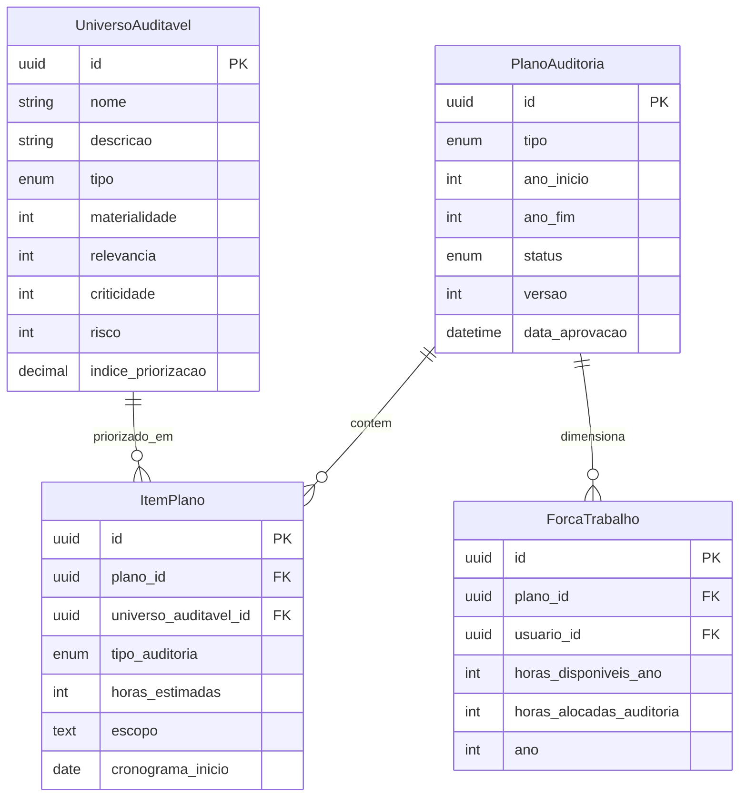
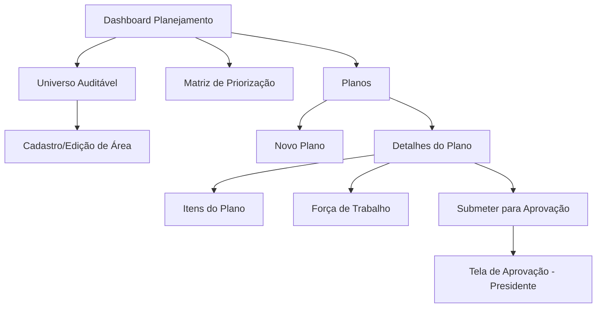
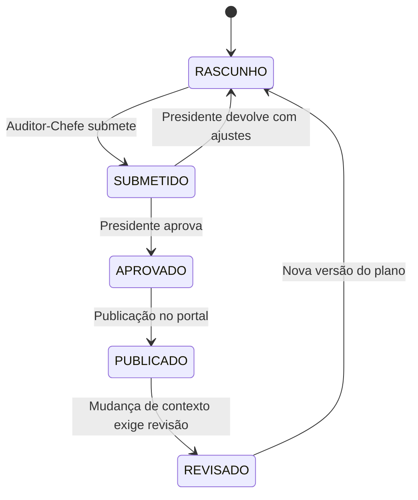

# CONFORMITAS (SGI)
## MOD-PLN-001 — Planejamento de Auditoria (PALP/PAA)

**Versão:** 1.0
**Data:** 16/06/2026
**Autor:** Gerado por IA
**Status:** Rascunho

---

## 1. IDENTIFICAÇÃO DO MÓDULO

| Campo | Valor |
|-------|-------|
| **ID do Módulo** | MOD-PLN-001 |
| **Nome do Módulo** | Planejamento de Auditoria (PALP/PAA) |
| **Domínio Funcional** | Planejamento |
| **Prioridade** | Must |
| **Complexidade** | Alta |
| **Onda de Implementação** | 1 |
| **Dependências** | MOD-ADM-001 |
| **Estimativa (homem-dia)** | 15 dias |

---

## 2. OBJETIVO E CONTEXTO

### 2.1 Propósito do Módulo
Este módulo gerencia o planejamento estratégico e operacional da atividade de auditoria interna da AUDIN/TJCE. Suporta a elaboração do Plano de Auditoria de Longo Prazo (PALP, quadrienal) e do Plano Anual de Auditoria (PAA), conforme exigido pela Resolução CNJ n.° 309/2020 (DIRAUD-Jud, arts. 31-41). O módulo implementa a metodologia de priorização baseada em riscos (materialidade, relevância, criticidade e risco) e o dimensionamento da força de trabalho, substituindo planilhas manuais por um fluxo estruturado e rastreável.

### 2.2 Alinhamento Estratégico
- **Objetivo Estratégico relacionado:** OE-02 — Automatizar o planejamento baseado em riscos (PALP e PAA)
- **Macroprocesso atendido:** Planejamento Estratégico e Operacional
- **Capacidade de negócio viabilizada:** Gestão da Carteira de Auditorias

### 2.3 Escopo do Módulo

#### Dentro do Escopo
- Cadastro do universo de processos/áreas auditáveis
- Elaboração, edição e versionamento do PALP (4 anos)
- Elaboração, edição e versionamento do PAA (anual)
- Matriz de priorização com critérios de materialidade, relevância, criticidade e risco
- Cálculo automatizado do índice de priorização
- Dimensionamento da força de trabalho disponível
- Distribuição de horas de auditoria por projeto
- Planejamento individual de cada auditoria (escopo, equipe, cronograma, questões de auditoria, testes)
- Aprovação e publicação dos planos (workflow de aprovação)
- Histórico de versões dos planos

#### Fora do Escopo
- Execução propriamente dita das auditorias (MOD-EXE-001)
- Elaboração do PAC-Aud (MOD-CAP-001)
- Gestão de riscos corporativos (MOD-RIS-001)

---

## 3. REQUISITOS FUNCIONAIS

### 3.1 Lista de Funcionalidades

| ID | Funcionalidade | Descrição | Prioridade | Status |
|----|---------------|-----------|------------|--------|
| RF-PLN-001 | Cadastro do Universo Auditável | Registrar áreas, processos e temas passíveis de auditoria | Must | Pendente |
| RF-PLN-002 | Matriz de Priorização | Calcular índice de priorização com base em materialidade, relevância, criticidade e risco | Must | Pendente |
| RF-PLN-003 | Elaboração do PALP | Criar e editar o Plano de Auditoria de Longo Prazo quadrienal | Must | Pendente |
| RF-PLN-004 | Elaboração do PAA | Criar e editar o Plano Anual de Auditoria | Must | Pendente |
| RF-PLN-005 | Dimensionamento de Força de Trabalho | Registrar horas disponíveis, distribuir entre auditorias | Must | Pendente |
| RF-PLN-006 | Planejamento Individual de Auditoria | Definir escopo, equipe, cronograma, questões e testes | Must | Pendente |
| RF-PLN-007 | Workflow de Aprovação | Submeter PAA/PALP ao Auditor-Chefe e Presidente para aprovação | Must | Pendente |
| RF-PLN-008 | Publicação e Transparência | Gerar versão publicável do plano para portal de transparência | Should | Pendente |

### 3.2 Casos de Uso (Gherkin)

#### RF-PLN-002: Matriz de Priorização

**Cenário Principal:**
```gherkin
Dado que o universo de processos auditáveis está cadastrado
E cada processo possui avaliação de materialidade, relevância, criticidade e risco
Quando o auditor solicita a geração da matriz de priorização
Então o sistema apresenta a lista ordenada por índice de priorização
E destaca os processos que devem compor o PAA conforme horas disponíveis
```

**Cenário Alternativo — Reprocessamento:**
```gherkin
Dado que os critérios de priorização de um processo foram alterados
Quando o auditor solicita recálculo da matriz
Então o sistema atualiza a posição do processo na matriz
E mantém log da alteração
```

**Cenário de Erro — Universo Vazio:**
```gherkin
Dado que não há processos cadastrados no universo auditável
Quando o auditor solicita a geração da matriz
Então o sistema exibe mensagem "Universo auditável vazio. Cadastre áreas/processos antes de gerar a matriz."
```

#### RF-PLN-005: Dimensionamento de Força de Trabalho

**Cenário Principal:**
```gherkin
Dado que a equipe da AUDIN está cadastrada com horas disponíveis por auditor
E há um PAA em elaboração
Quando o auditor acessa o painel de dimensionamento
Então o sistema exibe total de horas disponíveis vs. horas alocadas
E alerta se a alocação exceder a disponibilidade
```

### 3.3 Regras de Negócio do Módulo

| ID | Regra | Descrição | Gatilho | Ação |
|----|-------|-----------|---------|------|
| RN-PLN-001 | Prazo de submissão PAA | PAA deve ser submetido ao Presidente até 30/novembro de cada ano (art. 32, §1º, II DIRAUD-Jud) | Data do sistema | Alerta aos auditores a partir de 01/novembro |
| RN-PLN-002 | Prazo de submissão PALP | PALP deve ser submetido até 30/novembro de cada quadriênio | Data do sistema | Alerta no último ano do quadriênio |
| RN-PLN-003 | Prazo de publicação | Planos devem ser publicados até o 15º dia útil de dezembro (art. 32, §2º) | Aprovação do plano | Alerta de prazo de publicação |
| RN-PLN-004 | Indisponibilidade de horas | Não é permitido aprovar PAA com horas alocadas > horas disponíveis | Tentativa de aprovação | Bloqueio com mensagem explicativa |
| RN-PLN-005 | Flexibilidade do planejamento | Mudanças no contexto organizacional podem exigir revisão do PAA (art. 34, §4º) | Solicitação de revisão | Versionamento do plano com justificativa |

---

## 4. MODELO DE DADOS DO MÓDULO

### 4.1 Entidades Principais

#### UniversoAuditavel
| Campo | Tipo | Obrigatório | Descrição | Restrições |
|-------|------|-------------|-----------|------------|
| `id` | UUID | Sim | Identificador único | PK |
| `nome` | String | Sim | Nome da área/processo/tema | Unique |
| `descricao` | String | Não | Descrição do objeto auditável | — |
| `tipo` | Enum | Sim | AREA, PROCESSO, TEMA, PROJETO | — |
| `unidade_responsavel` | String | Não | Unidade administrativa responsável | — |
| `materialidade` | Integer | Não | Nota de 1 a 5 | 1-5 |
| `relevancia` | Integer | Não | Nota de 1 a 5 | 1-5 |
| `criticidade` | Integer | Não | Nota de 1 a 5 | 1-5 |
| `risco` | Integer | Não | Nota de 1 a 5 | 1-5 |
| `indice_priorizacao` | Decimal | Não | Índice calculado | — |
| `ativo` | Boolean | Sim | Se está ativo no universo | Default true |
| `created_at` | DateTime | Sim | Data de criação | Auto |
| `updated_at` | DateTime | Sim | Data de atualização | Auto |

#### PlanoAuditoria (PALP/PAA)
| Campo | Tipo | Obrigatório | Descrição | Restrições |
|-------|------|-------------|-----------|------------|
| `id` | UUID | Sim | Identificador único | PK |
| `tipo` | Enum | Sim | PALP, PAA | — |
| `ano_inicio` | Integer | Sim | Ano de início do plano | — |
| `ano_fim` | Integer | Sim | Ano de término | — |
| `status` | Enum | Sim | RASCUNHO, SUBMETIDO, APROVADO, PUBLICADO, REVISADO | — |
| `versao` | Integer | Sim | Número da versão | Auto-increment |
| `data_submissao` | DateTime | Não | Quando foi submetido à aprovação | — |
| `data_aprovacao` | DateTime | Não | Quando foi aprovado | — |
| `data_publicacao` | DateTime | Não | Quando foi publicado | — |
| `criado_por` | UUID | Sim | Auditor que criou o plano | FK → Usuario |
| `created_at` | DateTime | Sim | Data de criação | Auto |
| `updated_at` | DateTime | Sim | Data de atualização | Auto |

#### ItemPlano
| Campo | Tipo | Obrigatório | Descrição | Restrições |
|-------|------|-------------|-----------|------------|
| `id` | UUID | Sim | Identificador único | PK |
| `plano_id` | UUID | Sim | Plano ao qual pertence | FK → PlanoAuditoria |
| `universo_auditavel_id` | UUID | Sim | Objeto auditável | FK → UniversoAuditavel |
| `tipo_auditoria` | Enum | Sim | CONFORMIDADE, OPERACIONAL, FINANCEIRA, GESTAO, ESPECIAL | — |
| `forma_execucao` | Enum | Sim | DIRETA, INTEGRADA, INDIRETA, TERCEIRIZADA | — |
| `horas_estimadas` | Integer | Sim | Horas estimadas para a auditoria | > 0 |
| `equipe_ids` | JSON | Não | IDs dos auditores designados | — |
| `escopo` | Text | Não | Descrição do escopo da auditoria | — |
| `objetivo` | Text | Não | Objetivo da auditoria | — |
| `resultados_esperados` | Text | Não | Resultados esperados | — |
| `questoes_auditoria` | JSON | Não | Lista de questões de auditoria | — |
| `testes_previstos` | JSON | Não | Testes e procedimentos de auditoria | — |
| `cronograma_inicio` | Date | Não | Data prevista de início | — |
| `cronograma_fim` | Date | Não | Data prevista de conclusão | — |
| `prioridade` | Integer | Sim | Ordem de prioridade na matriz | — |
| `created_at` | DateTime | Sim | Data de criação | Auto |
| `updated_at` | DateTime | Sim | Data de atualização | Auto |

#### ForcaTrabalho
| Campo | Tipo | Obrigatório | Descrição | Restrições |
|-------|------|-------------|-----------|------------|
| `id` | UUID | Sim | Identificador único | PK |
| `plano_id` | UUID | Sim | Plano associado | FK → PlanoAuditoria |
| `usuario_id` | UUID | Sim | Auditor | FK → Usuario |
| `horas_disponiveis_ano` | Integer | Sim | Total de horas disponíveis no ano | > 0 |
| `horas_alocadas_auditoria` | Integer | Sim | Horas alocadas em auditorias | — |
| `horas_alocadas_consultoria` | Integer | Sim | Horas alocadas em consultorias | — |
| `horas_alocadas_capacitacao` | Integer | Sim | Horas alocadas em capacitação | — |
| `ano` | Integer | Sim | Ano de referência | — |
| `created_at` | DateTime | Sim | Data de criação | Auto |
| `updated_at` | DateTime | Sim | Data de atualização | Auto |

### 4.2 Relacionamentos

| Entidade A | Cardinalidade | Entidade B | Descrição |
|------------|---------------|------------|-----------|
| PlanoAuditoria | 1:N | ItemPlano | Um plano contém vários itens de auditoria |
| UniversoAuditavel | 1:N | ItemPlano | Um objeto auditável pode aparecer em vários planos |
| PlanoAuditoria | 1:N | ForcaTrabalho | Um plano tem alocação de força de trabalho |

### 4.3 Diagrama Entidade-Relacionamento (Módulo)



---

## 5. INTERFACES E INTERAÇÕES

### 5.1 APIs do Módulo

| Método | Endpoint | Descrição | Autenticação | Perfis Autorizados |
|--------|----------|-----------|-------------|---------------------|
| GET | `/api/v1/universo-auditavel` | Listar universo auditável | Bearer Token | Auditor, Auditor-Chefe |
| POST | `/api/v1/universo-auditavel` | Cadastrar área/processo | Bearer Token | Auditor, Auditor-Chefe |
| PUT | `/api/v1/universo-auditavel/{id}` | Editar área/processo | Bearer Token | Auditor, Auditor-Chefe |
| GET | `/api/v1/planos` | Listar planos (PALP/PAA) | Bearer Token | Auditor, Auditor-Chefe |
| POST | `/api/v1/planos` | Criar novo plano | Bearer Token | Auditor-Chefe |
| PUT | `/api/v1/planos/{id}` | Editar plano | Bearer Token | Auditor-Chefe |
| POST | `/api/v1/planos/{id}/submeter` | Submeter para aprovação | Bearer Token | Auditor-Chefe |
| POST | `/api/v1/planos/{id}/aprovar` | Aprovar plano | Bearer Token | Presidente |
| GET | `/api/v1/planos/{id}/itens` | Listar itens do plano | Bearer Token | Auditor, Auditor-Chefe |
| POST | `/api/v1/planos/{id}/itens` | Adicionar item ao plano | Bearer Token | Auditor-Chefe |
| GET | `/api/v1/matriz-priorizacao` | Obter matriz de priorização | Bearer Token | Auditor, Auditor-Chefe |
| GET | `/api/v1/forca-trabalho` | Consultar força de trabalho | Bearer Token | Auditor-Chefe |

### 5.2 Telas e Componentes de UI

| Tela / Componente | Descrição | Perfis com Acesso | Estados |
|--------------------|-----------|--------------------|---------|
| `UniversoAuditavelList` | Lista de áreas/processos auditáveis com busca e filtros | Auditor, Auditor-Chefe | Carregando, Vazio, Dados, Erro |
| `UniversoAuditavelForm` | Formulário de cadastro/edição com notas de priorização | Auditor, Auditor-Chefe | Carregando, Editando, Erro |
| `MatrizPriorizacao` | Tabela ordenada com índice de priorização calculado | Auditor, Auditor-Chefe | Carregando, Vazio, Dados |
| `PlanoList` | Lista de planos (PALP e PAA) com status | Auditor, Auditor-Chefe | Carregando, Vazio, Dados, Erro |
| `PlanoForm` | Criação/edição de plano com abas (dados gerais, itens, força de trabalho) | Auditor-Chefe | Carregando, Editando, Erro |
| `PlanoAprovacao` | Tela de revisão e aprovação do plano | Presidente | Carregando, Pendente, Erro |
| `ForcaTrabalho` | Painel com gráfico de horas disponíveis vs. alocadas | Auditor-Chefe | Carregando, Dados, Erro |

### 5.3 Fluxos de Navegação



### 5.4 Integrações com Outros Módulos

| Módulo de Origem/Destino | Dado Compartilhado | Direção | Mecanismo |
|--------------------------|--------------------|---------|-----------|
| MOD-EXE-001 | Itens do plano se tornam auditorias em execução | Saída | Evento "plano aprovado" |
| MOD-CAP-001 | Horas alocadas em capacitação | Saída | API |
| MOD-ADM-001 | Cadastro de usuários (auditores) | Entrada | API |
| MOD-DSH-001 | Dados de execução do PAA para dashboards | Saída | API |

---

## 6. WORKFLOWS E BPMN DO MÓDULO

### 6.1 Estados e Transições

**Entidade principal:** PlanoAuditoria



### 6.2 Regras de Transição

| Transição | Gatilho | Perfil Autorizado | Condições | Efeitos |
|-----------|---------|--------------------|-----------|---------|
| RASCUNHO → SUBMETIDO | Botão "Submeter" | Auditor-Chefe | PAA com itens preenchidos e força de trabalho balanceada | Status muda, data de submissão registrada |
| SUBMETIDO → APROVADO | Botão "Aprovar" | Presidente | Revisão concluída | Status muda, data de aprovação registrada |
| SUBMETIDO → RASCUNHO | Botão "Devolver" | Presidente | Justificativa obrigatória | Status volta, notificação ao Auditor-Chefe |
| APROVADO → PUBLICADO | Botão "Publicar" | Auditor-Chefe | — | Versão publicável gerada |
| PUBLICADO → REVISADO | Botão "Revisar Plano" | Auditor-Chefe | Justificativa da mudança de contexto | Nova versão rascunho criada |

---

## 7. REQUISITOS NÃO FUNCIONAIS DO MÓDULO

| ID | Requisito | Descrição | Métrica Alvo |
|----|-----------|-----------|--------------|
| RNF-PLN-001 | Performance — Matriz | Tempo de cálculo da matriz de priorização | p95 < 2s |
| RNF-PLN-002 | Performance — Listagem | Tempo de resposta da listagem de planos | p95 < 500ms |
| RNF-PLN-003 | Disponibilidade | Uptime do módulo | 99.5% |
| RNF-PLN-004 | Segurança — Dados | Classificação dos dados do módulo | Restrito |
| RNF-PLN-005 | Auditoria | Eventos logados: criação/alteração de planos, submissão, aprovação, publicação | Todos os eventos de transição de status |

---

## 8. TESTES DO MÓDULO

### 8.1 Estratégia de Testes

| Camada | Tipo | Ferramenta | Cobertura Alvo |
|--------|------|------------|----------------|
| Backend — Services | Unitários | Jest | ≥ 80% |
| Backend — Controllers | Integração | Jest + Supertest | ≥ 70% |
| Frontend — Componentes | Unitários | Vitest + RTL | ≥ 80% |
| Fluxo crítico — Aprovação PAA | E2E | Playwright | Cenário-chave |

### 8.2 Cenários de Teste Críticos

| ID | Cenário | Tipo | Descrição |
|----|---------|------|-----------|
| TST-PLN-001 | Cálculo da matriz de priorização | Unitário | Validar fórmula do índice com dados de entrada conhecidos |
| TST-PLN-002 | Submissão e aprovação do PAA | E2E | Auditor-Chefe submete, Presidente aprova |
| TST-PLN-003 | Bloqueio por excesso de horas | Integração | Tentar aprovar plano com horas alocadas > disponíveis |
| TST-PLN-004 | Versionamento do plano | Integração | Criar revisão após plano publicado |

---

## 9. RISCOS E DEPENDÊNCIAS

### 9.1 Riscos

| ID | Risco | Probabilidade | Impacto | Mitigação |
|----|-------|---------------|---------|-----------|
| R-PLN-001 | Metodologia de priorização não validada pelos auditores | Média | Alto | Validar protótipo com equipe AUDIN antes da implementação |
| R-PLN-002 | Mudança nos critérios da DIRAUD-Jud | Baixa | Alto | Arquitetura flexível para parametrização |

### 9.2 Dependências

| Dependência | Tipo | Impacto se Indisponível | Plano de Contingência |
|-------------|------|-------------------------|------------------------|
| MOD-ADM-001 | Bloqueante | Sem usuários cadastrados, não há como atribuir equipe | Cadastro manual de usuários no banco |
| Dados do universo auditável | Bloqueante | Sem universo cadastrado, matriz não pode ser gerada | Importação de planilha de inventário |

---

## 10. DEFINIÇÃO DE PRONTO (DoD) DO MÓDULO

- [ ] Todos os requisitos funcionais implementados e testados
- [ ] Cobertura de testes ≥ 80% (unitários)
- [ ] Cobertura de testes de integração ≥ 70%
- [ ] Testes E2E para fluxos críticos passando
- [ ] Lint e type-check sem erros
- [ ] Documentação de API atualizada (Swagger/OpenAPI)
- [ ] Matriz de priorização validada com equipe AUDIN
- [ ] Security review aprovado
- [ ] Performance dentro das metas estabelecidas
- [ ] PR revisado e aprovado por QA Agent

---

## 11. REGISTRO DE DECISÕES DO MÓDULO

| Data | Decisão | Motivo | Impacto | Decidido por |
|------|---------|--------|---------|-------------|
| 16/06 | Índice de priorização: (Mat × Rev × Crit × Risco)^(1/4) | Metodologia PAA/PALP da AUDIN (2021) define 4 fatores | Fórmula implementada no backend | IA |

---

## 12. CONTROLE DE VERSÃO

| Versão | Data | Autor | Alterações |
|--------|------|-------|------------|
| 1.0 | 16/06/2026 | IA | Versão inicial gerada a partir da visão estratégica e documentos de ingestão |
