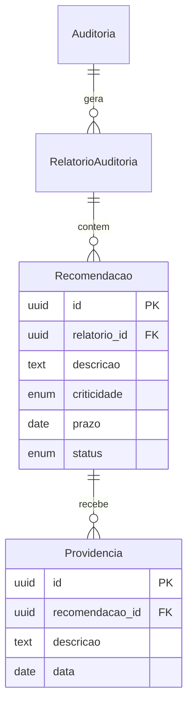
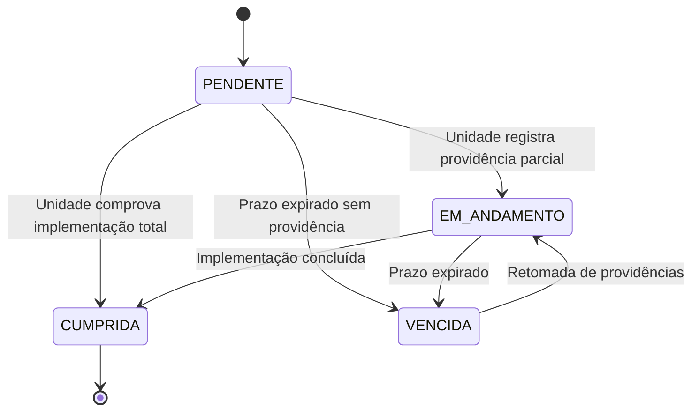

# CONFORMITAS (SGI)
## MOD-REL-001 — Relatórios e Monitoramento

**Versão:** 1.0
**Data:** 16/06/2026
**Autor:** Gerado por IA
**Status:** Rascunho

---

## 1. IDENTIFICAÇÃO DO MÓDULO

| Campo | Valor |
|-------|-------|
| **ID do Módulo** | MOD-REL-001 |
| **Nome do Módulo** | Relatórios e Monitoramento |
| **Domínio Funcional** | Relatórios e Monitoramento |
| **Prioridade** | Must |
| **Complexidade** | Alta |
| **Onda de Implementação** | 2 |
| **Dependências** | MOD-ACH-001, MOD-EXE-001 |
| **Estimativa (homem-dia)** | 12 dias |

---

## 2. OBJETIVO E CONTEXTO

### 2.1 Propósito do Módulo
Gerencia a emissão de relatórios de auditoria (preliminar e final) e o monitoramento da implementação de recomendações, conforme a DIRAUD-Jud (CNJ 309/2020, Seções VIII e IX, arts. 51-57). Inclui também a elaboração do Relatório Anual de Atividades da AUDIN para o órgão colegiado competente, conforme exigido pela CNJ 308/2020 (art. 5º).

### 2.2 Alinhamento Estratégico
- **Objetivo Estratégico relacionado:** OE-03 (Rastreabilidade), OE-05 (Transparência)
- **Macroprocesso atendido:** Monitoramento e Follow-up
- **Capacidade de negócio viabilizada:** Monitoramento de Recomendações

### 2.3 Escopo do Módulo

#### Dentro do Escopo
- Emissão de Relatório Preliminar com achados preliminares
- Emissão de Relatório Final com achados consolidados e recomendações
- Recomendações com prazos e responsáveis
- Acompanhamento da implementação de recomendações (follow-up)
- Registro de providências adotadas pelas unidades auditadas
- Relatório Anual de Atividades da AUDIN (art. 5º, CNJ 308)
- Alertas de prazos vencidos e escalonamento

#### Fora do Escopo
- Identificação de achados (MOD-ACH-001)
- Publicação de relatórios no portal (MOD-GOV-001)

---

## 3. REQUISITOS FUNCIONAIS

### 3.1 Lista de Funcionalidades

| ID | Funcionalidade | Descrição | Prioridade | Status |
|----|---------------|-----------|------------|--------|
| RF-REL-001 | Relatório Preliminar | Gerar relatório preliminar com achados para manifestação | Must | Pendente |
| RF-REL-002 | Relatório Final | Gerar relatório final com achados consolidados e recomendações | Must | Pendente |
| RF-REL-003 | Cadastro de Recomendações | Registrar recomendação com prazo, responsável e prioridade | Must | Pendente |
| RF-REL-004 | Monitoramento de Recomendações | Acompanhar status de cada recomendação (pendente, em andamento, cumprida, vencida) | Must | Pendente |
| RF-REL-005 | Providências da Unidade Auditada | Registrar ações tomadas em resposta a recomendações | Must | Pendente |
| RF-REL-006 | Relatório Anual de Atividades | Consolidar dados do exercício para relatório ao órgão colegiado | Must | Pendente |
| RF-REL-007 | Alertas de Prazo | Notificar auditores e gestores sobre prazos próximos ou vencidos | Should | Pendente |
| RF-REL-008 | Histórico de Follow-up | Registrar verificações de auditorias subsequentes | Should | Pendente |

### 3.2 Casos de Uso (Gherkin)

#### RF-REL-002: Relatório Final

**Cenário Principal:**
```gherkin
Dado que todos os achados da auditoria estão consolidados
E as manifestações da unidade auditada foram registradas
Quando o auditor responsável solicita a geração do Relatório Final
Então o sistema compila achados, manifestações e conclusões
E permite adicionar recomendações
E gera documento assinável
```

#### RF-REL-004: Monitoramento de Recomendações

**Cenário Principal:**
```gherkin
Dado que existem recomendações emitidas com prazos definidos
Quando o auditor acessa o painel de monitoramento
Então o sistema exibe recomendações agrupadas por status (pendente, vencida, cumprida)
E destaca em vermelho as vencidas
E permite registrar providências da unidade auditada
```

**Cenário Alternativo — Escalonamento:**
```gherkin
Dado que uma recomendação está vencida há mais de 30 dias
E a unidade auditada não registrou providências
Quando o sistema executa verificação diária
Então notifica o Auditor-Chefe para escalonamento ao Presidente
```

### 3.3 Regras de Negócio do Módulo

| ID | Regra | Descrição | Gatilho | Ação |
|----|-------|-----------|---------|------|
| RN-REL-001 | Relatório anual até julho | Relatório Anual deve ser encaminhado até final de julho do ano seguinte (art. 5º, §1º, CNJ 308) | Data do sistema | Alerta em junho |
| RN-REL-002 | Ausência de manifestação não obsta | Ausência de manifestação não impede emissão do Relatório Final (art. 54, §4º) | Emissão de relatório final | Bloco informativo "sem manifestação" |
| RN-REL-003 | Priorização de gravidade | Monitoramento deve priorizar correção de problemas graves (art. 57, §1º) | Emissão de recomendação | Campo criticidade obrigatório |
| RN-REL-004 | Verificação em auditorias subsequentes | Auditorias posteriores devem verificar recomendações anteriores (art. 57, §2º) | Abertura de nova auditoria na mesma área | Checklist de recomendações pendentes |

---

## 4. MODELO DE DADOS DO MÓDULO

### 4.1 Entidades Principais

#### RelatorioAuditoria
| Campo | Tipo | Obrigatório | Descrição | Restrições |
|-------|------|-------------|-----------|------------|
| `id` | UUID | Sim | Identificador único | PK |
| `auditoria_id` | UUID | Sim | Auditoria associada | FK → Auditoria |
| `tipo` | Enum | Sim | PRELIMINAR, FINAL | — |
| `conteudo` | Text | Sim | Conteúdo completo do relatório | — |
| `data_emissao` | Date | Sim | Data de emissão | — |
| `assinado_por` | UUID | Sim | Auditor-Chefe | FK → Usuario |
| `created_at` | DateTime | Sim | Data de criação | Auto |

#### Recomendacao
| Campo | Tipo | Obrigatório | Descrição | Restrições |
|-------|------|-------------|-----------|------------|
| `id` | UUID | Sim | Identificador único | PK |
| `relatorio_id` | UUID | Sim | Relatório que a originou | FK → RelatorioAuditoria |
| `achado_id` | UUID | Não | Achado relacionado | FK → AchadoAuditoria |
| `descricao` | Text | Sim | Texto da recomendação | — |
| `criticidade` | Enum | Sim | BAIXA, MEDIA, ALTA, CRITICA | — |
| `prazo` | Date | Sim | Data limite para implementação | — |
| `responsavel_id` | UUID | Sim | Gestor responsável | FK → Usuario |
| `status` | Enum | Sim | PENDENTE, EM_ANDAMENTO, CUMPRIDA, VENCIDA, CANCELADA | — |
| `created_at` | DateTime | Sim | Data de criação | Auto |
| `updated_at` | DateTime | Sim | Data de atualização | Auto |

#### Providencia
| Campo | Tipo | Obrigatório | Descrição | Restrições |
|-------|------|-------------|-----------|------------|
| `id` | UUID | Sim | Identificador único | PK |
| `recomendacao_id` | UUID | Sim | Recomendação associada | FK → Recomendacao |
| `descricao` | Text | Sim | Descrição da providência adotada | — |
| `data` | Date | Sim | Data da providência | — |
| `autor_id` | UUID | Sim | Quem registrou | FK → Usuario |
| `evidencia_path` | String | Não | Comprovante/documento | — |

#### RelatorioAnual
| Campo | Tipo | Obrigatório | Descrição | Restrições |
|-------|------|-------------|-----------|------------|
| `id` | UUID | Sim | Identificador único | PK |
| `ano` | Integer | Sim | Ano de referência | Unique |
| `conteudo` | Text | Sim | Conteúdo completo | — |
| `status` | Enum | Sim | RASCUNHO, ENVIADO, DELIBERADO, PUBLICADO | — |
| `data_envio` | Date | Não | Data de envio ao órgão colegiado | — |
| `data_publicacao` | Date | Não | Data de publicação na internet | — |

### 4.3 Diagrama Entidade-Relacionamento (Módulo)



---

## 5. INTERFACES E INTERAÇÕES

### 5.1 APIs do Módulo

| Método | Endpoint | Descrição | Autenticação | Perfis Autorizados |
|--------|----------|-----------|-------------|---------------------|
| POST | `/api/v1/auditorias/{id}/relatorios` | Gerar relatório | Bearer Token | Auditor, Auditor-Chefe |
| GET | `/api/v1/relatorios/{id}` | Obter relatório | Bearer Token | Auditor, Auditor-Chefe |
| POST | `/api/v1/relatorios/{id}/recomendacoes` | Adicionar recomendação | Bearer Token | Auditor-Chefe |
| GET | `/api/v1/recomendacoes` | Listar recomendações com filtros | Bearer Token | Auditor, Auditor-Chefe |
| PUT | `/api/v1/recomendacoes/{id}/status` | Atualizar status | Bearer Token | Gestor Unidade |
| POST | `/api/v1/recomendacoes/{id}/providencias` | Registrar providência | Bearer Token | Gestor Unidade |
| GET | `/api/v1/relatorios-anuais` | Listar relatórios anuais | Bearer Token | Auditor-Chefe |
| POST | `/api/v1/relatorios-anuais` | Criar relatório anual | Bearer Token | Auditor-Chefe |

### 5.2 Telas e Componentes de UI

| Tela / Componente | Descrição | Perfis com Acesso | Estados |
|--------------------|-----------|--------------------|---------|
| `PainelMonitoramento` | Dashboard com recomendações pendentes, vencidas, cumpridas | Auditor, Auditor-Chefe | Carregando, Vazio, Dados |
| `RecomendacaoList` | Lista de recomendações com filtros por status, criticidade, auditoria | Auditor, Gestor | Carregando, Vazio, Dados |
| `RelatorioForm` | Geração/visualização de relatório | Auditor, Auditor-Chefe | Carregando, Visualizando, Erro |
| `RelatorioAnualForm` | Elaboração do Relatório Anual de Atividades | Auditor-Chefe | Carregando, Editando, Erro |

---

## 6. WORKFLOWS E BPMN DO MÓDULO

### 6.1 Estados e Transições

**Entidade principal:** Recomendacao



---

## 7. REQUISITOS NÃO FUNCIONAIS DO MÓDULO

| ID | Requisito | Descrição | Métrica Alvo |
|----|-----------|-----------|--------------|
| RNF-REL-001 | Performance — Painel | Carregamento do painel de monitoramento | p95 < 2s |
| RNF-REL-002 | Segurança — Dados | Classificação dos dados | Restrito; Relatórios públicos após publicação |

---

## 8. TESTES DO MÓDULO

### 8.1 Estratégia de Testes

| Camada | Tipo | Ferramenta | Cobertura Alvo |
|--------|------|------------|----------------|
| Backend | Unitários/Integração | Jest | ≥ 80% / ≥ 70% |
| Frontend | Unitários | Vitest + RTL | ≥ 80% |

---

## 9. DEFINIÇÃO DE PRONTO (DoD) DO MÓDULO

- [ ] Todos os RFs implementados e testados
- [ ] Alertas de prazo funcionando
- [ ] Geração de relatórios em PDF
- [ ] Documentação de API atualizada
- [ ] PR revisado e aprovado

---

## 10. CONTROLE DE VERSÃO

| Versão | Data | Autor | Alterações |
|--------|------|-------|------------|
| 1.0 | 16/06/2026 | IA | Versão inicial |
