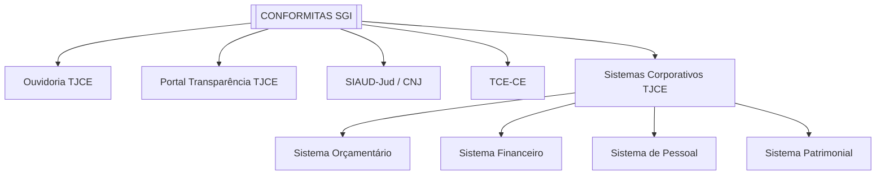

# CONFORMITAS (SGI) — CATÁLOGO DE INTEGRAÇÕES

**Versão:** 1.0 | **Data:** 16/06/2026 | **Responsável:** IA (Step 1)

---

## 1. INTRODUÇÃO

### 1.1 Objetivo do Documento
Este documento cataloga todos os sistemas externos e serviços com os quais o CONFORMITAS deverá se integrar, servindo como referência para arquitetura de integração, modelagem de contratos e planejamento de ondas de desenvolvimento.

### 1.2 Premissas
- As integrações devem respeitar padrões de segurança institucionais do TJCE
- Todos os contratos devem ser versionados e documentados em OpenAPI
- Ambientes de homologação devem estar disponíveis para testes
- Toda integração deve possuir timeout de 30s, retry (3 tentativas, backoff exponencial) e circuit breaker

---

## 2. VISÃO GERAL

### 2.1 Diagrama de Contexto

### 2.2 Resumo das Integrações

| ID | Sistema/Serviço | Tipo | Direção | Protocolo | Criticidade | Status |
|----|-----------------|------|---------|-----------|-------------|--------|
| INT-01 | Ouvidoria TJCE | API REST | Entrada | HTTPS/JSON | Alta | Planejada |
| INT-02 | Portal de Transparência TJCE | API REST | Saída | HTTPS/JSON | Alta | Planejada |
| INT-03 | SIAUD-Jud (Ações Coordenadas) | API REST | Bidirecional | HTTPS/JSON | Média | Planejada |
| INT-04 | TCE-CE (Comunicação) | API REST / SFTP | Saída | HTTPS/JSON | Média | Planejada |
| INT-05 | Sistema Orçamentário TJCE | API REST | Entrada | HTTPS/JSON | Baixa | Futura |
| INT-06 | Sistema Financeiro TJCE | API REST | Entrada | HTTPS/JSON | Baixa | Futura |
| INT-07 | Sistema de Pessoal TJCE | API REST | Entrada | HTTPS/JSON | Baixa | Futura |
| INT-08 | Sistema Patrimonial TJCE | API REST | Entrada | HTTPS/JSON | Baixa | Futura |
| INT-09 | SSO Corporativo TJCE | OAuth2/OIDC | Entrada | HTTPS | Baixa | Futura |

---

## 3. DETALHAMENTO POR INTEGRAÇÃO

### INT-01: Ouvidoria TJCE

| Campo | Valor |
|-------|-------|
| **Nome oficial** | Sistema de Ouvidoria do TJCE |
| **Finalidade** | Consumir denúncias e reclamações para subsidiar o planejamento de auditorias (CNJ 309 art. 34 §3º) |
| **Tipo** | API REST |
| **Direção** | Ouvidoria → CONFORMITAS |
| **Frequência** | Sincronização diária / sob demanda |
| **Criticidade** | Alta — planejamento baseado em riscos depende desta fonte |

**Endpoints esperados:**
| Método | Endpoint | Descrição |
|--------|----------|-----------|
| GET | `/api/v1/denuncias?data_inicio=&data_fim=&categoria=` | Listar denúncias por período e categoria |
| GET | `/api/v1/denuncias/{id}` | Detalhes de uma denúncia |

**Impacto da indisponibilidade:** Médio — planejamento pode operar sem esta fonte temporariamente.

---

### INT-02: Portal de Transparência TJCE

| Campo | Valor |
|-------|-------|
| **Nome oficial** | Portal de Transparência do TJCE |
| **Finalidade** | Publicar automaticamente PAA, PALP e Relatório Anual de Atividades (CNJ 308 art. 5º §3º; CNJ 309 art. 32 §2º) |
| **Tipo** | API REST |
| **Direção** | CONFORMITAS → Portal |
| **Frequência** | Sob demanda (acionada por evento de aprovação/publicação) |
| **Criticidade** | Alta — obrigação normativa de transparência |

**Endpoints esperados:**
| Método | Endpoint | Descrição |
|--------|----------|-----------|
| POST | `/api/v1/publicacoes` | Publicar documento com metadados e arquivo |

---

### INT-03: SIAUD-Jud — Ações Coordenadas

| Campo | Valor |
|-------|-------|
| **Nome oficial** | Sistema de Auditoria Interna do Poder Judiciário (SIAUD-Jud) |
| **Finalidade** | Receber Ações Coordenadas de Auditoria aprovadas pela CPA e reportar resultados (CNJ 308 art. 13-14) |
| **Tipo** | API REST / Webhook |
| **Direção** | Bidirecional |
| **Frequência** | Event-driven |
| **Criticidade** | Média — participação é obrigatória quando convocada |

**Endpoints esperados:**
| Método | Endpoint | Descrição |
|--------|----------|-----------|
| POST | `/api/v1/acoes-coordenadas` (webhook) | Receber nova ação coordenada |
| PUT | `/api/v1/acoes-coordenadas/{id}/resultado` | Reportar resultados à CPA |

---

### INT-04: TCE-CE

| Campo | Valor |
|-------|-------|
| **Nome oficial** | Tribunal de Contas do Estado do Ceará |
| **Finalidade** | Enviar comunicações de fraudes após 60 dias sem resposta do superior hierárquico (CNJ 309 art. 13); receber determinações |
| **Tipo** | API REST / SFTP |
| **Direção** | Bidirecional |
| **Criticidade** | Média |

---

### INT-05 a INT-08: Sistemas Corporativos TJCE

| ID | Sistema | Finalidade | Prioridade |
|----|---------|------------|------------|
| INT-05 | Orçamentário | Consultar execução orçamentária para auditorias financeiras | Futura |
| INT-06 | Financeiro | Consultar pagamentos e execução financeira | Futura |
| INT-07 | Pessoal | Consultar dados de RH, folha de pagamento | Futura |
| INT-08 | Patrimonial | Consultar bens e ativos | Futura |

Estas integrações são de prioridade **Baixa/Could** — dependem da disponibilidade de APIs nos sistemas de origem e podem ser implementadas em ondas futuras conforme necessidade.

---

### INT-09: SSO Corporativo TJCE

| Campo | Valor |
|-------|-------|
| **Nome oficial** | Single Sign-On do TJCE |
| **Finalidade** | Autenticação centralizada (futura) |
| **Tipo** | OAuth2 / OpenID Connect |
| **Criticidade** | Baixa — sistema opera com autenticação local inicialmente |

---

## 4. MATRIZ DE DEPENDÊNCIAS

| Integração | Depende de | Bloqueia | Onda |
|------------|------------|----------|------|
| INT-01 (Ouvidoria) | API disponível | — | 3 |
| INT-02 (Portal Transparência) | API disponível | — | 3 |
| INT-03 (SIAUD-Jud) | API SIAUD-Jud disponível | — | 3 |
| INT-04 (TCE) | — | — | 4 |
| INT-05 a 08 (Corporativos) | APIs dos sistemas de origem | — | 5+ |
| INT-09 (SSO) | Infraestrutura SSO TJCE | — | 5+ |

---

## 5. RISCOS DE INTEGRAÇÃO

| ID | Risco | Integração | Probabilidade | Impacto | Mitigação |
|----|-------|------------|---------------|---------|-----------|
| R-01 | API da Ouvidoria indisponível | INT-01 | Média | Médio | Operação manual do planejamento como fallback |
| R-02 | API do Portal de Transparência não existe | INT-02 | Alta | Alto | Publicação manual no portal como contingência |
| R-03 | SIAUD-Jud sem API padronizada | INT-03 | Alta | Médio | Cadastro manual de ações coordenadas |
| R-04 | Sistemas corporativos sem APIs | INT-05 a 08 | Alta | Baixo | Continuação de consultas manuais |
| R-05 | Expiração de certificado | Todas | Baixa | Crítico | Monitoramento de expiração, alerta 30 dias antes |

---

## 6. REQUISITOS NÃO FUNCIONAIS DE INTEGRAÇÃO

| ID | Requisito | Descrição |
|----|-----------|-----------|
| RNF-INT-01 | Timeout | Toda chamada externa: 30s |
| RNF-INT-02 | Retry | Backoff exponencial, 3 tentativas |
| RNF-INT-03 | Circuit Breaker | 5 falhas consecutivas → aberto por 60s |
| RNF-INT-04 | Logging | Request/response sem dados sensíveis |
| RNF-INT-05 | Idempotência | Idempotency-key em operações de escrita |
| RNF-INT-06 | Credenciais | Armazenadas em vault, nunca em logs/código |

---

## 7. CONTROLE DE VERSÃO

| Versão | Data | Autor | Alterações |
|--------|------|-------|------------|
| 1.0 | 16/06/2026 | IA (Step 1) | Versão inicial — 9 integrações catalogadas |
