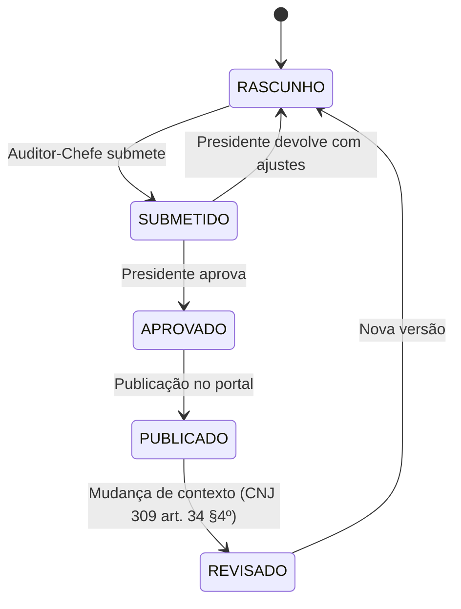
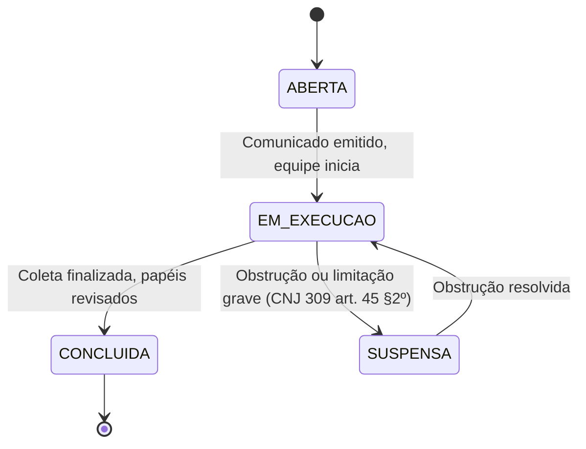
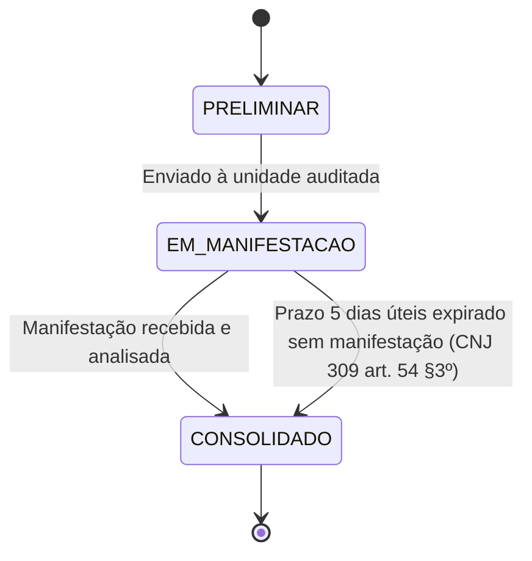
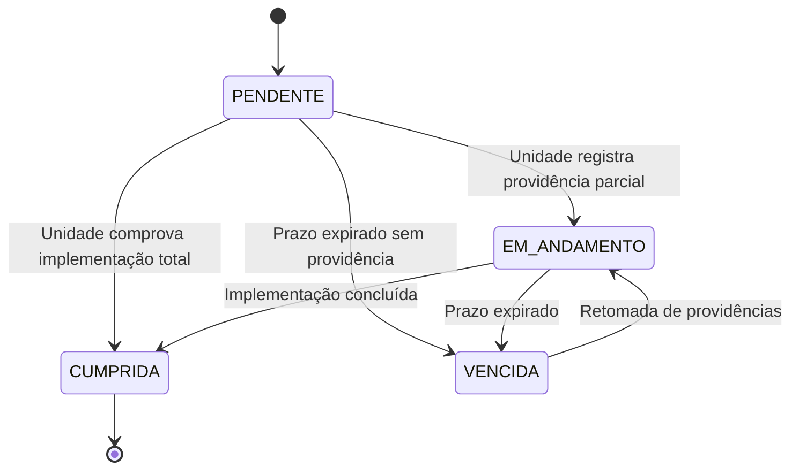
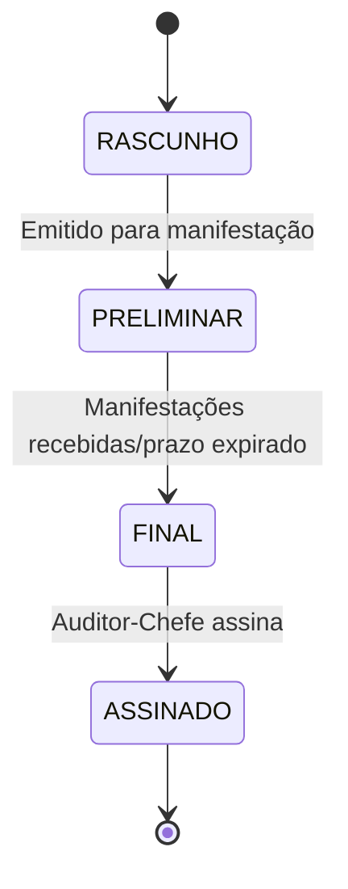
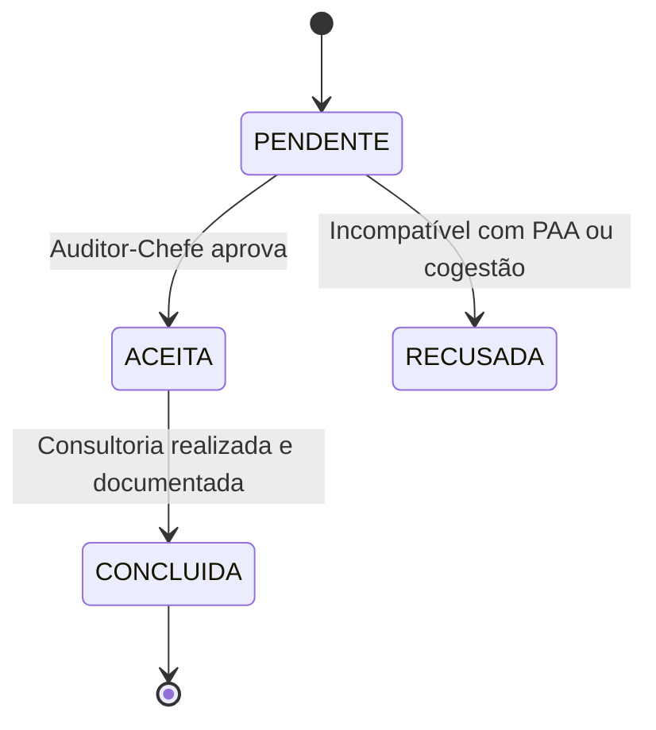
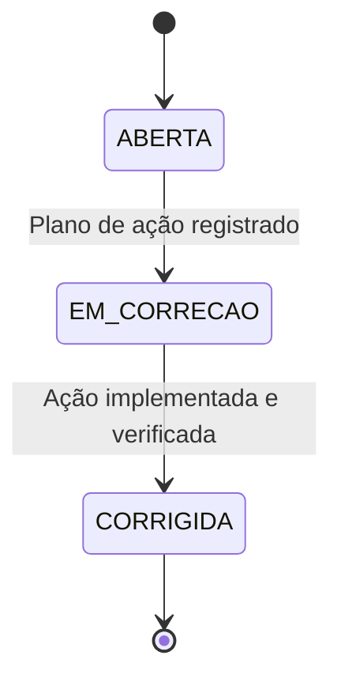
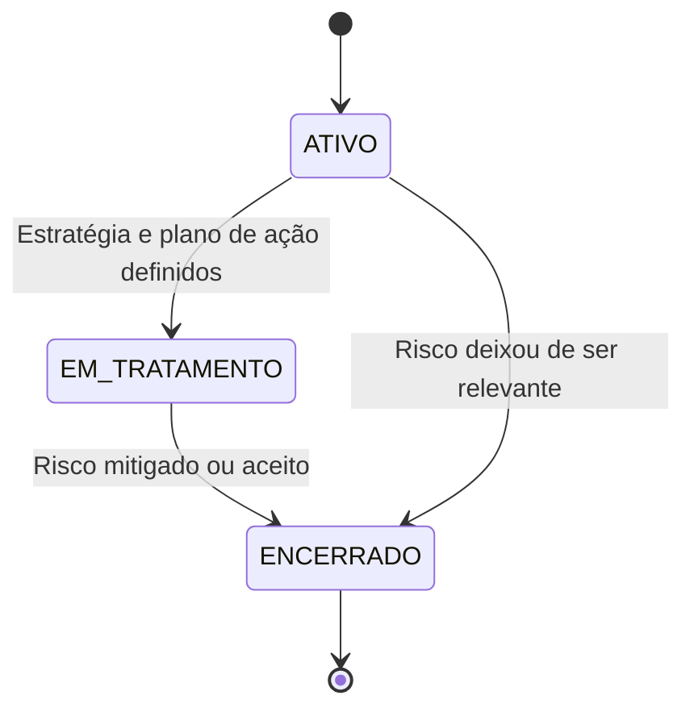
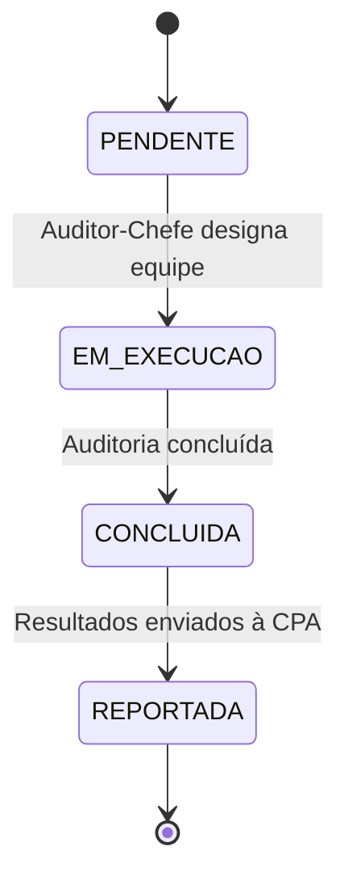
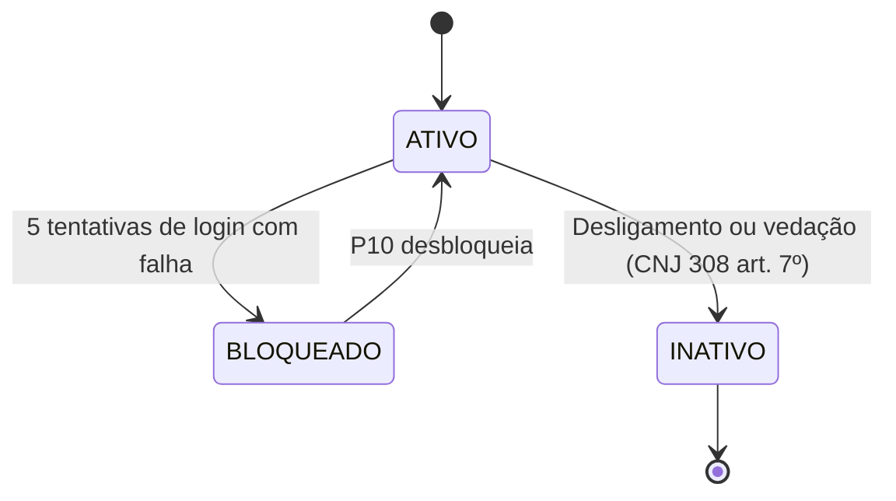

# CONFORMITAS (SGI) — WORKFLOWS E BPMN

**Versão:** 1.0 | **Data:** 16/06/2026 | **Responsável:** IA (Step 1)

---

## 1. Objetivo

Este documento especifica os workflows (diagramas de estado e transições) do CONFORMITAS, extraídos dos módulos validados no Step 0.5. Cada workflow representa o ciclo de vida de uma entidade central do sistema.

---

## 2. Workflows do Sistema

### WF-001: Ciclo de Vida do Plano de Auditoria (PALP/PAA)

**Entidade:** PlanoAuditoria  
**Módulo:** MOD-PLN-001

#### Diagrama de Estados

#### Tabela de Transições

| # | Origem | Evento | Destino | Perfil | Condições | Efeitos |
|---|--------|--------|---------|--------|-----------|---------|
| T1 | RASCUNHO | Submeter | SUBMETIDO | P01 | PAA com itens e força de trabalho balanceada | Data de submissão, notificação ao P03 |
| T2 | SUBMETIDO | Aprovar | APROVADO | P03 | Revisão concluída | Data de aprovação registrada |
| T3 | SUBMETIDO | Devolver | RASCUNHO | P03 | Justificativa obrigatória | Notificação ao P01 |
| T4 | APROVADO | Publicar | PUBLICADO | P01 | — | Versão publicável gerada, prazo de 15 dias úteis |
| T5 | PUBLICADO | Revisar | REVISADO | P01 | Justificativa da mudança de contexto | Nova versão rascunho criada |

---

### WF-002: Ciclo de Vida da Auditoria

**Entidade:** Auditoria  
**Módulo:** MOD-EXE-001

#### Diagrama de Estados

#### Tabela de Transições

| # | Origem | Evento | Destino | Perfil | Condições | Efeitos |
|---|--------|--------|---------|--------|-----------|---------|
| T1 | ABERTA | Iniciar trabalhos | EM_EXECUCAO | P02 | Comunicado emitido | Início registrado |
| T2 | EM_EXECUCAO | Concluir coleta | CONCLUIDA | P01 | Papéis de trabalho revisados | Dados disponíveis para achados |
| T3 | EM_EXECUCAO | Suspender | SUSPENSA | P01 | Justificativa documentada | Notificação ao P03 |
| T4 | SUSPENSA | Retomar | EM_EXECUCAO | P01 | Obstrução resolvida | — |

---

### WF-003: Ciclo de Vida do Achado de Auditoria

**Entidade:** AchadoAuditoria  
**Módulo:** MOD-ACH-001

#### Diagrama de Estados

#### Tabela de Transições

| # | Origem | Evento | Destino | Perfil | Condições | Efeitos |
|---|--------|--------|---------|--------|-----------|---------|
| T1 | PRELIMINAR | Enviar para manifestação | EM_MANIFESTACAO | P02 | 4 atributos preenchidos (CNJ 309 art. 46) | Prazo de 5 dias úteis iniciado, notificação ao P05 |
| T2 | EM_MANIFESTACAO | Registrar manifestação | CONSOLIDADO | P05 | Manifestação preenchida | Achado consolidado com resposta |
| T3 | EM_MANIFESTACAO | Prazo expirado | CONSOLIDADO | Sistema | 5 dias úteis sem manifestação | Achado consolidado com ressalva "sem manifestação" (CNJ 309 art. 54 §4º) |

---

### WF-004: Ciclo de Vida da Recomendação

**Entidade:** Recomendacao  
**Módulo:** MOD-REL-001

#### Diagrama de Estados

#### Tabela de Transições

| # | Origem | Evento | Destino | Perfil | Condições | Efeitos |
|---|--------|--------|---------|--------|-----------|---------|
| T1 | PENDENTE | Registrar providência parcial | EM_ANDAMENTO | P05 | Descrição e evidência | Status atualizado |
| T2 | PENDENTE | Comprovar implementação | CUMPRIDA | P05 | Evidência suficiente | — |
| T3 | PENDENTE | Prazo expirado | VENCIDA | Sistema | Data atual > prazo | Notificação a P01 e P06 |
| T4 | EM_ANDAMENTO | Concluir implementação | CUMPRIDA | P05 | Evidência validada | — |
| T5 | VENCIDA | Retomar providências | EM_ANDAMENTO | P05 | Novo plano registrado | Prazo renegociado |

---

### WF-005: Ciclo de Vida do Relatório de Auditoria

**Entidade:** RelatorioAuditoria  
**Módulo:** MOD-REL-001

#### Diagrama de Estados

#### Tabela de Transições

| # | Origem | Evento | Destino | Perfil | Condições | Efeitos |
|---|--------|--------|---------|--------|-----------|---------|
| T1 | RASCUNHO | Emitir preliminar | PRELIMINAR | P02 | Achados incluídos | Notificação ao P05 |
| T2 | PRELIMINAR | Consolidar final | FINAL | P02 | Manifestações registradas ou prazo expirado (CNJ 309 art. 54 §4º) | Recomendações incluídas |
| T3 | FINAL | Assinar | ASSINADO | P01 | Revisão concluída | Relatório final disponível |

---

### WF-006: Ciclo de Vida da Solicitação de Consultoria

**Entidade:** SolicitacaoConsultoria  
**Módulo:** MOD-CON-001

#### Diagrama de Estados

---

### WF-007: Ciclo de Vida da Não Conformidade (PQAUD)

**Entidade:** NaoConformidade  
**Módulo:** MOD-QLD-001

#### Diagrama de Estados

---

### WF-008: Ciclo de Vida do Risco (AUDIN)

**Entidade:** Risco  
**Módulo:** MOD-RIS-001

#### Diagrama de Estados

---

### WF-009: Ciclo de Vida da Ação Coordenada (SIAUD-Jud)

**Entidade:** AcaoCoordenada  
**Módulo:** MOD-INT-001

#### Diagrama de Estados

---

### WF-010: Ciclo de Vida do Usuário (Perfis)

**Entidade:** UsuarioPerfil  
**Módulo:** MOD-ADM-001

#### Diagrama de Estados

---

## 3. Requisitos de Transição (Workflow)

### RF-WF001-01: Submissão do PALP para Revisão

**Como** Auditor-Chefe, **Quero** submeter o PALP em rascunho para aprovação, **Para que** o Presidente possa revisar e aprovar.

- **Origem:** RASCUNHO → **Evento:** Submeter → **Destino:** SUBMETIDO
- **Condições:** Ao menos 1 item cadastrado no plano
- **Ações:** Notificar Presidente. Registrar log.

### RF-WF003-01: Validação Metodológica de Achado

**Como** Auditor, **Quero** registrar achado com os 4 atributos, **Para que** seja enviado à unidade auditada para manifestação.

- **Origem:** PRELIMINAR → **Evento:** Enviar → **Destino:** EM_MANIFESTACAO
- **Condições:** Situação, Critério, Causa e Efeito preenchidos
- **Ações:** Iniciar contagem de 5 dias úteis. Notificar P05.

### RF-WF004-01: Escalonamento de Recomendação Vencida

**Como** Sistema, **Quero** detectar recomendações vencidas há mais de 30 dias, **Para que** o Auditor-Chefe tome providências de escalonamento.

- **Condição:** Recomendação VENCIDA + 30 dias sem providência
- **Ação:** Notificar P01 para possível comunicação ao P03

### RF-GLB-001: Segregação de Funções na Aprovação

**Como** Sistema, **Quero** impedir que o criador de um objeto execute ações de aprovação/revisão sobre o mesmo, **Para que** a segregação de funções seja garantida.

- **Escopo:** Transições de "Aprovar" ou "Validar" nos workflows WF-001, WF-002, WF-005
- **Condição:** Usuário atual ≠ Criador do objeto
- **Ação ao violar:** Bloquear com mensagem "Ação negada: Violação de segregação de funções (RN-ADM-003)"

---

## 4. Resumo de Workflows

| WF | Entidade | Estados | Transições | Módulo |
|----|----------|---------|------------|--------|
| WF-001 | PlanoAuditoria | 5 | 5 | MOD-PLN-001 |
| WF-002 | Auditoria | 4 | 4 | MOD-EXE-001 |
| WF-003 | AchadoAuditoria | 3 | 3 | MOD-ACH-001 |
| WF-004 | Recomendacao | 5 | 5 | MOD-REL-001 |
| WF-005 | RelatorioAuditoria | 4 | 3 | MOD-REL-001 |
| WF-006 | SolicitacaoConsultoria | 4 | 3 | MOD-CON-001 |
| WF-007 | NaoConformidade | 3 | 2 | MOD-QLD-001 |
| WF-008 | Risco | 3 | 3 | MOD-RIS-001 |
| WF-009 | AcaoCoordenada | 4 | 3 | MOD-INT-001 |
| WF-010 | UsuarioPerfil | 3 | 3 | MOD-ADM-001 |
| **TOTAL** | | **38 estados** | **34 transições** | **10 módulos** |

---

## Histórico de Revisões

| Versão | Data | Autor | Descrição |
|--------|------|-------|-----------|
| 1.0 | 16/06/2026 | IA (Step 1) | Criação — 10 workflows com 38 estados e 34 transições |
