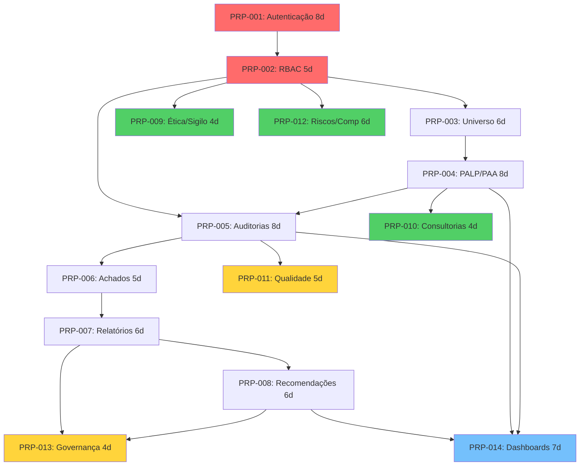

# Dependency Matrix — Matriz de Dependências de PRPs

> **Versão:** 1.0 | **Data:** 2026-06-16 | **Status:** Gerado (Step 4)
> **Projeto:** CONFORMITAS 3.0 | **Autor:** IA (Step 4)
> **Referências:** `docs/prps/PRP-*.md`

---

## 1. Visão Geral

### 1.1 Propósito
Esta matriz define quais PRPs podem ser executados em paralelo e quais são sequenciais, formando o plano de execução em 4 ondas. É a ponte entre os PRPs (Step 3) e as ondas de execução.

### 1.2 Principais Decisões

| Decisão | Justificativa | Impacto | Risco |
|---------|---------------|---------|-------|
| PRP-001 e PRP-002 são fundacionais (Onda 1) | Autenticação e RBAC são pré-requisito de todos os demais módulos | Bloqueia todo o resto | Se PRP-001 atrasar, todo o projeto atrasa |
| PRP-003 e PRP-009 rodam em paralelo com PRP-005 | Não dependem entre si, compartilham dependência em PRP-001+PRP-002 | Acelera Onda 1 | — |
| Backend antes de frontend em cada domínio | APIs precisam estar estáveis para o frontend consumir | Menos retrabalho | Mudanças de contrato de API podem quebrar UI |
| PRP-012 agrupa 3 módulos auxiliares | Baixa complexidade individual, sem dependências de execução | Economia de PRPs | Se um módulo atrasar, atrasa os outros 2 |

---

## 2. Inventário de PRPs

| PRP | ID | Nome | Onda | Estimativa (dias) | Complexidade | Prioridade | Status |
|-----|----|------|------|-------------------|--------------|------------|--------|
| PRP-001 | 001 | Autenticação e Usuários | 1 | 8 | Alta | Crítico | ⏳ |
| PRP-002 | 002 | Perfis, RBAC e Configurações | 1 | 5 | Média | Crítico | ⏳ |
| PRP-003 | 003 | Universo Auditável e Matriz | 1 | 6 | Média | Alto | ⏳ |
| PRP-004 | 004 | PALP, PAA e Força de Trabalho | 1 | 8 | Alta | Alto | ⏳ |
| PRP-005 | 005 | Auditorias, Evidências e Papéis | 1 | 8 | Alta | Crítico | ⏳ |
| PRP-006 | 006 | Achados e Manifestações | 1 | 5 | Média | Crítico | ⏳ |
| PRP-009 | 009 | Ética, Sigilo e Impedimentos | 1 | 4 | Baixa | Alto | ⏳ |
| PRP-007 | 007 | Relatórios de Auditoria | 2 | 6 | Média | Alto | ⏳ |
| PRP-008 | 008 | Recomendações e Monitoramento | 2 | 6 | Média | Alto | ⏳ |
| PRP-010 | 010 | Consultorias e Assessoramento | 2 | 4 | Baixa | Média | ⏳ |
| PRP-011 | 011 | Qualidade e PQAUD | 3 | 5 | Média | Média | ⏳ |
| PRP-012 | 012 | Riscos, Competências e Biblioteca | 3 | 6 | Média | Média | ⏳ |
| PRP-013 | 013 | Governança, Transparência e Fraudes | 3 | 4 | Baixa | Média | ⏳ |
| PRP-014 | 014 | Dashboards, BI e Integrações | 4 | 7 | Média | Média | ⏳ |

---

## 3. Matriz de Dependências

| PRP | Bloqueado por | Desbloqueia | Pode rodar em paralelo com |
|-----|---------------|-------------|---------------------------|
| PRP-001 | — | PRP-002 a PRP-014 | — (é o primeiro) |
| PRP-002 | PRP-001 | PRP-003 a PRP-014 | — |
| PRP-003 | PRP-001, PRP-002 | PRP-004 | PRP-005, PRP-009, PRP-012 |
| PRP-004 | PRP-001, PRP-002, PRP-003 | PRP-005, PRP-010, PRP-014 | — |
| PRP-005 | PRP-001, PRP-002, PRP-004 | PRP-006, PRP-011, PRP-014 | — |
| PRP-006 | PRP-001, PRP-002, PRP-005 | PRP-007 | — |
| PRP-007 | PRP-001, PRP-002, PRP-006 | PRP-008, PRP-013 | — |
| PRP-008 | PRP-001, PRP-002, PRP-007 | PRP-013, PRP-014 | PRP-011 |
| PRP-009 | PRP-001, PRP-002 | — | PRP-003, PRP-005, PRP-012 |
| PRP-010 | PRP-001, PRP-002, PRP-004 | — | PRP-007, PRP-008 |
| PRP-011 | PRP-001, PRP-002, PRP-005, PRP-007 | — | PRP-008, PRP-012 |
| PRP-012 | PRP-001, PRP-002 | — | PRP-003, PRP-009, PRP-011 |
| PRP-013 | PRP-001, PRP-002, PRP-007, PRP-008 | — | PRP-011, PRP-012 |
| PRP-014 | PRP-001, PRP-002, PRP-004, PRP-005, PRP-008 | — | — |

---

## 4. Caminho Crítico (Critical Path)

```
PRP-001 (8d) → PRP-002 (5d) → PRP-003 (6d) → PRP-004 (8d) → PRP-005 (8d) → PRP-006 (5d) → PRP-007 (6d) → PRP-008 (6d) → PRP-014 (7d)
```

**Duração do caminho crítico (sequencial): 59 dias**

---

## 5. Ondas de Execução

### Onda 1 (Fundação + Core) — 36 dias em paralelo, 15 dias úteis em time dedicado

PRP-001 e PRP-002 são sequenciais (8d + 5d = 13d base). Após PRP-002, PRP-003 + PRP-009 + PRP-005 rodam em paralelo (máx 8d). Após PRP-003, PRP-004 inicia. Após PRP-005, PRP-006 inicia. Com time de 3 devs, Onda 1 completa em aproximadamente 20-25 dias úteis.

### Resumo por Onda

| Onda | PRPs | Dias (sequencial) | Dias (paralelo — 3 devs) | Economia |
|------|------|-------------------|--------------------------|----------|
| 1 | PRP-001,002,003,004,005,006,009 | 44 | ~22 | 50% |
| 2 | PRP-007,008,010 | 16 | ~8 | 50% |
| 3 | PRP-011,012,013 | 15 | ~8 | 47% |
| 4 | PRP-014 | 7 | 7 | 0% |
| **Total** | **14 PRPs** | **74 dias (sequencial)** | **~45 dias (paralelo)** | **39%** |

---

## 6. Diagrama de Dependências


🔴=Crítico 🟢=Alto 🟡=Médio 🔵=Médio

---

**Versão:** 1.0 | **Data:** 2026-06-16
