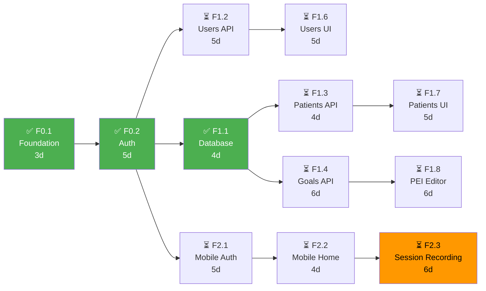
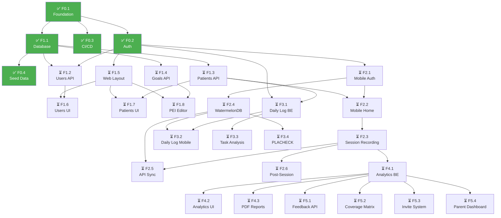

# Dependency Matrix — Matriz de Dependências de PRPs

> **Versão:** {X.Y} | **Data:** {YYYY-MM-DD} | **Status:** {Rascunho/Alinhado/Aprovado}
> **Projeto:** {Nome do Projeto} | **Sprint/Release:** {Número ou nome}
> **Autor:** {Tech Lead / EM} | **Revisores:** {PM, Tech Lead, DevOps}
> **Referências:** `{Development Plan}`, `{PRP-XXX}`

---

## 📋 Checklist Pré-Preenchimento

Antes de construir esta matriz, certifique-se de que:
- [ ] Todos os PRPs do período estão criados e revisados (`docs/prps/`)
- [ ] Cada PRP tem a seção "Dependências" (Bloqueado por / Desbloqueia) preenchida
- [ ] Capacidade do time está definida (quantos devs, quantas tarefas paralelas)
- [ ] Estimativas de cada PRP estão atualizadas (dias ou story points)
- [ ] Objetivo de negócio da release está claro (o que é MVP, o que é pós-MVP)

---

## 1. Visão Geral

### 1.1 Propósito
Esta matriz define **quais PRPs podem ser executados em paralelo** e **quais são sequenciais**, formando o **plano de execução** (ondas) da release. Ela é a ponte entre o planejamento estratégico (Roadmap) e o planejamento tático (Sprints).

> **Exemplo:** *"A matriz do NeuroHub organiza 35 PRPs em 6 ondas de execução, respeitando dependências técnicas (API antes de UI) e de negócio (Auth antes de qualquer módulo)."*

### 1.2 Principais Decisões desta Matriz

| Decisão | Justificativa | Impacto | Risco |
|---------|---------------|---------|-------|
| {Ex: Máximo 5 PRPs paralelos na Onda 2} | {Ex: Time tem 5 devs, 1 por PRP} | {Ex: Velocidade ótima sem overhead} | {Ex: Se 1 dev faltar, onda atrasa} |
| {Ex: Backend APIs antes de UIs} | {Ex: Contratos precisam estar estáveis} | {Ex: UI dev não fica bloqueado} | {Ex: API pode mudar e quebrar UI} |
| {Ex: Mobile sync após core backend} | {Ex: Sync depende de endpoints estáveis} | {Ex: Menos retrabalho no sync} | {Ex: Atraso no mobile se backend atrasar} |

---

## 2. Inventário de PRPs

> **Fonte da verdade:** `docs/prps/PRP-XXX.md` para cada PRP listado abaixo.

### 2.1 Legenda de Status

| Símbolo | Status | Definição | Quem altera |
|---------|--------|-----------|-------------|
| ✅ | Complete | DoD 100% atendido, mergeado | Tech Lead |
| 🔄 | In Progress | Dev iniciou, PR pode estar aberto | Dev Owner |
| ⏳ | Pending | Especificado, priorizado, não iniciado | PM |
| 🛑 | Blocked | Impedimento técnico ou de negócio | Tech Lead |
| ❌ | Cancelled | Removido do escopo | PM |

### 2.2 Tabela Master de PRPs

| PRP | ID | Nome | Fase | Estimativa (dias) | Complexidade | Valor Negócio | Status | Owner |
|-----|----|------|------|-------------------|--------------|---------------|--------|-------|
| F0.1 | PRP-001 | {Foundation} | Phase 0 | 3 | Baixa | Crítico | ✅ | Tech Lead |
| F0.2 | PRP-002 | {Auth} | Phase 0 | 5 | Média | Crítico | ✅ | Backend Dev |
| F0.3 | PRP-004 | {CI/CD} | Phase 0 | 3 | Baixa | Crítico | ✅ | DevOps |
| F0.4 | PRP-005 | {Seed Data} | Phase 0 | 2 | Baixa | Médio | ✅ | Backend Dev |
| F1.1 | PRP-003 | {Database} | Phase 0 | 4 | Alta | Crítico | ✅ | Tech Lead |
| F1.2 | PRP-006 | {Users CRUD API} | Phase 1 | 5 | Média | Alto | ⏳ | Backend Dev |
| F1.3 | PRP-007 | {Patients CRUD API} | Phase 1 | 4 | Média | Alto | ⏳ | Backend Dev |
| F1.4 | PRP-008 | {Goals/PEI CRUD API} | Phase 1 | 6 | Alta | Alto | ⏳ | Backend Dev |
| F1.5 | PRP-009 | {Web Dashboard Layout} | Phase 1 | 4 | Média | Alto | ⏳ | Frontend Dev |
| F1.6 | PRP-010 | {Users Management UI} | Phase 1 | 5 | Média | Alto | ⏳ | Frontend Dev |
| F1.7 | PRP-011 | {Patients Management UI} | Phase 1 | 5 | Média | Alto | ⏳ | Frontend Dev |
| F1.8 | PRP-012 | {PEI Editor UI} | Phase 1 | 6 | Alta | Alto | ⏳ | Frontend Dev |
| F2.1 | PRP-013 | {Mobile Auth & Sync} | Phase 2 | 5 | Média | Alto | ⏳ | Mobile Dev |
| F2.2 | PRP-014 | {Mobile Home Screen} | Phase 2 | 4 | Média | Alto | ⏳ | Mobile Dev |
| F2.3 | PRP-015 | {Session Recording} | Phase 2 | 6 | Alta | Crítico | ⏳ | Mobile Dev |
| F2.4 | PRP-016 | {WatermelonDB Schema} | Phase 2 | 3 | Alta | Alto | ⏳ | Mobile Dev |
| F2.5 | PRP-017 | {API Sync Endpoint} | Phase 2 | 5 | Alta | Alto | ⏳ | Backend Dev |
| F2.6 | PRP-018 | {Post-Session Summary} | Phase 2 | 4 | Média | Alto | ⏳ | Mobile Dev |
| F3.1 | PRP-019 | {Daily Log Backend} | Phase 3 | 4 | Média | Médio | ⏳ | Backend Dev |
| F3.2 | PRP-020 | {Daily Log Mobile} | Phase 3 | 4 | Média | Médio | ⏳ | Mobile Dev |
| F3.3 | PRP-021 | {Task Analysis} | Phase 3 | 5 | Média | Médio | ⏳ | Frontend Dev |
| F3.4 | PRP-022 | {PLACHECK Tool} | Phase 3 | 5 | Média | Médio | ⏳ | Mobile Dev |
| F4.1 | PRP-023 | {Analytics Aggregation} | Phase 4 | 5 | Alta | Alto | ⏳ | Backend Dev |
| F4.2 | PRP-024 | {Analytics Dashboard} | Phase 4 | 5 | Média | Alto | ⏳ | Frontend Dev |
| F4.3 | PRP-025 | {PDF Report Generation} | Phase 4 | 6 | Alta | Alto | ⏳ | Backend Dev |

**Resumo:**
- **Total PRPs:** {X} | **Complete:** {Y} | **In Progress:** {Z} | **Pending:** {W} | **Blocked:** {V}
- **Dias totais estimados:** {Soma das estimativas}
- **Dias totais em paralelo (ondas):** {Soma das durações das ondas}
- **Economia de paralelização:** {Dias sequenciais - Dias em ondas}

---

## 3. Critical Path (Caminho Crítico)

> **O caminho crítico é a sequência de PRPs que, se atrasada, atrasa toda a release.**
> **Identifique-o visualmente e quantifique-o.**

### 3.1 Diagrama do Caminho Crítico

### 3.2 Cálculo do Caminho Crítico

| Caminho | PRPs | Duração total | É crítico? |
|---------|------|---------------|-------------|
| F0.1 → F0.2 → F1.2 → F1.6 | 4 PRPs | 3+5+5+5 = **18 dias** | Sim |
| F0.1 → F0.2 → F1.1 → F1.3 → F1.7 | 5 PRPs | 3+5+4+4+5 = **21 dias** | **Sim (mais longo)** |
| F0.1 → F0.2 → F1.1 → F1.4 → F1.8 | 5 PRPs | 3+5+4+6+6 = **24 dias** | **Sim (mais longo)** |
| F0.1 → F0.2 → F2.1 → F2.2 → F2.3 | 5 PRPs | 3+5+5+4+6 = **23 dias** | Sim |
| F0.1 → F0.2 → F1.1 → F3.1 → F3.3 | 5 PRPs | 3+5+4+4+5 = **21 dias** | Não (paralelo) |

> **Caminho crítico identificado:** F0.1 → F0.2 → F1.1 → F1.4 → F1.8 = **24 dias**
> **Se F1.4 (Goals API) atrasar 2 dias, a release atrasa 2 dias.**

---

## 4. Ondas de Execução

> **Ondas são grupos de PRPs que podem rodar em paralelo.**
> **Regra:** PRPs na mesma onda NÃO podem depender um do outro.
> **Capacidade máxima por onda:** {Número de devs disponíveis} PRPs simultâneos.

### 4.1 Onda 1: {Nome da Onda}

| Atributo | Valor |
|----------|-------|
| **PRPs** | F0.2, F0.3, F0.4 |
| **Pré-condição** | F0.1 (Foundation) ✅ completo |
| **Paralelo máximo** | 3 PRPs |
| **Duração estimada** | 5 dias (determinado pelo PRP mais longo: F0.2 = 5d) |
| **Risco de dependência** | Baixo — PRPs são independentes entre si |
| **Status** | ✅ Completa |

**Justificativa de agrupamento:**
- F0.2 (Auth), F0.3 (CI/CD) e F0.4 (Seed Data) não dependem um do outro.
- Todos dependem apenas de F0.1 (Foundation), que já está completo.
- CI/CD (F0.3) é necessário para os PRPs seguintes, mas pode ser usado em paralelo com F0.2.

**Alocação do time:**
| PRP | Dev alocado | Dias estimados | Dias reais | Status |
|-----|-------------|----------------|------------|--------|
| F0.2 | Backend Senior | 5 | 5 | ✅ |
| F0.3 | DevOps | 3 | 2 | ✅ |
| F0.4 | Backend Pleno | 2 | 2 | ✅ |

### 4.2 Onda 2: {Nome da Onda}

| Atributo | Valor |
|----------|-------|
| **PRPs** | F1.2, F1.3, F1.4, F1.5, F2.1 |
| **Pré-condição** | F0.2 (Auth) ✅ + F1.1 (Database) ✅ |
| **Paralelo máximo** | 5 PRPs |
| **Duração estimada** | 6 dias (determinado pelo PRP mais longo: F1.4 = 6d) |
| **Risco de dependência** | Médio — F1.4 (Goals API) é complexo e pode atrasar F1.8 na próxima onda |
| **Status** | ✅ Completa |

**Justificativa de agrupamento:**
- F1.2, F1.3, F1.4 (APIs) dependem de F1.1 (Database) ✅ e F0.2 (Auth) ✅.
- F1.5 (Web Dashboard Layout) depende apenas de F0.2 (Auth) ✅ — pode rodar em paralelo.
- F2.1 (Mobile Auth) depende apenas de F0.2 (Auth) ✅ — pode rodar em paralelo.
- **Nenhum PRP desta onda depende de outro PRP desta mesma onda.**

**Alocação do time:**
| PRP | Dev alocado | Dias estimados | Dias reais | Status |
|-----|-------------|----------------|------------|--------|
| F1.2 | Backend Senior | 5 | 4 | ✅ |
| F1.3 | Backend Pleno | 4 | 4 | ✅ |
| F1.4 | Backend Senior | 6 | 6 | ✅ |
| F1.5 | Frontend Senior | 4 | 4 | ✅ |
| F2.1 | Mobile Pleno | 5 | 5 | ✅ |

### 4.3 Onda 3: {Nome da Onda}

| Atributo | Valor |
|----------|-------|
| **PRPs** | F1.6, F1.7, F1.8, F2.2, F2.4, F3.1 |
| **Pré-condição** | Onda 2 completa (F1.2, F1.3, F1.4, F1.5, F2.1 ✅) |
| **Paralelo máximo** | 6 PRPs |
| **Duração estimada** | 6 dias (F1.8 = 6d) |
| **Risco de dependência** | Médio — F1.8 depende de F1.4 (que foi longo na onda anterior) |
| **Status** | ✅ Completa |

**Justificativa de agrupamento:**
- F1.6 (Users UI) depende de F1.2 (Users API) ✅ + F1.5 (Layout) ✅.
- F1.7 (Patients UI) depende de F1.3 (Patients API) ✅ + F1.5 (Layout) ✅.
- F1.8 (PEI Editor) depende de F1.4 (Goals API) ✅ + F1.5 (Layout) ✅.
- F2.2 (Mobile Home) depende de F2.1 (Mobile Auth) ✅ + F1.3 (Patients API) ✅.
- F2.4 (WatermelonDB) depende de F2.1 (Mobile Auth) ✅.
- F3.1 (Daily Log Backend) depende de F1.3 (Patients API) ✅ + F0.2 (Auth) ✅.

### 4.4 Onda 4: {Nome da Onda}

| Atributo | Valor |
|----------|-------|
| **PRPs** | F2.3, F2.5, F2.6, F3.2, F3.3, F3.4 |
| **Pré-condição** | Dependências específicas (F2.2, F2.4, F3.1, F1.4 ✅) |
| **Paralelo máximo** | 6 PRPs |
| **Duração estimada** | 6 dias (F2.3 = 6d) |
| **Risco de dependência** | Alto — F2.3 (Session Recording) é core do mobile e complexo |
| **Status** | ✅ Completa |

### 4.5 Onda 5: {Nome da Onda}

| Atributo | Valor |
|----------|-------|
| **PRPs** | F4.1, F4.2, F4.3 |
| **Pré-condição** | F2.3 (Session Recording) ✅ — dados existem para analytics |
| **Paralelo máximo** | 3 PRPs |
| **Duração estimada** | 6 dias (F4.3 = 6d) |
| **Risco de dependência** | Baixo — F4.1 é backend, F4.2 é frontend, F4.3 é backend; independentes entre si |
| **Status** | ✅ Completa |

### 4.6 Onda 6: {Nome da Onda}

| Atributo | Valor |
|----------|-------|
| **PRPs** | F5.1, F5.2, F5.3, F5.4 |
| **Pré-condição** | Ondas 1-5 completas |
| **Paralelo máximo** | 4 PRPs |
| **Duração estimada** | 5 dias (F5.2 = 5d) |
| **Risco de dependência** | Baixo — todos dependem de infraestrutura já estabilizada |
| **Status** | ✅ Completa |

### 4.7 Resumo das Ondas

| Onda | PRPs | Pré-condição | Paralelo | Duração | Status | Risco Dominante |
|------|------|--------------|----------|---------|--------|-----------------|
| 1 | F0.2, F0.3, F0.4 | F0.1 ✅ | 3 | 5 dias | ✅ | Baixo |
| 2 | F1.2, F1.3, F1.4, F1.5, F2.1 | F0.2 ✅ + F1.1 ✅ | 5 | 6 dias | ✅ | Médio (F1.4 longo) |
| 3 | F1.6, F1.7, F1.8, F2.2, F2.4, F3.1 | Onda 2 ✅ | 6 | 6 dias | ✅ | Médio (F1.8 complexo) |
| 4 | F2.3, F2.5, F2.6, F3.2, F3.3, F3.4 | Específicas | 6 | 6 dias | ✅ | Alto (F2.3 core) |
| 5 | F4.1, F4.2, F4.3 | F2.3 ✅ | 3 | 6 dias | ✅ | Baixo |
| 6 | F5.1, F5.2, F5.3, F5.4 | Ondas 1-5 ✅ | 4 | 5 dias | ✅ | Baixo |

**Tempo total sequencial (sem paralelização):** {Soma de todas as estimativas} = ~{X} dias
**Tempo total com ondas:** {Soma das durações das ondas} = ~{Y} dias
**Economia de paralelização:** {X - Y} dias ({(X-Y)/X*100}% mais rápido)

---

## 5. Quick Dependencies (Tabela de Lookup)

> **Use esta tabela para responder rapidamente: "O que precisa estar pronto antes de eu começar o PRP X?"**

| PRP | Nome | Pode Começar Após (pré-requisitos) | Bloqueia (quem depende deste) | Onda |
|-----|------|-----------------------------------|------------------------------|------|
| F0.1 | Foundation | — (primeiro PRP) | F0.2, F0.3, F0.4 | — |
| F0.2 | Auth | F0.1 | F1.2, F1.5, F2.1, F3.1 | 1 |
| F0.3 | CI/CD | F0.1 | — (infraestrutura) | 1 |
| F0.4 | Seed Data | F1.1 | — | 1 |
| F1.1 | Database | F0.1 | F1.2, F1.3, F1.4, F0.4 | — |
| F1.2 | Users API | F0.2, F1.1 | F1.6 | 2 |
| F1.3 | Patients API | F1.1 | F1.7, F2.2, F3.1 | 2 |
| F1.4 | Goals API | F1.1 | F1.8 | 2 |
| F1.5 | Web Layout | F0.2 | F1.6, F1.7, F1.8 | 2 |
| F1.6 | Users UI | F1.2, F1.5 | — | 3 |
| F1.7 | Patients UI | F1.3, F1.5 | — | 3 |
| F1.8 | PEI Editor | F1.4, F1.5 | — | 3 |
| F2.1 | Mobile Auth | F0.2 | F2.2, F2.4 | 2 |
| F2.2 | Mobile Home | F2.1, F1.3 | F2.3 | 3 |
| F2.3 | Session Recording | F2.2 | F2.5, F2.6, F4.1 | 4 |
| F2.4 | WatermelonDB | F2.1 | F2.5, F3.2, F3.4 | 3 |
| F2.5 | API Sync | F2.3, F2.4 | — | 4 |
| F2.6 | Post-Session | F2.3 | — | 4 |
| F3.1 | Daily Log BE | F1.3, F0.2 | F3.2, F3.3 | 3 |
| F3.2 | Daily Log Mobile | F3.1, F2.4 | — | 4 |
| F3.3 | Task Analysis | F3.1 | — | 4 |
| F3.4 | PLACHECK | F2.4 | — | 4 |
| F4.1 | Analytics BE | F2.3 | F4.2, F4.3 | 5 |
| F4.2 | Analytics UI | F4.1 | — | 5 |
| F4.3 | PDF Reports | F4.1 | — | 5 |
| F5.1 | Feedback API | Ondas 1-5 | — | 6 |
| F5.2 | Coverage Matrix | Ondas 1-5 | — | 6 |
| F5.3 | Invite System | Ondas 1-5 | — | 6 |
| F5.4 | Parent Dashboard | Ondas 1-5 | — | 6 |

---

## 6. Grafo Completo de Dependências

> **Como ler:** Seta A → B significa "A deve estar completo antes de B começar". PRPs na mesma coluna vertical podem rodar em paralelo (se na mesma onda).

---

## 7. Riscos de Dependência

> **Riscos que podem quebrar o paralelismo ou atrasar o caminho crítico.**

| ID | Risco | Onda afetada | Probabilidade | Impacto | Mitigação | Owner |
|----|-------|--------------|---------------|---------|-----------|-------|
| DEP-01 | F1.4 (Goals API) atrasar e bloquear F1.8 (PEI Editor) | 3 | Média | Alto | {Ex: Reduzir escopo de F1.4 para MVP; separar LP/MP/CP em sub-PRPs} | Tech Lead |
| DEP-02 | F2.3 (Session Recording) complexo e atrasar F4.1 (Analytics) | 4-5 | Média | Alto | {Ex: Spike técnico de 1 dia antes de F2.3; prototipar timer/contadores} | Mobile Lead |
| DEP-03 | F2.4 (WatermelonDB) não performar com > 1k registros | 3-4 | Média | Alto | {Ex: Limitar cache inicial a 500 registros; testar sync em staging} | Mobile Lead |
| DEP-04 | F1.5 (Web Layout) mudar e quebrar UIs dependentes (F1.6, F1.7, F1.8) | 3 | Baixa | Médio | {Ex: Congelar Design System antes da Onda 2; tokens versionados} | UX Lead |
| DEP-05 | Dev alocado em F1.4 ficar indisponível | 2 | Baixa | Alto | {Ex: Backend Senior pode assumir; documentar contexto no PRP} | EM |
| DEP-06 | F2.5 (API Sync) conflitos de resolução imprevisíveis | 4 | Média | Médio | {Ex: Definir estratégia LWW antes de codar; testar com dados reais} | Tech Lead |

---

## 8. Capacidade do Time e Alocação

> **A matriz de dependências é teórica. A capacidade do time é o que determina o paralelismo real.**

### 8.1 Capacidade por Onda

| Onda | Devs disponíveis | FTE total | PRPs na onda | PRPs / Dev | Risco de sobrecarga |
|------|------------------|-----------|--------------|------------|---------------------|
| 1 | 3 | 3.0 | 3 | 1.0 | Baixo |
| 2 | 5 | 5.0 | 5 | 1.0 | Baixo |
| 3 | 6 | 5.5 | 6 | 1.1 | Médio (QA dividido) |
| 4 | 6 | 5.5 | 6 | 1.1 | Médio |
| 5 | 3 | 3.0 | 3 | 1.0 | Baixo |
| 6 | 4 | 4.0 | 4 | 1.0 | Baixo |

### 8.2 Alocação Detalhada

| Role | Pessoa | Foco nas Ondas | Capacidade máxima |
|------|--------|----------------|-------------------|
| Tech Lead | {Nome} | Review, arquitetura, unblock | 1 PRP crítico + review de todos |
| Backend Senior | {Nome} | 1, 2, 4, 5 | 1 PRP por onda |
| Backend Pleno | {Nome} | 2, 3, 4 | 1 PRP por onda |
| Frontend Senior | {Nome} | 2, 3, 4, 5 | 1 PRP por onda |
| Mobile Pleno | {Nome} | 2, 3, 4 | 1 PRP por onda |
| QA | {Nome} | 3, 4, 5, 6 (E2E) | 0.5 FTE — testa após dev entregar |
| UX Designer | {Nome} | 2 (Figma), 3 (review) | 0.5 FTE |

> **💡 Regra:** Nunca alocar 1 dev em 2 PRPs da mesma onda. Um PRP por dev por onda. Exceção: Tech Lead faz review enquanto codifica 1 PRP crítico.

---

## 9. Análise de Impacto de Atraso

> **"Se o PRP X atrasar Y dias, o que acontece?"**

| PRP | Dias de atraso simulado | Ondas afetadas | PRPs bloqueados | Impacto na release | Ação de contingência |
|-----|------------------------|----------------|-----------------|---------------------|----------------------|
| F1.4 | 2 dias | 3 | F1.8 | 2 dias | Reduzir F1.4 para MVP (sem lições aninhadas) |
| F2.3 | 3 dias | 5 | F4.1, F4.2, F4.3 | 3 dias | F4.1 usar dados mockados de sessão para não bloquear |
| F0.2 | 2 dias | 1, 2, 3 | F1.2, F1.5, F2.1, F3.1 | 2 dias | — (caminho crítico, não há como mitigar) |
| F2.4 | 2 dias | 4 | F2.5, F3.2, F3.4 | 0 dias | F2.5 e F3.2 podem usar SQLite puro temporariamente |

---

## 10. Revisão e Manutenção

### 10.1 Quando revisar esta matriz

| Evento | Ação | Responsável |
|--------|------|-------------|
| Início de cada sprint | Validar se onda atual está realista | Tech Lead |
| PRP atrasado > 1 dia | Reavaliar onda seguinte; identificar PRPs que podem começar antes | Tech Lead |
| Novo PRP adicionado | Inserir no grafo; recalcular caminho crítico | Tech Lead + PM |
| PRP removido/cancelado | Remover do grafo; ajustar ondas | PM |
| Mudança de capacidade do time (dev sai/entra) | Reduzir/aumentar paralelismo por onda | EM |
| Fim de cada release | Arquivar matriz; criar nova para próxima release | Tech Lead |

### 10.2 Log de Mudanças na Matriz

| Data | Mudança | Motivo | Impacto nas ondas | Quem decidiu |
|------|---------|--------|-------------------|--------------|
| {YYYY-MM-DD} | {Ex: F1.4 dividido em F1.4a e F1.4b} | {Ex: Escopo grande demais} | {Ex: Onda 2 aumentou de 5 para 6 PRPs, duração mantida} | {Tech Lead} |
| {YYYY-MM-DD} | {Ex: F3.2 movido da Onda 3 para Onda 4} | {Ex: F2.4 atrasou, F3.2 depende de F2.4} | {Ex: Onda 3 reduziu, Onda 4 aumentou} | {Tech Lead} |

---

## 📌 Revisões do Documento

| Versão | Data | Autor | Mudanças |
|--------|------|-------|----------|
| 0.1 | {YYYY-MM-DD} | {Autor} | Rascunho inicial |
| 0.2 | {YYYY-MM-DD} | {Autor} | Adicionado grafo Mermaid e análise de impacto de atraso |
| 1.0 | {YYYY-MM-DD} | {Autor} | Aprovado para execução da release |

---

## ✅ Checklist de Aprovação

- [ ] Todas as dependências de cada PRP foram validadas (seção 4.1/4.2 dos PRPs)
- [ ] Caminho crítico identificado e quantificado (seção 3)
- [ ] Ondas respeitam capacidade do time (seção 8)
- [ ] Nenhum PRP em uma onda depende de outro PRP na mesma onda
- [ ] Riscos de dependência mapeados com mitigação (seção 7)
- [ ] Análise de impacto de atraso revisada (seção 9)
- [ ] PM validou que ordem das ondas entrega valor incremental
- [ ] Tech Lead validou que caminho crítico é tecnicamente viável

---

> **Nota:** Esta matriz é um documento vivo. Revisão obrigatória a cada sprint ou quando houver atraso > 1 dia em PRP do caminho crítico. A versão no repositório (`docs/plans/dependency-matrix.md`) é a fonte da verdade.
