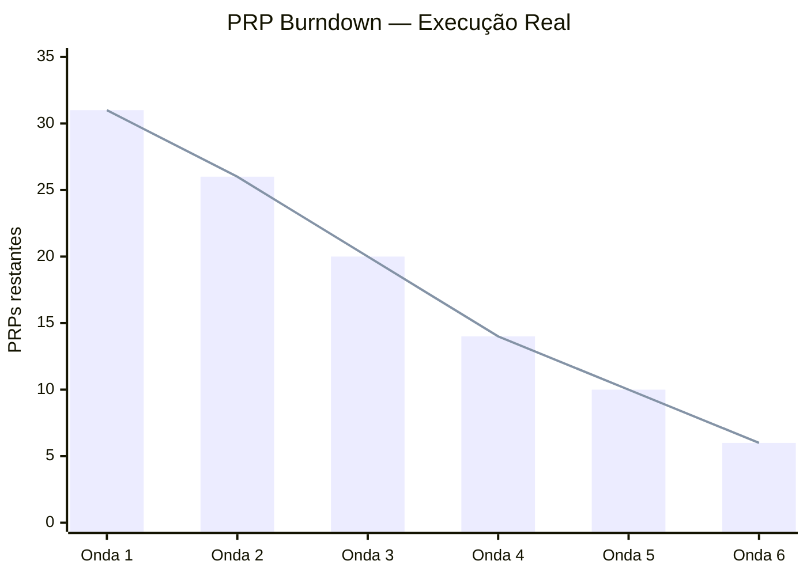

# Execution Waves — Relatório de Execução de Ondas

> **Versão:** {X.Y} | **Data:** {YYYY-MM-DD} | **Status:** {Em execução / Finalizado}
> **Projeto:** {Nome do Projeto} | **Sprint/Release:** {Número ou nome}
> **Autor:** {Tech Lead / EM} | **Revisores:** {PM, QA, DevOps}
> **Referências:** `{Dependency Matrix}`, `{Development Plan}`, `{PRP-XXX}`

---

## 📋 Checklist Pré-Preenchimento

Este documento deve ser atualizado **ao final de cada onda** (nunca antes). Antes de preencher:
- [ ] Todos os PRPs da onda estão marcados como ✅ Complete no Development Plan
- [ ] DoD de cada PRP foi validado (seção 12 dos PRPs individuais)
- [ ] Code review foi realizado para todos os PRPs da onda
- [ ] Testes (unit, integration, E2E) estão passando na branch principal
- [ ] Deploy em staging foi validado
- [ ] Regressão de ondas anteriores verificada (testes de PRPs antigos continuam verdes)

---

## 1. Visão Geral da Execução

### 1.1 Propósito
Este documento é o **relato histórico** do que foi efetivamente construído em cada onda de execução. Ele serve para:
- **Rastrear** o que foi entregue vs. o que foi planejado
- **Documentar** decisões técnicas, arquiteturais e de negócio tomadas durante a execução
- **Registrar** dívidas técnicas, riscos materializados e lições aprendidas
- **Comunicar** progresso a stakeholders não-técnicos

> **Exemplo (NeuroHub):** *"Relatório de execução das 6 ondas de desenvolvimento do NeuroHub. Cada onda agrupa PRPs executados em paralelo, com resumo de implementações, arquivos criados/alterados, próximos passos e lições aprendidas."*

### 1.2 Resumo Executivo

| Métrica | Valor | Observação |
|---------|-------|------------|
| **Ondas totais planejadas** | {X} | Incluindo ondas pós-MVP |
| **Ondas completas** | {Y} | Até a data deste documento |
| **PRPs totais** | {Z} | Do Development Plan |
| **PRPs completos** | {W} | Com DoD 100% |
| **PRPs em andamento** | {V} | — |
| **PRPs planejados (não iniciados)** | {U} | — |
| **Progresso geral** | {W/Z %} | — |
| **Tempo total estimado** | {X semanas} | Do Dependency Matrix |
| **Tempo total real** | {Y semanas} | Até a data deste documento |
| **Velocity média** | {PRPs/semana} | Completos / semanas reais |
| **Débito técnico acumulado** | {N itens} | Da seção 10 dos PRPs |

---

## 2. Ondas de Execução

> **Estrutura obrigatória por onda:** Siga exatamente as seções abaixo para cada onda. Não omita seções.

---

### Onda {N}: {Nome da Onda}

#### 2.{N}.1 Metadados da Onda

| Atributo | Valor Planejado | Valor Real | Delta |
|----------|----------------|------------|-------|
| **PRPs** | {Lista} | {Lista (se mudou)} | {Adições/Remoções} |
| **Pré-condição** | {O que deveria estar pronto} | {O que realmente estava pronto} | {Diferença} |
| **Paralelo** | {N} PRPs simultâneos | {N} PRPs simultâneos | {Diferença} |
| **Estimativa de duração** | {X} semanas | {Y} semanas | {Y-X} semanas |
| **Data de início** | {YYYY-MM-DD} | {YYYY-MM-DD} | {Diferença} |
| **Data de término** | {YYYY-MM-DD} | {YYYY-MM-DD} | {Diferença} |
| **Status** | {Planejada / Em execução / Completa} | {Real} | — |
| **Risco dominante (planejado)** | {Baixo/Médio/Alto} | {Materializado?} | {Mitigação funcionou?} |

#### 2.{N}.2 PRPs Implementados

| PRP | Nome | Owner | Estimativa (dias) | Real (dias) | Status | Dependências atendidas? | Notas |
|-----|------|-------|-------------------|-------------|--------|------------------------|-------|
| F0.1 | {Foundation} | {Nome} | 3 | 3 | ✅ | Sim | Monorepo, Docker, CI base |
| F0.2 | {Auth} | {Nome} | 5 | 5 | ✅ | Sim | JWT, Passport, bypass dev |
| F0.3 | {CI/CD} | {Nome} | 3 | 2 | ✅ | Sim | Lint, type-check, testes |
| F0.4 | {Seed Data} | {Nome} | 2 | 2 | ✅ | Sim | Seeds de orgs e usuários |

**Análise de velocity da onda:**
- **Dias totais estimados:** {Soma das estimativas} = {X} dias
- **Dias totais reais:** {Soma dos reais} = {Y} dias
- **Fator de velocidade:** {Y/X} (> 1 = mais lento que estimado, < 1 = mais rápido)
- **PRP mais longo:** {ID} — {dias} dias (determinou a duração da onda)
- **PRP que mais atrasou:** {ID} — estimado {X}, real {Y} — motivo: {explicação}

#### 2.{N}.3 Resumo de Implementações

> **Documente aqui TODOS os arquivos criados/alterados nesta onda, organizados por camada.**
> **Use paths completos relativos ao monorepo.**

##### Backend API (`apps/api/`)

| Módulo | Arquivo | Tipo | Descrição | Testes? |
|--------|---------|------|-----------|---------|
| `{auth}` | `src/auth/auth.module.ts` | Novo | NestJS module de autenticação | — |
| `{auth}` | `src/auth/auth.service.ts` | Novo | JWT + bcrypt + login/register | `auth.service.spec.ts` ✅ |
| `{auth}` | `src/auth/auth.controller.ts` | Novo | REST endpoints | `auth.e2e-spec.ts` ✅ |
| `{auth}` | `src/auth/dto/login.dto.ts` | Novo | DTO de login com class-validator | — |
| `{auth}` | `src/auth/guards/jwt.guard.ts` | Novo | Passport JWT guard | — |
| `{auth}` | `src/auth/decorators/roles.decorator.ts` | Novo | Decorator `@Roles()` | — |

**Padrões aplicados:**
- {Ex: TDD — todos os services têm `.spec.ts`}
- {Ex: Clean Architecture — controllers delegam para services}
- {Ex: Multi-tenancy — `organization_id` em todas as queries}

##### Frontend Web (`apps/web/`)

| Componente/Hook/Página | Arquivo | Tipo | Descrição | Testes? |
|------------------------|---------|------|-----------|---------|
| `DashboardLayout` | `src/components/Dashboard/DashboardLayout.tsx` | Novo | Sidebar + Header + AuthContext | — |
| `Sidebar` | `src/components/Sidebar/Sidebar.tsx` | Novo | Navegação com roles | — |
| `useAuth` | `src/hooks/useAuth.ts` | Novo | Hook de autenticação | `useAuth.test.ts` ✅ |
| `Login` | `src/app/login/page.tsx` | Novo | Página de login | `login.e2e-spec.ts` ✅ |

**Padrões aplicados:**
- {Ex: Feature-based folder structure}
- {Ex: Zustand para estado global}
- {Ex: TanStack Query para cache server}

##### Mobile (`apps/mobile/`)

| Screen/Context/DB | Arquivo | Tipo | Descrição | Testes? |
|-------------------|---------|------|-----------|---------|
| `LoginScreen` | `src/screens/LoginScreen.tsx` | Novo | Tela de login com Expo | `LoginScreen.test.tsx` ✅ |
| `AuthContext` | `src/context/AuthContext.tsx` | Novo | Provider JWT + refresh | — |
| `schema` | `src/database/schema.ts` | Novo | WatermelonDB schema inicial | — |

**Padrões aplicados:**
- {Ex: Offline-first — dados cacheados no login}
- {Ex: NativeWind para estilização}

##### Shared / Infra

| Paciente/Arquivo | Tipo | Descrição |
|------------------|------|-----------|
| `packages/shared-types` | Novo | Typescript types compartilhados entre web e API |
| `packages/eslint-config` | Novo | Configuração unificada de lint |
| `docker-compose.yml` | Alterado | Adicionado PostgreSQL + Redis |
| `.github/workflows/ci.yml` | Novo | Pipeline de lint, type-check, testes |

#### 2.{N}.4 Decisões Técnicas Tomadas Nesta Onda

> **Registre aqui decisões que mudaram a arquitetura ou o escopo original.**

| Data | Decisão | Contexto | Alternativa | Por que escolhemos esta | Impacto | Quem decidiu |
|------|---------|----------|-------------|------------------------|---------|--------------|
| {YYYY-MM-DD} | {Ex: Usar Auth0 no lugar de Supabase Auth} | {Ex: PRD especificava Auth0, mas time testou Supabase} | {Supabase Auth} | {Ex: Compliance de dados sensíveis exige controle total} | {Ex: Atraso de 1 dia para configuração} | {Tech Lead} |
| {YYYY-MM-DD} | {Ex: Simplificar seed data para MVP} | {Ex: Seed completo estava tomando 3 dias} | {Seed completo com 1000 registros} | {Ex: MVP precisa apenas de 10 usuários de exemplo} | {Ex: Seed completo será PRP futuro} | {PM + Tech Lead} |

#### 2.{N}.5 Riscos Materializados e Impedimentos

> **O que deu errado ou quase deu errado durante esta onda?**

| ID | Risco (do Dependency Matrix) | Materializou? | Impacto real | Ação tomada | Resultado | Lição aprendida |
|----|---------------------------|---------------|--------------|-------------|-----------|-----------------|
| {DEP-01} | {Ex: F1.4 (Goals API) atrasar} | {Sim/Não} | {Ex: Atraso de 0 dias (mitigação funcionou)} | {Ex: Reduzimos escopo de lições aninhadas} | {Ex: Entregue no prazo} | {Ex: Sempre quebrar PRPs grandes antes de estimar} |
| {RSK-XXX} | {Ex: WatermelonDB sync não performou} | {Não} | {—} | {Ex: Spike de 1 dia antes da Onda 4} | {Prevenido} | {Ex: Spikes técnicos antes de ondas de risco} |

#### 2.{N}.6 Débito Técnico Acumulado

> **Dívidas conscientes que serão pagas em ondas futuras.**

| ID | Débito | Origem | Impacto atual | Onda de pagamento | Status |
|----|--------|--------|---------------|-------------------|--------|
| {DT-001} | {Ex: Auth bypass em dev (`AUTH_ENABLED=false`)} | {Ex: Facilitar desenvolvimento local} | {Ex: Baixo — apenas dev} | {Ex: Onda 7 (hardering)} | {Pendente} |
| {DT-002} | {Ex: Seed data sem dados de produção realistas} | {Ex: MVP pressa} | {Ex: Médio — testes não refletem volume real} | {Ex: Onda 8 (performance)} | {Pendente} |

#### 2.{N}.7 Métricas de Qualidade da Onda

| Métrica | Valor alvo | Valor real | Status |
|---------|-----------|----------|--------|
| Cobertura de testes unitários | ≥ 80% | {X%} | {✅/⚠️/❌} |
| Testes E2E passando | 100% | {X%} | {✅/⚠️/❌} |
| Lint / Type check | 0 erros | {X erros} | {✅/⚠️/❌} |
| Vulnerabilidades críticas | 0 | {X} | {✅/⚠️/❌} |
| Regressões (PRPs anteriores quebrados) | 0 | {X} | {✅/⚠️/❌} |
| Deploy staging bem-sucedido | 1 | {X} | {✅/⚠️/❌} |

---

## 3. Resumo Consolidado de Implementações

> **Seção opcional para documentos longos. Agrupa implementações por camada, independente de onda.**

### 3.1 Backend API — Módulos Entregues

| Módulo | Onda | Endpoints | Testes | Status |
|--------|------|-----------|--------|--------|
| `auth` | 1 | POST /login, POST /register | ✅ service + e2e | ✅ |
| `users` | 2 | CRUD /users | ✅ service + e2e | ✅ |
| `patients` | 2 | CRUD /patients | ✅ service + e2e | ✅ |
| `goals` | 2 | CRUD /goals + hierarquia | ✅ service + e2e | ✅ |
| `daily-logs` | 3 | CRUD /daily-logs | ✅ service + e2e | ✅ |
| `sync` | 4 | POST /sync/batch | ✅ service + e2e | ✅ |
| `analytics` | 5 | GET /analytics/* | ✅ service | ✅ |
| `reports` | 5 | GET /reports/* | ✅ service | ✅ |
| `audit` | 5 | Global module | ✅ service | ✅ |
| `feedback-dimensions` | 6 | POST /feedbacks | ✅ service | ✅ |
| `invites` | 6 | POST /invites | ✅ service | ✅ |

### 3.2 Frontend Web — Componentes e Hooks Entregues

| Categoria | Onda | Itens | Testes | Status |
|-----------|------|-------|--------|--------|
| `Layout` | 2 | DashboardLayout, Sidebar, Header | — | ✅ |
| `Users` | 3 | UsersList, UserForm, UserModal, useUsers | ✅ | ✅ |
| `Patients` | 3 | PatientsList, PatientForm, PatientModal, usePatients | ✅ | ✅ |
| `PEI` | 3 | PEITree, GoalForm, LessonForm, useGoals | ✅ | ✅ |
| `TaskAnalysis` | 4 | TaskAnalysisForm | ✅ | ✅ |
| `Analytics` | 5 | AnalyticsDashboard, useAnalytics | ✅ | ✅ |
| `Dashboard` | 6 | CoverageMatrix, ParentProgress, useCoverageMatrix, useParentProgress | ✅ | ✅ |

### 3.3 Mobile — Screens e Database Entregues

| Categoria | Onda | Itens | Testes | Status |
|-----------|------|-------|--------|--------|
| `Auth` | 2 | LoginScreen, AuthContext | ✅ | ✅ |
| `Home` | 3 | HomeScreen | ✅ | ✅ |
| `Session` | 4 | SessionScreen, SessionSummaryScreen | ✅ | ✅ |
| `DailyLog` | 4 | DailyLogFormScreen | ✅ | ✅ |
| `PLACHECK` | 4 | PLACHECKScreen | ✅ | ✅ |
| `Database` | 3 | WatermelonDB schema (patients, goals, lessons, daily_logs, sessions, sync_records) | — | ✅ |

---

## 4. Próximos Passos

> **O que vem depois? Liste em ordem de prioridade.**

| # | Próximo Passo | Onda/PRP | Prioridade | Bloqueado por | Status |
|---|---------------|----------|------------|---------------|--------|
| 1 | {Ex: Notificações In-App} | Onda 7 / PRP-030 | Alto | Onda 6 completa | ⏳ Planejado |
| 2 | {Ex: Upload de Documentos/Mídia} | Onda 7 / PRP-031 | Alto | Onda 6 completa | ⏳ Planejado |
| 3 | {Ex: Subscription & Billing} | Onda 8 / PRP-032 | Médio | Onda 7 completa | ⏳ Planejado |
| 4 | {Ex: Performance optimization} | — | Médio | — | 🔄 Em andamento |
| 5 | {Ex: Deploy em produção} | — | Alto | CI/CD completo | ⏳ Planejado |

---

## 5. Lições Aprendidas (Post-Mortem por Onda)

> **Revisão obrigatória ao final de cada onda. O que funcionou? O que não funcionou?**

### 5.1 O que funcionou bem

| Onda | Aspecto | Por que funcionou |
|------|---------|-------------------|
| 1 | {Ex: Monorepo com Turborepo} | {Ex: Cache de builds reduziu CI de 10min para 3min} |
| 2 | {Ex: TDD estruturado} | {Ex: Factories compartilhadas aceleraram testes de integração} |
| 3 | {Ex: Paralelização de UI e APIs} | {Ex: Frontend não ficou bloqueado esperando backend} |
| 4 | {Ex: WatermelonDB sync} | {Ex: Spike técnico antes da onda evitou retrabalho} |

### 5.2 O que não funcionou bem

| Onda | Aspecto | Problema | Ação para próxima vez |
|------|---------|----------|----------------------|
| 2 | {Ex: Estimativa de F1.4} | {Ex: Subestimamos complexidade da hierarquia PEI} | {Ex: Quebrar PRPs de API em sub-tarefas antes de estimar} |
| 3 | {Ex: F1.8 (PEI Editor)} | {Ex: Componente tree ficou grande demais} | {Ex: Dividir em sub-componentes (TreeNode, TreeLeaf) em PRPs separados} |
| 4 | {Ex: Testes E2E mobile} | {Ex: Detox não estava configurado, usamos apenas unit} | {Ex: Configurar Detox na Onda 1, não deixar para depois} |

### 5.3 Recomendações para próximas ondas/releases

| # | Recomendação | Prioridade | Responsável | Prazo |
|---|--------------|------------|-------------|-------|
| 1 | {Ex: Configurar E2E mobile (Detox) antes de começar próxima onda} | Alto | {Mobile Lead} | {Próxima sprint} |
| 2 | {Ex: Quebrar PRPs de API > 5 dias em sub-PRPs} | Alto | {Tech Lead} | {Imediato} |
| 3 | {Ex: Adicionar performance budgets no CI} | Médio | {DevOps} | {Onda 7} |
| 4 | {Ex: Documentar decisões arquiteturais em ADRs} | Médio | {Tech Lead} | {Contínuo} |

---

## 6. Anexos

### Anexo A: Velocity Tracker por Onda

| Onda | PRPs planejados | PRPs completos | Dias estimados | Dias reais | Fator de velocidade | PRP mais longo |
|------|-----------------|----------------|----------------|------------|---------------------|----------------|
| 1 | 4 | 4 | 13 | 12 | 0.92 | F0.2 (5 dias) |
| 2 | 5 | 5 | 24 | 24 | 1.00 | F1.4 (6 dias) |
| 3 | 6 | 6 | 30 | 28 | 0.93 | F1.8 (6 dias) |
| 4 | 6 | 6 | 28 | 30 | 1.07 | F2.3 (6 dias) |
| 5 | 4 | 4 | 22 | 20 | 0.91 | F4.3 (6 dias) |
| 6 | 4 | 4 | 20 | 18 | 0.90 | F5.2 (5 dias) |

**Velocity média:** {Total PRPs / Total semanas reais} = {X} PRPs/semana

### Anexo B: Burndown de PRPs

### Anexo C: Mapa de Calor de Complexidade

| Onda | Baixa | Média | Alta | Total | Risco médio |
|------|-------|-------|------|-------|-------------|
| 1 | 3 | 1 | 0 | 4 | Baixo |
| 2 | 1 | 3 | 1 | 5 | Médio |
| 3 | 0 | 4 | 2 | 6 | Médio-Alto |
| 4 | 0 | 3 | 3 | 6 | Alto |
| 5 | 0 | 2 | 2 | 4 | Médio-Alto |
| 6 | 0 | 3 | 1 | 4 | Médio |

---

## 📌 Revisões do Documento

| Versão | Data | Autor | Mudanças |
|--------|------|-------|----------|
| 0.1 | {YYYY-MM-DD} | {Autor} | Rascunho — Onda 1 completa |
| 0.2 | {YYYY-MM-DD} | {Autor} | Adicionadas Ondas 2 e 3 |
| 0.3 | {YYYY-MM-DD} | {Autor} | Adicionadas Ondas 4, 5, 6 + lições aprendidas |
| 1.0 | {YYYY-MM-DD} | {Autor} | Documento finalizado — todas as ondas MVP completas |

---

## ✅ Checklist de Aprovação do Relatório

- [ ] Todas as ondas completas têm seções 2.{N}.1 a 2.{N}.7 preenchidas
- [ ] Todos os PRPs listados estão marcados como ✅ Complete no Development Plan
- [ ] Resumo de implementações inclui paths completos e testes
- [ ] Decisões técnicas foram registradas com contexto e impacto
- [ ] Riscos materializados foram documentados com lições aprendidas
- [ ] Débito técnico foi catalogado com onda de pagamento definida
- [ ] Métricas de qualidade foram coletadas e comparadas com o alvo
- [ ] Próximos passos estão priorizados e desbloqueados
- [ ] Lições aprendidas foram revisadas em retrospectiva do time
- [ ] Stakeholders de negócio foram informados do progresso

---

> **Nota:** Este documento é um documento vivo. Atualize ao final de cada onda. Não apague entradas de ondas anteriores — append only. A versão no repositório (`docs/execution-waves.md`) é a fonte da verdade.
