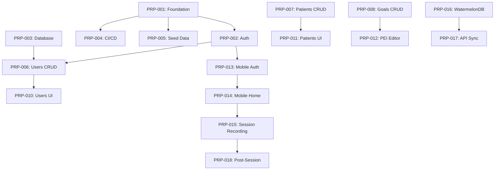
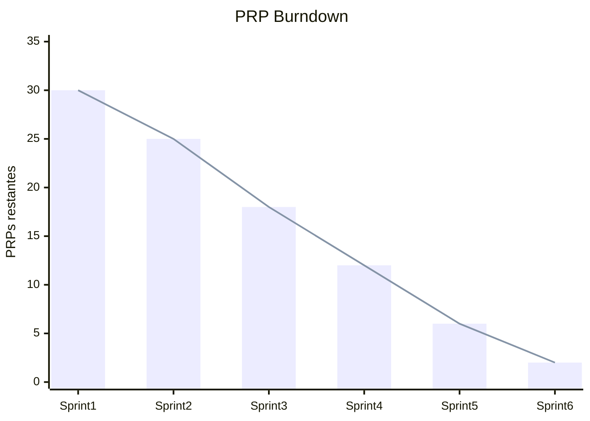

# Template de Planejamento de Desenvolvimento — PRP-Based Development Plan

> **Versão:** {X.Y} | **Data:** {Mês/Ano} | **Status:** {Rascunho/Alinhado/Aprovado}
> **Projeto:** {Nome do Projeto} | **Codename:** {Opcional}
> **Autor:** {Tech Lead / PM} | **Revisores:** {Lista}
> **Referências:** `{PRD}`, `{SPEC}`, `{ARCHITECTURE}`, `{Design System}`

---

## 📋 Checklist Pré-Preenchimento

Antes de começar, certifique-se de que existem:
- [ ] PRD aprovado com personas e fluxos prioritários
- [ ] SPEC v1.0+ com requisitos funcional e não-funcionais detalhados
- [ ] Architecture Definition Document (ADD) aprovado
- [ ] Design System definido (tokens, componentes, acessibilidade)
- [ ] Estimativa de capacidade do time (devs, QAs, UX) por sprint
- [ ] Definição de ambientes (dev/staging/prod) e estratégia de deploy

---

## 1. Visão Geral do Plano

### 1.1 Propósito
Descreva em 2-3 parágrafos:
- **O que** este plano cobre (escopo temporal e funcional)
- **Para quem** serve (time de dev, stakeholders, clientes)
- **Metodologia** base (Scrum, Kanban, PRP-based, etc.)
- **Horizonte** (MVP, Release 1.0, etc.)

> **Exemplo (NeuroHub):** *"Este documento descreve a estratégia de implementação e marcos para o desenvolvimento do NeuroHub. Utilizaremos Agile (Scrum/Kanban) com ciclos de 2 semanas (Sprints). Priorização baseada em Valor para o Cliente e Riscos Técnicos."*

### 1.2 Metodologia de Desenvolvimento

```markdown
| Aspecto | Definição | Detalhamento |
|---------|-----------|--------------|
| Framework | Scrum / Kanban / XP / Shape Up | Justificativa da escolha |
| Ciclo | 2 semanas (Sprint) | Duração fixa ou variável? |
| Priorização | Valor para cliente × Risco técnico | Matriz de priorização |
| Cerimônias | Planning, Daily, Review, Retro | Horários e participantes |
| Ferramenta | Jira / Linear / GitHub Projects | Board público ou interno |
```

### 1.3 PRP-Based Development (abordagem estruturada)

> **O que é um PRP?** Project Requirement Proposal — um contrato completo de trabalho que substitui a "história de usuário" tradicional. Cada PRP é auto-suficiente.

```markdown
| Característica | Descrição | Por que usamos |
|----------------|-----------|----------------|
| Contrato completo | API Contracts + Component Specs + Test Strategy | Elimina ambiguidade entre PM e dev |
| Matriz de dependências | Grafo explícito do que bloqueia o que | Paralelização máxima |
| Ondas de execução | Agrupamento de PRPs independentes | Velocidade sem quebrar dependências |
| TDD estruturado | Factories, mocks, templates antes do código | Qualidade desde o início |
```

**Documentação de suporte obrigatória por PRP:**
- `docs/prps/PRP-XXX-{Nome}.md` — Especificação do PRP
- `docs/plans/YYYY-MM-DD-dependency-matrix-design.md` — Design da matriz
- `docs/plans/YYYY-MM-DD-dependency-matrix-implementation.md` — Implementação da matriz
- `docs/plans/YYYY-MM-DD-tdd-structured-design.md` — Design dos testes
- `docs/plans/YYYY-MM-DD-tdd-structured-implementation.md` — Implementação dos testes

---

## 2. Roadmap e Marcos (Fases)

> **Estrutura:** Cada fase agrupa PRPs relacionados por objetivo de negócio. Use o formato abaixo para cada fase.

### 2.X Phase {N}: {Nome da Fase} (Weeks {Início}-{Fim})

**Objetivo de negócio:** {Uma frase descrevendo o valor entregue ao cliente}
**Persona principal:** {Quem se beneficia desta fase}
**Risco técnico dominante:** {O que pode dar errado e como mitigar}
**PRPs incluídos:** {Lista de IDs de PRP}

#### Deliverables (o que é entregue ao final da fase)

| # | Deliverable | Critério de aceitação | Responsável | Status |
|---|-------------|----------------------|-------------|--------|
| 1 | {Nome} | {Mensurável} | {Role} | ✅/🔄/⏳ |

#### Status Atual da Fase

```markdown
| PRP | ID | Nome | Status | PRP File | Owner | Estimativa (dias) |
|-----|----|------|--------|----------|-------|-------------------|
| F0.1 | PRP-001 | Project Foundation & Setup | ✅ Complete | PRP-001-Foundation.md | Tech Lead | 3 |
| F0.2 | PRP-002 | Auth & Identity | ✅ Complete | PRP-002-Auth.md | Backend Dev | 5 |
| F0.3 | PRP-004 | CI/CD Pipeline | ✅ Complete | PRP-004-CICD.md | DevOps | 3 |
```

> **💡 Melhoria:** Adicione colunas "Risco técnico", "Complexidade" (Baixa/Média/Alta) e "Valor de negócio" para facilitar priorização quando há pressão de prazo.

---

## 3. Estratégia de Deploy

| Ambiente | Branch | Gatilho | Responsável | Smoke Test |
|----------|--------|---------|-------------|------------|
| **Dev** | `develop` | Cada commit | CI/CD automático | Unit + Integration |
| **Staging** | `staging` | Semanal (merge develop) | CI/CD automático | E2E críticos |
| **Prod** | `main` | Quinzenal ou sob demanda | Tech Lead (aprovação manual) | E2E completo + Health checks |

**Regras de deploy:**
1. **Dev:** Deploy contínuo. Quebrar é aceitável, mas deve ser corrigido em < 4h.
2. **Staging:** Após code review e testes de integração passando. QA faz UAT aqui.
3. **Prod:** Tag semântica (`v1.2.3`) + changelog + aprovação escrita do PM.

> **💡 Melhoria:** Inclua "Rollback time" (tempo máximo para reverter) e "Rollback procedure" (passos documentados). O original não cobre contingência de deploy.

---

## 4. Definition of Done (DoD)

> **O DoD é um contrato social do time.** Todo PRP só pode ser marcado como "Complete" se TODOS os critérios abaixo forem atendidos.

| # | Critério | Como verificar | Responsável pela verificação | Obrigatório? |
|---|----------|---------------|------------------------------|--------------|
| 1 | Código revisado (Code Review) | PR aprovado por 1+ dev sênior | Tech Lead | Sim |
| 2 | Testes escritos PRIMEIRO (TDD) | Commit history mostra testes antes da implementação | QA / Tech Lead | Sim |
| 3 | Testes unitários passando (>80% coverage) | `npm test --coverage` | CI | Sim |
| 4 | Testes E2E críticos passando | `npm run test:e2e` | CI | Sim |
| 5 | Documentação do PRP atualizada | `docs/prps/PRP-XXX.md` reflete o que foi entregue | PM | Sim |
| 6 | UI/UX conforme Design System | Screenshots comparados com Figma | UX Designer | Sim |
| 7 | Sem regressões | E2E de PRPs anteriores continuam passando | CI | Sim |
| 8 | Performance baseline | Lighthouse / k6 dentro dos SLAs | Tech Lead | Não (MVP) / Sim (pós-MVP) |
| 9 | Acessibilidade | axe-core sem violações críticas | QA | Não (MVP) / Sim (pós-MVP) |
| 10 | Security scan | `npm audit` sem vulnerabilidades críticas | CI | Sim |

> **💡 Melhoria:** Diferencie DoD do MVP vs DoD pós-MVP. Tentar atingir 100% no MVP atrasa demais. Seja explícito sobre o que é "obrigatório agora" vs "obrigatório depois".

---

## 5. Ondas de Execução (Dependency Matrix)

> **Conceito:** Ondas são grupos de PRPs que podem ser executados em paralelo porque não têm dependências entre si. Respeitar a ordem das ondas é crítico para não quebrar o build.

### 5.1 Como construir uma onda

```markdown
**Onda {N}: {Nome}**
**PRPs:** {Lista de IDs}
**Pré-condição:** {O que precisa estar completo antes}
**Paralelo:** {Quantos PRPs simultâneos} (máximo baseado em capacidade do time)
**Estimativa:** {X semanas}
**Status:** {🔄 Em andamento / ✅ Completa / ⏳ Planejada}
**Risco de dependência:** {Baixo/Médio/Alto — probabilidade de um PRP atrasar a onda}
```

### 5.2 Exemplo de Ondas (NeuroHub)

| Onda | PRPs | Pré-condição | Paralelo | Estimativa | Status | Notas |
|------|------|--------------|----------|------------|--------|-------|
| 1 | F0.2, F0.3, F0.4 | F0.1 ✅ | 3 | 1 semana | ✅ | Foundation |
| 2 | F1.2, F1.3, F1.4, F1.5, F2.1 | F0.2 ✅ + F1.1 ✅ | 5 | 2 semanas | ✅ | Backend + Mobile start |
| 3 | F1.6, F1.7, F1.8, F2.2, F2.4, F3.1 | Onda 2 completa | 6 | 2-3 semanas | ✅ | UIs + Mobile core |
| 4 | F2.3, F2.5, F2.6, F3.2, F3.3, F3.4 | Dependências específicas | Conforme grafo | 2 semanas | ✅ | Features avançadas |
| 5 | F4.1, F4.2, F4.3 | F2.3 completo | 2-3 | 1-2 semanas | ✅ | Analytics & polish |
| 6 | F5.1, F5.2, F5.3, F5.4 | Ondas 1-5 completas | 4 | 1-2 semanas | ✅ | MVP comercial |

### 5.3 Matriz de Dependências (Grafo)

```markdown


**Regras de leitura:**
- Seta A → B significa "A deve estar completo antes de B começar"
- PRPs na mesma "coluna" vertical podem rodar em paralelo
- PRPs em ondas diferentes NUNCA podem ser paralelizados se houver seta entre eles
```

> **💡 Melhoria:** O plano original lista ondas mas não mostra o grafo visual. Use Mermaid para manter versionado. Adicione uma coluna "Risco de dependência" para identificar early se um PRP pode atrasar toda a onda seguinte.

---

## 6. Controle de PRPs (Master List)

> **Esta é a fonte da verdade do status de todos os PRPs.** Atualize semanalmente.

### 6.1 Legenda de Status

| Símbolo | Status | Definição | Quem altera |
|---------|--------|-----------|-------------|
| ✅ | Complete | DoD 100% atendido, mergeado na branch principal | Tech Lead |
| 🔄 | In Progress | Dev iniciou, PR pode estar aberto | Dev Owner |
| ⏳ | Planned | Especificado, priorizado, mas não iniciado | PM |
| 🛑 | Blocked | Impedimento técnico ou de negócio | Tech Lead |
| ❌ | Cancelled | Removido do escopo, documentar razão | PM |
| ⏸️ | Paused | Suspenso temporariamente, documentar razão | Tech Lead |

### 6.2 Tabela Master de PRPs

```markdown
| PRP | ID | Nome | Fase | Onda | Status | PRP File | Owner | Estimativa (dias) | Real (dias) | Complexidade | Valor Negócio |
|-----|----|------|------|------|--------|----------|-------|-------------------|-------------|--------------|---------------|
| F0.1 | PRP-001 | Project Foundation & Setup | Phase 0 | 1 | ✅ | PRP-001-Foundation.md | Tech Lead | 3 | 3 | Baixa | Crítico |
| F0.2 | PRP-002 | Auth & Identity | Phase 0 | 1 | ✅ | PRP-002-Auth.md | Backend Dev | 5 | 5 | Média | Crítico |
| F0.3 | PRP-004 | CI/CD Pipeline | Phase 0 | 1 | ✅ | PRP-004-CICD.md | DevOps | 3 | 2 | Baixa | Crítico |
| F0.4 | PRP-005 | Seed Data | Phase 0 | 1 | ✅ | PRP-005-SeedData.md | Backend Dev | 2 | 2 | Baixa | Médio |
| F1.1 | PRP-003 | Database Schema | Phase 0 | — | ✅ | PRP-003-Database.md | Tech Lead | 4 | 5 | Alta | Crítico |
| F1.2 | PRP-006 | Users CRUD API | Phase 1 | 2 | ✅ | PRP-006-UsersCRUD.md | Backend Dev | 5 | 4 | Média | Alto |
| ... | ... | ... | ... | ... | ... | ... | ... | ... | ... | ... | ... |
```

**Resumo:**
- **Total PRPs:** {X}
- **Complete:** {Y} ({Y/X %})
- **In Progress:** {Z}
- **Planned:** {W}
- **Blocked:** {V}
- **Velocity média:** {PRPs completos / semanas decorridas}

> **💡 Melhoria:** Adicione "Real (dias)" para calcular velocity real vs estimada. Isso melhora estimativas futuras. A coluna "Valor Negócio" ajuda a decidir o que cortar se houver pressão de prazo.

---

## 7. Documentação de Planejamento

### 7.1 Design Documents (docs/plans/)

| Data | Documento | Tipo | Status | Responsável |
|------|-----------|------|--------|-------------|
| {YYYY-MM-DD} | {Nome} | Design / Implementation | ✅ Approved | {Autor} |
| 2026-03-16 | Dependency Matrix Design | Design | ✅ Approved | Tech Lead |
| 2026-03-16 | Dependency Matrix Implementation | Implementation | ✅ Complete | Tech Lead |
| 2026-03-16 | TDD Structured Design | Design | ✅ Approved | Tech Lead |
| 2026-03-16 | TDD Structured Implementation | Implementation | ✅ Complete | Tech Lead |

### 7.2 PRP Documents (docs/prps/)

> **Cada PRP deve ter um arquivo markdown seguindo o template da seção 8.**

```markdown
| PRP | Arquivo | Última atualização | Revisado por |
|-----|---------|-------------------|--------------|
| PRP-001 | PRP-001-Foundation.md | {Data} | Tech Lead |
| PRP-002 | PRP-002-Auth.md | {Data} | Backend Dev |
```

> **💡 Melhoria:** O plano original não tem uma seção de "Documentação de Planejamento" estruturada. Isso garante que artefatos de design não se percam e sejam revisáveis.

---

## 8. Template Individual de PRP

> **Cada PRP é um documento separado em `docs/prps/PRP-XXX-{Nome}.md`.**
> **Use este template para TODOS os PRPs.**

---

# PRP: [{F0.X}] — [{Nome Descritivo}]

> **ID:** PRP-{XXX} | **Fase:** {Phase N} | **Onda:** {Onda M}
> **Owner:** {Dev responsável} | **Reviewer:** {Tech Lead / Senior Dev}
> **Estimativa:** {X dias} | **Status:** {⏳ Planned / 🔄 In Progress / ✅ Complete}
> **Criado em:** {Data} | **Última atualização:** {Data}

---

## 8.1 Contexto e Objetivo

**Por que este PRP existe?**
{Explique o problema de negócio ou técnico que este PRP resolve. 1-2 parágrafos.}

**O que é entregue?**
{Liste em bullets o que o usuário final (ou sistema) poderá fazer após este PRP.}

**O que NÃO está no escopo?**
{Explicitamente liste o que será feito em PRPs futuros. Evita creep.}

> **Exemplo:** *"Este PRP entrega a autenticação completa do sistema: login com email/senha, JWT, refresh token, e estrutura de RBAC. NÃO inclui recuperação de senha (PRP-00X) nem MFA (PRP-00Y)."*

---

## 8.2 Requisitos Funcionais (deste PRP)

| ID | Requisito | Critérios de Aceitação (Gherkin) | Prioridade | Status |
|----|-----------|----------------------------------|------------|--------|
| RF-XXX.1 | {Descrição} | Dado {contexto}, Quando {ação}, Então {resultado} | Must | ⏳ |
| RF-XXX.2 | {Descrição} | Dado {contexto}, Quando {ação}, Então {resultado} | Must | ⏳ |

---

## 8.3 Requisitos Não-Funcionais (deste PRP)

| ID | Requisito | Métrica | Como verificar |
|----|-----------|---------|----------------|
| RNF-XXX.1 | Performance | < 200ms P95 | k6 / Lighthouse |
| RNF-XXX.2 | Segurança | Sem vulnerabilidades críticas | `npm audit` |
| RNF-XXX.3 | Acessibilidade | WCAG 2.1 AA | axe-core |

---

## 8.4 API Contracts (se aplicável)

### Endpoint 1: {MÉTODO} {/rota}

**Descrição:** {O que faz}
**Autenticação:** {JWT / Público / API Key}
**Rate Limit:** {X req/min}

**Request:**
```json
{
  "campo": "tipo",
  "obrigatorio": true
}
```

**Response 200:**
```json
{
  "id": "uuid",
  "campo": "valor"
}
```

**Response 4XX/5XX:**
```json
{
  "error": "CODIGO",
  "message": "Descrição legível",
  "code": "MACHINE_READABLE_CODE"
}
```

---

## 8.5 Component Spec (se aplicável — Frontend/Mobile)

### {Nome do Componente/Screen}

**Props / Estado:**
```typescript
interface Props {
  patientId: string;
  onSave: (data: FormData) => void;
}
```

**Comportamento:**
- {O que acontece quando o usuário clica em X}
- {O que acontece em caso de erro}
- {Estados de loading, empty, error}

**Design Reference:**
- Figma: `{link}`
- Design System: `{tokens usados}`

---

## 8.6 Database Changes (se aplicável)

```markdown
| Operação | Tabela | Campos | Índice | Migration |
|----------|--------|--------|--------|-----------|
| CREATE | users | id, email, password_hash, role | idx_email | 20240601_add_users |
| ALTER | patients | add diagnosis_level | — | 20240602_add_diagnosis |
```

---

## 8.7 Test Strategy

> **TDD estruturado: escreva estes testes ANTES do código.**

### Unit Tests

| # | Descrição | Factory/Mock necessário | Arquivo |
|---|-----------|------------------------|---------|
| 1 | Deve criar usuário com senha hash | `createUser()`, `mockBcrypt` | `auth.service.spec.ts` |
| 2 | Deve rejeitar email duplicado | `createUser({ email: 'dup' })` | `auth.service.spec.ts` |

### Integration Tests

| # | Descrição | Setup | Arquivo |
|---|-----------|-------|---------|
| 1 | POST /auth/login retorna JWT válido | `TestContainers(Postgres)` | `auth.e2e-spec.ts` |
| 2 | GET /users requer role ADMIN | `mockAuthContext(THERAPIST)` | `users.e2e-spec.ts` |

### E2E Tests

| # | Fluxo | Ferramenta | Arquivo |
|---|-------|------------|---------|
| 1 | Login → Dashboard → Logout | Playwright | `auth.spec.ts` |

---

## 8.8 Dependências

### Bloqueado por (must be complete before this PRP)

| PRP | ID | Nome | Status | Por que é necessário |
|-----|----|------|--------|---------------------|
| F0.1 | PRP-001 | Foundation | ✅ | Estrutura de monorepo |
| F1.1 | PRP-003 | Database | ✅ | Tabela users precisa existir |

### Bloqueia (this PRP must be complete before)

| PRP | ID | Nome | Status | Por que depende |
|-----|----|------|--------|-----------------|
| F1.6 | PRP-010 | Users UI | ⏳ | Precisa da API de users |
| F2.1 | PRP-013 | Mobile Auth | ⏳ | Precisa do mesmo JWT logic |

---

## 8.9 Riscos e Mitigações

| ID | Risco | Probabilidade | Impacto | Mitigação | Status |
|----|-------|---------------|---------|-----------|--------|
| RSK-001 | {Risco técnico} | Média | Alto | {Ação preventiva} | Monitorado |

---

## 8.10 Checklist de DoD (preencher ao final)

- [ ] Código revisado (Code Review aprovado)
- [ ] Testes escritos PRIMEIRO (TDD)
- [ ] Testes unitários passando (>80% coverage)
- [ ] Testes E2E críticos passando
- [ ] API Contracts testados (Supertest/Playwright)
- [ ] Documentação do PRP atualizada
- [ ] UI/UX conforme Figma/Design System
- [ ] Sem regressões em PRPs anteriores
- [ ] Migration de banco aplicada e testada
- [ ] Performance dentro do SLA definido
- [ ] Security scan limpo
- [ ] Deploy em staging validado

---

## 8.11 Notas e Decisões

> **Registre aqui decisões tomadas durante o desenvolvimento, aprendizados, e dívida técnica consciente.**

| Data | Nota | Tipo | Ação futura |
|------|------|------|-------------|
| {Data} | {Decisão ou aprendizado} | Decisão / Dívida / Aprendizado | {Se dívida, quando será paga} |

---

## 9. Anexos

### Anexo A: Velocity Tracker

| Sprint | PRPs planejados | PRPs completos | Pontos / dias estimados | Pontos / dias reais | Velocity |
|--------|-----------------|----------------|------------------------|---------------------|----------|
| 1 | 3 | 3 | 10 | 10 | 1.0 |
| 2 | 5 | 4 | 20 | 22 | 0.9 |
| 3 | 6 | 6 | 25 | 24 | 1.04 |

> **💡 Melhoria:** O plano original não rastreia velocity. Sem isso, não há como prever quando o projeto termina.

### Anexo B: Burndown Chart (exemplo)



### Anexo C: Capacidade do Time

| Role | Pessoas | FTE | Foco nas ondas |
|--------|---------|-----|----------------|
| Tech Lead | 1 | 1.0 | Review, arquitetura, unblock |
| Backend Senior | 1 | 1.0 | Ondas 1-2 (APIs) |
| Backend Pleno | 1 | 0.8 | Ondas 3-4 (features) |
| Frontend Senior | 1 | 1.0 | Ondas 2-3 (Dashboards) |
| Mobile Pleno | 1 | 1.0 | Ondas 2-4 (App) |
| QA | 1 | 0.5 | E2E, regressão |
| UX Designer | 1 | 0.5 | Figma, Design System |
| PM | 1 | 0.5 | PRPs, priorização |

---

## 📌 Revisões do Plano

| Versão | Data | Autor | Mudanças |
|--------|------|-------|----------|
| 0.1 | {Data} | {Autor} | Rascunho inicial |
| 0.2 | {Data} | {Autor} | Adicionada Onda 6 (MVP Comercial) |
| 1.0 | {Data} | {Autor} | Aprovado para execução |

---

## ✅ Checklist de Aprovação do Plano

- [ ] Tech Lead validou arquitetura e dependências
- [ ] PM validou priorização e valor de negócio por fase
- [ ] UX validou que cada fase tem entregáveis testáveis
- [ ] QA validou que DoD é exequível
- [ ] DevOps validou estratégia de deploy
- [ ] Stakeholders de negócio aprovaram roadmap e datas

---

> **Nota:** Este plano é um documento vivo. Revisão obrigatória a cada 2 sprints (ou mensal). Ajuste ondas e priorizações baseado em velocity real e mudanças de negócio.
