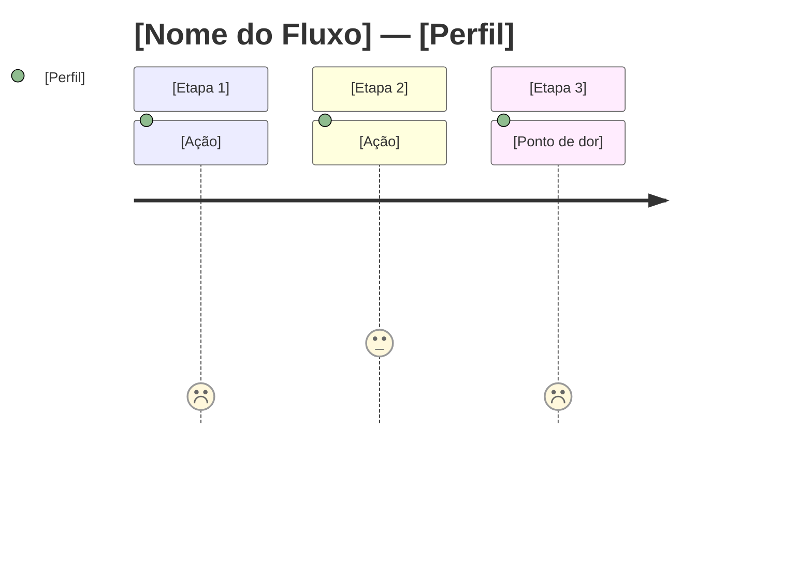

# LLC Subfluxo: Prototipagem Agentica

**Pipeline:** Live and Let Code (LLC)  
**Fase:** Prototipagem (subfluxo do Step 8 → Step 9)  
**Granularidade:** Executado **por módulo (MOD-*) ou PRP (PRP-*)** que envolva interfaces de usuário.  
**Depende de:** Step 7 (Design System), Step 8 (Camada Mock)  
**Mantenedor:** Equipe LLC

## 🛠️ Como usar esta Skill

1. Coloque este arquivo em `.claude/skills/` ou na pasta `docs/skills/` do projeto.
2. Invoque no chat: `@llc-subflow-prototyping --module MOD-PLN-001` ou `@llc-subflow-prototyping --prp PRP-003`.
3. A IA executará as 6 fases sequencialmente, parando no CHECKPOINT VISUAL (Fase 4 → 5).

## 📋 Pré-requisitos

- [ ] `docs/business/specs/perfis_permissoes.md` — base para personas (Step 1)
- [ ] `docs/business/specs/workflows_bpmn.md` — base para journey maps (Step 1)
- [ ] `docs/business/specs/visao_estrategica_e_negocio.md` — contexto do sistema (Step 0.5)
- [ ] `docs/business/specs/requisitos_funcionais.md` — escopo funcional (Step 1)
- [ ] `docs/design/DESIGN_SYSTEM.md` — tokens e padrões visuais (Step 7)
- [ ] `docs/architecture/ARCHITECTURE.md` — stack frontend (Step 5)
- [ ] `mocks/` — camada de dados mockados (Step 8)
- [ ] `docs/business/specs/MOD-*.md` — especificação do módulo alvo (Step 0.5)
- [ ] `docs/prps/PRP-*.md` — PRP alvo (Step 3)
- [ ] Ferramentas recomendadas (opcionais): MCP server Excalidraw, MCP server Pencil

---

## 🎯 PROMPT DE EXECUÇÃO

Você está executando o subfluxo de prototipagem agentica do pipeline LLC para o módulo/PRP especificado pelo usuário. Execute as 6 fases em ordem. **PARE no CHECKPOINT VISUAL entre as Fases 4 e 5.**

### Parâmetros de Entrada

O usuário deve especificar:
- `--module MOD-XXX-NNN` ou `--prp PRP-NNN` — o alvo da prototipagem
- `--flow N` (opcional) — fluxo específico dentro do módulo (ex: "cadastro", "listagem", "workflow de aprovação")

---

### FASE 1: Descoberta & Estratégia

**Objetivo:** Mapear usuários, fluxos e pontos de dor — ANCORADO na documentação LLC existente.

**Âncora LLC:** NÃO gere personas do zero. Derive-as dos documentos já validados.

#### 1.1 Leia as fontes LLC
- `docs/business/specs/perfis_permissoes.md` → cada perfil (P01, P02...) vira uma persona.
- `docs/business/specs/workflows_bpmn.md` → cada workflow vira um journey map.
- `docs/business/specs/visao_estrategica_e_negocio.md` → objetivos estratégicos viram métricas de sucesso.
- `docs/business/specs/MOD-*.md` (módulo alvo) → funcionalidades e regras de negócio do módulo.
- `docs/prps/PRP-*.md` (PRP alvo) → escopo detalhado do que será implementado.

#### 1.2 Gere os artefatos

**User Personas** (`docs/business/specs/personas_[MOD-ID].md`):
```markdown
# Persona: [Nome do Perfil] (P01)
**Origem:** `docs/business/specs/perfis_permissoes.md`

## Dados Demográficos
- Cargo: [do perfil]
- Unidade: [da visão estratégica]
- Nível de experiência com sistemas: [inferir do contexto]

## Objetivos no Sistema
- [derivar das funcionalidades que este perfil pode acessar]

## Pontos de Dor (Processo Atual)
- [inferir das premissas e restrições da visão estratégica]

## Cenários de Uso Frequentes
- [derivar dos workflows BPMN que envolvem este perfil]
```

**Journey Map** (`docs/business/specs/journey_[MOD-ID].mmd`):


#### 1.3 Validação Cruzada
- Todos os perfis listados no módulo têm persona?
- Todos os workflows do módulo têm journey map?
- Pontos de dor são rastreáveis às premissas/restrições da visão?

**Artefatos:** `docs/business/specs/personas_[MOD-ID].md` + `docs/business/specs/journey_[MOD-ID].mmd`

---

### FASE 2: Tokens Semânticos

**Objetivo:** IMPLEMENTAR os tokens definidos no Design System (Step 7). Não redefini-los.

**Âncora LLC:** `docs/design/DESIGN_SYSTEM.md` §2 (Fundamentos/Tokens) e §2.5 (Dark Mode).

#### 2.1 Leia o Design System
- Extraia TODOS os tokens de `docs/design/DESIGN_SYSTEM.md`:
  - Paleta de cores (§2.1 + §2.5 Dark Mode)
  - Tipografia (§2.2)
  - Espaçamento (§2.3)
  - Elevação (§2.4)

#### 2.2 Gere os arquivos de tokens

**Formato JSON** (`src/tokens/tokens.json`):
```json
{
  "color": {
    "primitive": {
      "mint": { "500": "#13eca4", "600": "#0eb57d" },
      "forest": { "500": "#61897c" },
      "gray": { "50": "#f6f8f7", "100": "#d4dcd8", "900": "#111816" }
    },
    "semantic": {
      "action": { "primary": "{color.primitive.mint.500}", "primaryHover": "{color.primitive.mint.600}" },
      "text": { "main": "{color.primitive.gray.900}", "secondary": "{color.primitive.forest.500}" },
      "background": { "default": "{color.primitive.gray.50}", "surface": "#ffffff" },
      "border": { "default": "{color.primitive.gray.100}" },
      "status": {
        "success": { "fg": "#22c55e", "bg": "#dcfce7" },
        "critical": { "fg": "#ef4444", "bg": "#fee2e2" },
        "warning": { "fg": "#eab308", "bg": "#fef9c3" },
        "info": { "fg": "#3b82f6", "bg": "#dbeafe" }
      }
    },
    "dark": {
      "background": { "default": "#0f1412", "surface": "#1a1f1d" },
      "text": { "main": "#e8edea", "secondary": "#8aa398" },
      "border": { "default": "#2d3531" }
    }
  },
  "typography": {
    "fontFamily": { "sans": "'Inter', system-ui, sans-serif", "mono": "'Fira Code', monospace" },
    "scale": {
      "displayLg": { "size": "36px", "weight": "800", "lineHeight": "1.2" },
      "headingMd": { "size": "24px", "weight": "700", "lineHeight": "1.25" },
      "bodyMd": { "size": "16px", "weight": "400", "lineHeight": "1.5" },
      "labelSm": { "size": "14px", "weight": "500", "lineHeight": "1.2" },
      "caption": { "size": "12px", "weight": "400", "lineHeight": "1.5" }
    }
  },
  "spacing": {
    "xs": "4px", "sm": "8px", "md": "16px", "lg": "24px", "xl": "32px"
  },
  "elevation": {
    "sm": "0 1px 3px rgba(0,0,0,0.1)",
    "md": "0 4px 6px rgba(0,0,0,0.1)",
    "lg": "0 10px 15px rgba(0,0,0,0.1)"
  },
  "radius": {
    "md": "8px", "lg": "16px"
  }
}
```

**Formato CSS Variables** (`src/tokens/tokens.css`):
```css
:root {
  --color-action-primary: #13eca4;
  --color-action-primary-hover: #0eb57d;
  --color-text-main: #111816;
  --color-text-secondary: #61897c;
  --color-background-default: #f6f8f7;
  --color-background-surface: #ffffff;
  --color-border-default: #d4dcd8;
  --color-status-success-fg: #22c55e;
  --color-status-success-bg: #dcfce7;
  /* ... todos os tokens */
  --font-sans: 'Inter', system-ui, sans-serif;
  --font-mono: 'Fira Code', monospace;
  --text-display-lg: 800 36px/1.2 var(--font-sans);
  --text-heading-md: 700 24px/1.25 var(--font-sans);
  --text-body-md: 400 16px/1.5 var(--font-sans);
  --space-xs: 4px; --space-sm: 8px; --space-md: 16px; --space-lg: 24px; --space-xl: 32px;
  --shadow-sm: 0 1px 3px rgba(0,0,0,0.1);
  --shadow-md: 0 4px 6px rgba(0,0,0,0.1);
  --shadow-lg: 0 10px 15px rgba(0,0,0,0.1);
  --radius-md: 8px; --radius-lg: 16px;
}

[data-theme="dark"] {
  --color-background-default: #0f1412;
  --color-background-surface: #1a1f1d;
  --color-text-main: #e8edea;
  --color-text-secondary: #8aa398;
  --color-border-default: #2d3531;
}
```

**Adaptação ao Stack:**
- Se Tailwind: gere também `tailwind.config.ts` com `extend.theme.colors` mapeando os tokens.
- Se Styled Components: gere `src/tokens/theme.ts` como `DefaultTheme`.
- Se CSS Modules: apenas o `tokens.css` é suficiente.

#### 2.3 Validação de Contraste
- Execute verificação automatizada de contraste (WCAG AA):
  - Texto normal: ≥ 4.5:1
  - Texto grande (≥18px bold ou ≥24px): ≥ 3:1
- Gere relatório: `docs/design/accessibility_report_[MOD-ID].md`.
- Se alguma combinação falhar, **NÃO altere as cores do Design System**. Registre o problema e escale para validação humana.

**Artefatos:** `src/tokens/tokens.json` + `src/tokens/tokens.css` + config do stack + `docs/design/accessibility_report_[MOD-ID].md`

---

### FASE 3: Wireframes Lo-Fi

**Objetivo:** Definir layout e hierarquia de informação — sem cores, sem tipografia final.

**Âncora LLC:** `docs/business/specs/workflows_bpmn.md` (fluxos), `docs/design/DESIGN_SYSTEM.md` §3 (Layout), §5 (Padrões de Interface).

#### 3.1 Identifique as telas do módulo
A partir do módulo/PRP alvo e seus workflows BPMN, liste as telas necessárias:
- Tela de listagem / consulta
- Tela de criação / cadastro
- Tela de detalhe / visualização
- Tela de edição
- Modais de confirmação (se aplicável)
- Telas de workflow (transições de estado)

#### 3.2 Gere os wireframes

**Ferramenta primária (recomendado):** MCP server Excalidraw (`excalidraw-mcp`).
- Crie um arquivo `.excalidraw` por tela.
- Use formas básicas: retângulos para cards/inputs, linhas para separadores, texto para labels.
- Siga o grid de 4px/8px e a estrutura de páginas do Design System §3.

**Fallback (se MCP não disponível):** Descreva cada tela em markdown com diagrama ASCII:

```
┌──────────────────────────────────────────┐
│ [Sidebar 240px] │ Topbar (64px)          │
│                 ├─────────────────────────┤
│ Nav:            │ Título da Página        │
│ • Dashboard     │ ┌──────┐ ┌──────┐ ┌───┐│
│ • Módulo 1      │ │Card 1│ │Card 2│ │...││ ← KPIs
│ • Módulo 2      │ └──────┘ └──────┘ └───┘│
│                 │ ┌──────────────────────┐│
│                 │ │ Tabela de Dados      ││
│                 │ │ • Header fixo        ││
│                 │ │ • Linhas zebradas    ││
│                 │ │ • Paginação inf.     ││
│                 │ └──────────────────────┘│
│                 │ [+ Novo]  [Exportar]    │
└──────────────────────────────────────────┘
```

#### 3.3 Checklist Heurístico por Tela
Para cada wireframe gerado, documente:
- [ ] Visibilidade de status: o usuário sabe onde está? (breadcrumb, título)
- [ ] Controle e liberdade: existe "voltar" ou "cancelar"?
- [ ] Consistência: mesma ação = mesmo ícone/label em todas as telas?
- [ ] Prevenção de erros: confirmação antes de ações destrutivas?
- [ ] Reconhecimento vs. memorização: labels e ícones são autoexplicativos?
- [ ] Touch targets ≥ 44px (mobile)
- [ ] Estados representados: loading, empty, error visíveis no wireframe?

**Artefatos:** Wireframes (`.excalidraw` ou `.md`) + `docs/design/heuristic_eval_[MOD-ID].md`

---

### FASE 4: Protótipo Hi-Fi

**Objetivo:** Aplicar Design System ao wireframe aprovado, gerando protótipo visual de alta fidelidade.

**Âncora LLC:** `docs/design/DESIGN_SYSTEM.md` (completo), `src/tokens/tokens.css` (Fase 2).

#### 4.1 Prepare o prompt para o MCP Pencil

**Ferramenta primária (recomendado):** MCP server Pencil (`pencil-mcp`).

Para cada tela do wireframe aprovado, construa um prompt contendo:
- Estrutura do layout (do wireframe)
- Cores (dos tokens semânticos — use nomes de token, NÃO hex)
- Tipografia (da escala tipográfica)
- Espaçamento (do grid de 8px)
- Componentes do Design System (Button, Card, Badge, Input, Modal, Table)
- Estados obrigatórios (loading, empty, error — da Matriz de Estados §9)

**Template de prompt para Pencil:**
```
Crie um protótipo de alta fidelidade para a tela [nome da tela]
do módulo [MOD-ID].

Estrutura (do wireframe aprovado):
[DESCREVER LAYOUT]

Design System:
- Paleta: usar tokens semânticos de src/tokens/tokens.css
  (NÃO usar hex diretamente)
- Tipografia: --text-display-lg para títulos, --text-body-md para corpo,
  --text-label-sm para labels
- Espaçamento: grid de 8px (--space-md: 16px, --space-lg: 24px)
- Elevação: cards = --shadow-sm, modais = --shadow-lg
- Radius: cards e inputs = --radius-md (8px), modais = --radius-lg (16px)

Componentes:
- DataCards (KPIs): 3 cards horizontais com --text-display-lg para valor,
  label acima, badge de tendência (success/critical)
- Tabela: header fixo com --color-background-surface, linhas zebradas,
  altura mínima 48px, paginação inferior
- Botões: Primary (apenas 1 por tela), Secondary, Ghost
- Campos: label acima do input, helper text abaixo, erro em --color-status-critical-fg

Estados OBRIGATÓRIOS:
- Loading: skeleton com shimmer
- Empty: ilustração + texto + CTA
- Error: mensagem inline + botão "Tentar novamente"

Acessibilidade:
- Contraste ≥ 4.5:1 para texto normal
- Focus ring visível (2px --color-action-primary)
- Touch targets ≥ 44px
```

**Fallback (se MCP Pencil não disponível):**
Gere uma descrição detalhada em markdown com:
- Especificações visuais precisas (tokens, medidas, cores por nome de variável)
- Comportamento de cada componente
- Estados detalhados

#### 4.2 CHECKPOINT VISUAL 🔴

**APÓS gerar o protótipo hi-fi, PARE.** O protótipo NÃO avança para código sem:

- [ ] Screenshots ou preview do protótipo apresentados ao usuário
- [ ] Usuário confirma que o layout corresponde ao wireframe aprovado
- [ ] Usuário confirma que as cores e tipografia seguem o Design System
- [ ] Usuário confirma que os estados (loading, empty, error) estão representados
- [ ] Usuário aprova EXPLICITAMENTE o avanço para a Fase 5

**Artefatos:** Protótipos hi-fi (Pencil ou descritivo) + Aprovação visual registrada

---

### FASE 5: Geração de Código

**Objetivo:** Transformar o protótipo hi-fi aprovado em código funcional, consumindo a camada mock do Step 8.

**Âncora LLC:** `docs/architecture/ARCHITECTURE.md` (stack), `mocks/` (Step 8), `docs/design/DESIGN_SYSTEM.md`.

#### 5.1 Verifique dependências
- Confirme que `mocks/` está configurado (browser.ts, handlers, data).
- Confirme que `src/tokens/tokens.css` está importado no entry point.
- Verifique se as dependências do stack estão instaladas (executar `npm install` ou equivalente se necessário).

#### 5.2 Implemente os componentes

Para cada tela do protótipo aprovado:

**Componentes base** (`src/components/ui/`):
- Siga o Design System §4 (Biblioteca de Componentes).
- Use os tokens CSS, NÃO hex diretamente.
- Implemente TODOS os estados: default, hover, focus, active, disabled, loading.
- Use `forwardRef` para composição.
- Use `cn()` utility para merge condicional de classes.
- Acessibilidade: `aria-label`, `role`, `tabIndex`, keyboard navigation.

**Páginas** (`src/app/[modulo]/`):
- Monte as páginas compondo os componentes base.
- Integre com MSW handlers de `mocks/handlers/`.
- Implemente fetch de dados usando os handlers mock.

**Estados obrigatórios por página:**
- **Loading:** Skeleton screen enquanto dados carregam.
- **Empty:** Ilustração + texto + CTA quando não há dados.
- **Error:** Mensagem + botão "Tentar novamente" quando a chamada falha.
- **Success:** Dados renderizados normalmente.

#### 5.3 Integração com Camada Mock (Step 8)
- Importe `mocks/browser.ts` no entry point de desenvolvimento.
- Use os handlers exatos de `mocks/handlers/[modulo].ts`.
- NÃO crie novos endpoints mock — use os existentes.
- Se um endpoint necessário não existir nos mocks, **PARE** e solicite que o Step 8 seja re-executado para adicioná-lo.

#### 5.4 Stories (Storybook)
- Crie um arquivo `*.stories.tsx` para cada componente.
- Cubra todas as variantes e estados.

**Artefatos:** `src/components/ui/*.tsx` + `src/app/[modulo]/*.tsx` + `*.stories.tsx`

---

### FASE 6: Validação & Iteração

**Objetivo:** Validar o código gerado contra usabilidade, acessibilidade e consistência com o Design System. Retroalimentar o planejamento.

**Âncora LLC:** `docs/design/DESIGN_SYSTEM.md`, `docs/testing/` (guias de teste).

#### 6.1 Testes de Usabilidade

Execute os cenários definidos na Fase 1 (personas e journeys):

| Cenário | Tarefa | Perfil | Métrica |
|---------|--------|--------|---------|
| [Fluxo 1] | [Ação específica] | [P01] | Tempo, erros, satisfação |
| [Fluxo 2] | [Ação específica] | [P02] | Tempo, erros, satisfação |

Documente em: `docs/design/usability_report_[MOD-ID].md`

#### 6.2 Avaliação Heurística (Nielsen 10)

Para cada tela, avalie contra as 10 heurísticas de Nielsen:
1. Visibilidade do status do sistema
2. Correspondência entre sistema e mundo real
3. Controle e liberdade do usuário
4. Consistência e padrões
5. Prevenção de erros
6. Reconhecimento em vez de memorização
7. Flexibilidade e eficiência de uso
8. Design estético e minimalista
9. Ajude usuários a reconhecer, diagnosticar e recuperar erros
10. Ajuda e documentação

Classifique achados por severidade:
- 🔴 **Alta:** Bloqueia conclusão de tarefa — corrigir antes do deploy
- 🟡 **Média:** Causa atrito significativo — corrigir na próxima iteração
- 🟢 **Baixa:** Melhoria cosmética — backlog

Documente em: `docs/design/heuristic_eval_[MOD-ID].md` (atualizar o da Fase 3).

#### 6.3 Auditoria de Acessibilidade

- Execute testes automatizados (axe-core, Lighthouse).
- Verifique: todos inputs têm label, todos botões têm aria-label, contraste ≥ 4.5:1.
- Gere relatório: `docs/design/a11y_report_[MOD-ID].json`.

#### 6.4 Teste de Responsividade

- Verifique nos breakpoints: mobile (375px), tablet (768px), desktop (1440px).
- Confirme: touch targets ≥ 44px, sidebar colapsa, tabelas têm scroll horizontal.

#### 6.5 Retroalimentação do Planejamento

**Atualize `docs/planning/TASKS.md`:**
- Marque tarefas de UI do módulo como concluídas `[x]`.
- Adicione NOVAS tarefas para achados de validação (severidade Alta e Média).
- Atualize a seção `## Log de Execução` com data, módulo e resumo.

**Atualize `docs/prps/PRP-*.md` (PRP alvo):**
- Atualize status das fases de UI.
- No `## Execution Log`, adicione entrada com resumo da validação.
- Registre technical debt identificado na validação.

**Artefatos:** `docs/design/usability_report_[MOD-ID].md` + `docs/design/a11y_report_[MOD-ID].json` + atualizações em TASKS.md e PRPs

---

## ⚠️ REGRAS CRÍTICAS

1. **Âncora LLC:** NÃO crie personas, fluxos ou tokens do zero. Derive tudo dos documentos LLC já validados.
2. **CHECKPOINT VISUAL:** A transição Fase 4 → Fase 5 é BLOQUEADA até aprovação humana explícita do protótipo hi-fi.
3. **Tool-agnóstico:** MCP servers são recomendados, não obrigatórios. Fallback para markdown descritivo se indisponíveis.
4. **Consumo de mocks:** Fase 5 USA os handlers de `mocks/`. Não crie endpoints mock paralelos.
5. **Estados completos:** Toda tela deve ter loading, empty, error e success implementados.
6. **Retroalimentação:** Achados de validação viram tarefas no backlog. O ciclo não termina sem atualizar TASKS.md.
7. **Por módulo:** Este subfluxo roda UMA vez por módulo/PRP. Não tente prototipar o sistema inteiro de uma vez.
8. **Idempotência:** Se artefatos já existirem, pergunte antes de sobrescrever.

---

## 📤 SAÍDA ESPERADA POR FASE

| Fase | Artefatos | Gate |
|------|-----------|------|
| 1 — Discovery | `personas_[MOD-ID].md`, `journey_[MOD-ID].mmd` | — |
| 2 — Tokens | `tokens.json`, `tokens.css`, config stack, `accessibility_report_[MOD-ID].md` | — |
| 3 — Wireframes | Wireframes (`.excalidraw` ou `.md`), `heuristic_eval_[MOD-ID].md` | — |
| 4 — Hi-Fi | Protótipos hi-fi (Pencil ou descritivo) | 🔴 CHECKPOINT VISUAL |
| 5 — Código | Componentes `src/components/ui/`, páginas `src/app/`, stories | — |
| 6 — Validação | `usability_report_[MOD-ID].md`, `a11y_report_[MOD-ID].json`, TASKS.md e PRPs atualizados | ✅ Concluído |

**Após a Fase 6, o módulo está pronto para integração e o próximo módulo/PRP pode iniciar o subfluxo.**
