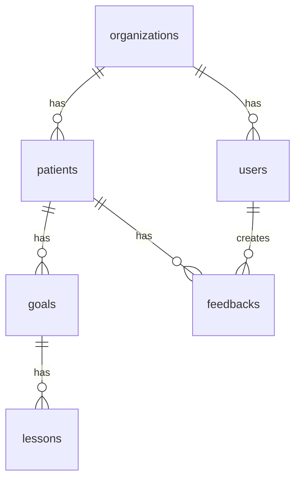
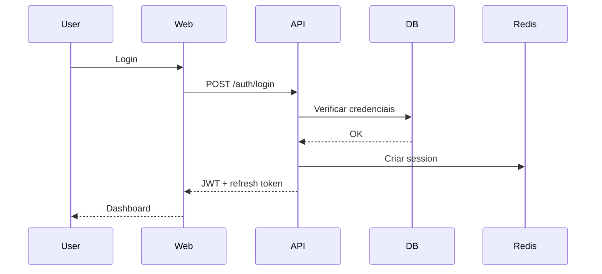

# Template de Especificação Técnica (SPEC)

> **Versão:** {X.Y} | **Data:** {Mês/Ano} | **Status:** {Rascunho/Alinhado/Aprovado}
> **Projeto:** {Nome do Projeto} | **Codename:** {Opcional}
> **Referências:** `{lista de documentos de referência}`

---

## 📋 Checklist Pré-Preenchimento

Antes de começar, certifique-se de que existem:
- [ ] Product Requirements Document (PRD) aprovado
- [ ] Design System / UI Kit definido
- [ ] Arquitetura base validada com o time técnico
- [ ] Modelo de dados conceitual (ER Diagram)
- [ ] Definição de ambientes (dev/staging/prod)

---

## 1. Visão Geral

### 1.1 Propósito
Descreva em 2-3 parágrafos:
- **O que** é o sistema/produto
- **Para quem** (personas principais)
- **Qual problema** resolve
- **Diferencial** em relação a soluções existentes

> **Exemplo (NeuroHub):** *"Plataforma SaaS para acompanhamento multidisciplinar de crianças e adolescentes com TEA. Conecta pais, terapeutas, coordenadores e instituições num ecossistema colaborativo com coleta offline-first, dashboards analíticos e relatórios automatizados."*

### 1.2 Escopo
- **Incluído:** Funcionalidades cobertas por esta versão
- **Excluído:** Funcionalidades explicitamente fora do escopo (evita creep)
- **Futuro:** Funcionalidades planejadas para versões posteriores

### 1.3 Princípios Técnicos
Liste 3-5 princípios não-negociáveis que guiam todas as decisões técnicas:

| Princípio | Descrição | Impacto |
|-----------|-----------|---------|
| Multi-tenancy | Isolamento de dados por organização | `organization_id` em todas as queries |
| Offline-first | Funcionamento 100% sem rede | WatermelonDB + sync FIFO |
| TDD | Test-driven development | Cobertura > 80% |
| LGPD por padrão | Privacidade by design | RBAC granular + audit trail |
| Audit trail imutável | Toda ação logada | Tabela `audit_logs` append-only |

### 1.4 Glossário e Definições

| Termo | Definição | Contexto |
|-------|-----------|----------|
| {Sigla/Termo} | {Significado claro e objetivo} | {Onde é usado} |
| PEI | Plano Educacional Individualizado | Módulo de metas e lições |
| TEA | Transtorno do Espectro Autista | Domínio do negócio |
| LP/MP/CP | Longo Prazo / Médio Prazo / Curto Prazo | Hierarquia de metas |

> **💡 Melhoria:** Adicione uma coluna "Sinônimos" para evitar ambiguidade entre times (ex: "Cliente" vs "Paciente" vs "Usuário").

---

## 2. Requisitos Funcionais (RF)

### Estrutura por Módulo

Para cada módulo, crie uma subseção seguindo exatamente este padrão:

```markdown
### 2.X Módulo {N}: {Nome do Módulo} {Status}

**Objetivo:** Uma frase descrevendo o propósito deste módulo.
**Stakeholder principal:** {Quem usa esta funcionalidade}
**Dependências:** {Módulos que precisam estar prontos antes}

| ID | Requisito | Critérios de Aceitação | Prioridade | Status |
|----|-----------|------------------------|------------|--------|
| RF-2.X.1 | {Descrição clara, usando linguagem do usuário} | Dado {contexto}, Quando {ação}, Então {resultado} | Must/Should/Could | ✅/⚠️/🔄/⏳ |
```

#### Legenda de Status (obrigatória)

| Símbolo | Status | Definição | Quem pode alterar |
|---------|--------|-----------|-------------------|
| ✅ | Implementado | Código mergeado, testado e disponível em staging | Tech Lead |
| ⚠️ | Parcial | Funcionalidade entregue mas com gaps conhecidos | Tech Lead |
| 🔄 | Em andamento | Desenvolvimento iniciado, PR aberto | Dev Team |
| ⏳ | Planejado | Especificado, priorizado, mas não iniciado | Product Manager |
| ❌ | Cancelado | Removido do escopo, documentar razão | Product Manager |
| 🐛 | Bloqueado | Impedimento técnico ou de negócio identificado | Tech Lead |

#### Legenda de Prioridade (obrigatória)

| Prioridade | Definição | Impacto no release |
|------------|-----------|-------------------|
| **Must** | Sem isso, o release não sai | Bloqueante |
| **Should** | Importante, mas release pode sair sem | Pode ser patch posterior |
| **Could** | Desejável, se houver tempo | Backlog próximo |
| **Won't** | Reconhecidamente fora do escopo desta versão | Documentar para vNext |

> **💡 Melhoria:** Inclua uma coluna "Estimativa (dias)" e "Complexidade técnica (Baixa/Média/Alta)" para facilitar planning.

### 2.1 Módulo 1: {Exemplo — Autenticação e RBAC}

| ID | Requisito | Critérios de Aceitação | Prioridade | Status |
|----|-----------|------------------------|------------|--------|
| RF-1.1.1 | Login com email/senha | 1. bcrypt + JWT; 2. Token expira em 24h; 3. Refresh token em cookie httpOnly | Must | ✅ |
| RF-1.1.4 | Recuperação de senha via email | 1. Token temporário 15min; 2. Link único; 3. Invalidação após uso | Should | 🔄 |
| RF-1.1.8 | Bloqueio após 5 tentativas | 1. Contador por IP+email; 2. Bloqueio 30min; 3. Email de alerta | Should | ⏳ |
| RF-1.2.1 | Isolamento multi-tenant | 1. `organization_id` em 100% das queries; 2. Teste de cross-tenant leak | Must | ✅ |
| RF-1.2.2 | RBAC granular | 1. Roles: ADMIN, THERAPIST, PARENT...; 2. Decorator `@Roles()`; 3. Guards | Must | ✅ |
| RF-1.2.3 | Logs de auditoria imutáveis | 1. Tabela append-only; 2. Campos: who, what, when, old_val, new_val; 3. Não deletável | Must | ✅ |

**Tecnologia:** {Stack específico do módulo}
**Arquivos:** `{caminhos no monorepo}`
**Testes:** {Onde estão os testes E2E/unitários deste módulo}

---

## 3. Requisitos Não-Funcionais (RNF)

### 3.1 Performance e Escalabilidade

| ID | Requisito | Métrica | Como medir | Status |
|----|-----------|---------|------------|--------|
| RNF-01 | Latência de UI | < 50ms (interação) | Lighthouse / Web Vitals | ⚠️ |
| RNF-02 | Carregamento inicial | < 2s (3G lento) | Lighthouse TTI | ⚠️ |
| RNF-03 | API P95 | < 500ms | Datadog / New Relic | ⚠️ |
| RNF-04 | Throughput | 1000 req/s | k6 / Artillery | ⏳ |
| RNF-05 | Banco de dados | Queries < 100ms | PostgreSQL slow query log | ✅ |

> **💡 Melhoria:** Adicione "Baseline atual" vs "Target" vs "Deadline para atingir". Muitos RNFs são definidos mas nunca monitorados.

### 3.2 Segurança e Compliance

| ID | Requisito | Implementação | Evidência de conformidade |
|----|-----------|---------------|---------------------------|
| RNF-10 | AES-256 em repouso | PostgreSQL TDE / S3 SSE | Configuração de infra |
| RNF-11 | TLS 1.3 em trânsito | Nginx / ALB | SSL Labs report |
| RNF-12 | bcrypt para senhas | AuthService | Código + teste de hash |
| RNF-13 | LGPD — direito ao esquecimento | Endpoint `DELETE /me` + anonymization | Teste E2E |
| RNF-14 | LGPD — portabilidade | Exportação JSON/CSV | Teste de exportação |

### 3.3 Disponibilidade e Confiabilidade

| ID | Requisito | SLA | Plano de contingência |
|----|-----------|-----|----------------------|
| RNF-20 | Uptime API | 99.9% | Health checks + rollback automático |
| RNF-21 | Backup banco | Ponto de recuperação 24h | Snapshots automáticos + teste de restore |
| RNF-22 | Degradação graceful | Modo read-only se DB down | Circuit breaker |

### 3.4 Acessibilidade

| ID | Requisito | Padrão | Como testar |
|----|-----------|--------|-------------|
| RNF-30 | WCAG 2.1 AA | W3C | axe-core + Lighthouse |
| RNF-31 | Alto contraste | Taxa ≥ 4.5:1 | Ferramenta de contraste |
| RNF-32 | Touch targets | ≥ 72dp mobile | Inspeção de layout |
| RNF-33 | Screen reader | Labels ARIA | NVDA/VoiceOver manual |

> **💡 Melhoria:** Inclua uma seção "Testes de acessibilidade" no CI, não apenas manual.

---

## 4. Arquitetura e Tecnologia

### 4.1 Stack Completo

| Camada | Tecnologia | Versão | Pasta | Justificativa |
|--------|-----------|--------|-------|---------------|
| Backend | NestJS | ^10.x | `apps/api/` | Framework opinativo, DI nativo |
| ORM | Prisma | ^5.x | `apps/api/prisma/` | Type-safe, migrations automáticas |
| Banco | PostgreSQL | 15+ | Docker | JSONB para flexibilidade, JSON schemas |
| Cache | Redis | 7+ | Docker | Sessions, rate limiting |
| Frontend Web | Next.js | ^14.x | `apps/web/` | SSR, App Router, SEO |
| UI Kit | Shadcn/UI + Tailwind | latest | `packages/ui/` | Consistência, acessibilidade built-in |
| Mobile | Expo + React Native | ^50.x | `apps/mobile/` | Offline-first, OTA updates |
| Local DB | WatermelonDB | latest | `apps/mobile/src/database/` | Sync SQLite ↔ PostgreSQL |
| Monorepo | Turborepo | latest | Root | Cache de builds, pipelines |
| Testes | Jest + Playwright | latest | `packages/test-config/` | Unit + E2E |

> **💡 Melhoria:** Adicione uma coluna "Alternativas consideradas" e "Por que descartamos". Isso evita debates cíclicos no futuro.

### 4.2 Diagrama de Arquitetura

```
[Inserir diagrama C4 ou arquitetura de alto nível]
- Contexto (C1): Sistema em relação a usuários e sistemas externos
- Container (C2): Apps, bancos, filas
- Componente (C3): Módulos principais do backend
```

> **💡 Melhoria:** O SPEC original não inclui diagramas. Use Mermaid ou PlantUML para manter versionado junto ao código.

### 4.3 Estrutura de Pastas (Monorepo)

```
├── apps/
│   ├── api/              # NestJS backend
│   │   ├── src/
│   │   │   ├── auth/     # Módulo de autenticação
│   │   │   ├── {domínio}/ # Um diretório por módulo do RF
│   │   │   ├── prisma/   # Schema, migrations, seed
│   │   │   └── test-helpers/ # Factories, mocks
│   │   └── test/         # E2E tests
│   ├── web/              # Next.js frontend
│   │   ├── src/
│   │   │   ├── app/      # App Router (Next.js 13+)
│   │   │   ├── components/
│   │   │   │   ├── {Domínio}/ # Um diretório por módulo
│   │   │   │   └── ui/   # Design system (Button, Card, Input)
│   │   │   ├── context/  # Providers (Auth, Theme)
│   │   │   └── hooks/    # use{Domain} por entidade
│   │   └── e2e/          # Playwright tests
│   └── mobile/           # Expo + React Native
│       ├── src/
│       │   ├── screens/  # Uma screen por fluxo principal
│       │   ├── database/ # WatermelonDB models
│       │   └── context/  # AuthContext, SyncContext
│       └── e2e/          # Detox tests
├── packages/
│   ├── shared-types/     # TypeScript types compartilhados
│   ├── eslint-config/    # Configuração unificada
│   └── test-helpers/     # Factories e mocks compartilhados
├── docker-compose.yml    # PostgreSQL, Redis, MinIO
└── turbo.json            # Pipelines de build/test/lint
```

**Regras de organização:**
1. Um diretório de módulo backend = uma tabela Prisma principal + seus DTOs + service + controller + testes
2. Um diretório de componente web = uma entidade do domínio + seus forms, lists, modals
3. Uma screen mobile = um fluxo de usuário completo (ex: Login → Home → Session)

---

## 5. Modelo de Dados

### 5.1 Entidades Principais

Para cada entidade, preencha:

```markdown
#### {Nome da Entidade} ({nome_tabela})

**Propósito:** {Para que serve}
**Volume estimado:** {Linhas/mês ou total}
**Retenção:** {Quanto tempo os dados são mantidos}

| Campo | Tipo | Obrigatório | Índice | Descrição |
|-------|------|-------------|--------|-----------|
| id | UUID | Sim | PK | Identificador único |
| created_at | Timestamp | Sim | B-Tree | Criação |
| updated_at | Timestamp | Sim | B-Tree | Última modificação |
| {campo_custom} | {Tipo} | {Sim/Não} | {Tipo índice} | {Descrição} |
```

### 5.2 Relacionamentos

```markdown
| Entidade A | Relação | Entidade B | Cardinalidade | Cascade |
|------------|---------|------------|---------------|---------|
| users | pertence a | organizations | N:1 | RESTRICT |
| patients | tem | goals | 1:N | CASCADE |
| goals | tem | lessons | 1:N | CASCADE |
```

### 5.3 Índices e Otimização

```markdown
| Índice | Tipo | Campos | Justificativa |
|--------|------|--------|---------------|
| idx_patients_org | B-Tree | organization_id | Isolamento multi-tenant |
| idx_feedbacks_patient_dim | Composite | patient_id, dimension, created_at | Queries de analytics |
```

> **💡 Melhoria:** Inclua uma seção "Estratégia de Particionamento" para tabelas que crescerão rapidamente (ex: `audit_logs`, `daily_logs`).

### 5.4 Schema Prisma (Resumo)

```prisma
// Exemplo de como documentar o schema no SPEC
model organizations {
  id        String   @id @default(uuid())
  name      String
  createdAt DateTime @default(now()) @map("created_at")
  users     users[]
  patients  patients[]

  @@map("organizations")
}
```

---

## 6. APIs e Contratos

### 6.1 Endpoints Principais

| Método | Rota | Módulo | Auth | Rate Limit | Status |
|--------|------|--------|------|------------|--------|
| POST | `/api/auth/login` | Auth | Público | 5 req/min | ✅ |
| GET | `/api/users` | Users | JWT + ADMIN | 100 req/min | ✅ |
| POST | `/api/{recurso}` | {Módulo} | JWT + {Role} | {Limite} | {Status} |

### 6.2 Contrato de Request/Response (Exemplo)

```markdown
#### POST /api/feedbacks

**Descrição:** Cria um feedback estruturado em 8 dimensões
**Autenticação:** Bearer {JWT}
**Roles:** THERAPIST, SCHOOL

**Request Body:**
```json
{
  "patient_id": "uuid",
  "dimension": "COMUNICACAO",
  "score": 4,
  "notes": "string (opcional, max 2000)",
  "session_id": "uuid (opcional)"
}
```

**Response 201:**
```json
{
  "id": "uuid",
  "patient_id": "uuid",
  "dimension": "COMUNICACAO",
  "score": 4,
  "notes": "...",
  "created_by": "uuid",
  "created_at": "2026-06-03T13:51:00Z"
}
```

**Response 403:**
```json
{
  "error": "FORBIDDEN",
  "message": "User does not have access to this patient",
  "code": "PATIENT_ACCESS_DENIED"
}
```

**Response 429:**
```json
{
  "error": "RATE_LIMITED",
  "retry_after": 60
}
```
```

> **💡 Melhoria:** O SPEC original lista apenas rotas. Adicione exemplos de request/response, códigos de erro e rate limits. Use OpenAPI/Swagger como fonte da verdade.

### 6.3 Versionamento da API

| Versão | Base Path | Status | Sunset Date |
|--------|-----------|--------|-------------|
| v1 | `/api/v1/` | Ativa | — |
| v2 | `/api/v2/` | Beta | — |

> **💡 Melhoria:** Defina uma política de depreciação (ex: 6 meses de aviso antes de sunset).

---

## 7. Fluxos de Dados e Integrações

### 7.1 Sync Offline-First (se aplicável)

```markdown
| Direção | Endpoint | Estratégia | Conflict Resolution |
|---------|----------|------------|---------------------|
| Mobile → Server | POST /api/sync/batch | FIFO queue | Last-write-wins + manual merge flag |
| Server → Mobile | GET /api/sync/changes | Delta sync (since timestamp) | N/A |
```

### 7.2 Integrações Externas

| Sistema | Tipo | Dados | Frequência | Status |
|---------|------|-------|------------|--------|
| Stripe | Pagamento | Subscriptions, invoices | Webhook | ⏳ |
| SendGrid | Email | Transacionais | API | ✅ |
| MinIO/S3 | Storage | Fotos, vídeos | API | ⏳ |
| FHIR R4 | Health | Patient records, billing | API | ⏳ |

> **💡 Melhoria:** Inclua diagramas de sequência para integrações críticas (ex: webhook de pagamento).

---

## 8. Roadmap e Releases

### 8.1 Versões Planejadas

| Versão | Codename | Data Alvo | Features Principais | Status |
|--------|----------|-----------|---------------------|--------|
| v1.0 | MVP | {Data} | Auth, Pacientes, PEI básico | ✅ |
| v1.1 | Sync | {Data} | Offline-first, mobile app | ✅ |
| v1.2 | Analytics | {Data} | Dashboards, relatórios | ✅ |
| v2.0 | Scale | {Data} | Notificações, documentos, billing | ⏳ |

### 8.2 Ondas de Desenvolvimento (PRPs)

| Onda | PRPs | Features | Dependências |
|------|------|----------|--------------|
| Onda 7 | PRP-030, PRP-031 | Notificações, Upload de Mídia | WebSocket gateway |
| Onda 8 | PRP-032, PRP-033, PRP-034 | Billing, FHIR/ANS, Marketplace | Stripe account, ANS certificação |

> **💡 Melhoria:** Adicione uma coluna "Riscos" e "Mitigação" por onda.

---

## 9. Testes e Qualidade

### 9.1 Estratégia de Testes

| Tipo | Ferramenta | Cobertura | Onde roda |
|------|-----------|-----------|-----------|
| Unitário | Jest | > 80% | CI (GitHub Actions) |
| Integração | Jest + TestContainers | APIs principais | CI |
| E2E Web | Playwright | Fluxos críticos | CI (staging) |
| E2E Mobile | Detox | Login, Sync, Session | CI (emulador) |
| Performance | k6 | APIs de leitura | Nightly |
| Acessibilidade | axe-core | Todas as páginas | CI |
| Segurança | OWASP ZAP | APIs expostas | Mensal |

### 9.2 Factories e Mocks

```markdown
Local: `apps/api/src/test-helpers/`
Shared: `packages/test-helpers/`

Padrão de factory:
- `createUser(overrides?: Partial<User>)` → usuário com dados válidos + overrides
- `createPatient(organizationId: string)` → sempre vinculado a uma org
- `mockAuthContext(role: Role)` → para testes de autorização
```

> **💡 Melhoria:** O SPEC original menciona TDD mas não detalha. Defina padrões de nomeação de testes e estrutura de diretórios.

---

## 10. Infraestrutura e Deploy

### 10.1 Ambientes

| Ambiente | URL | Banco | Dados | Deploy |
|----------|-----|-------|-------|--------|
| Local | `http://localhost:3000` | Docker PostgreSQL | Seed | Manual |
| Staging | `https://staging.{domínio}` | RDS staging | Anonimizados | Auto (merge main) |
| Produção | `https://{domínio}` | RDS prod | Reais | Auto (tag release) |

### 10.2 CI/CD Pipeline

```yaml
# Resumo do pipeline (detalhar em .github/workflows/)
1. Lint (ESLint, Prettier)
2. Type Check (TypeScript strict)
3. Test (Unit + Integration)
4. Build (Turborepo cache)
5. Coverage (threshold 80%)
6. Deploy Staging (merge main)
7. Deploy Prod (tag v*.*.*)
```

### 10.3 Monitoramento e Observabilidade

| Camada | Ferramenta | Métricas | Alertas |
|--------|-----------|----------|---------|
| Aplicação | Datadog / Sentry | Error rate, latency, throughput | PagerDuty |
| Infra | AWS CloudWatch | CPU, memória, disco | Email + Slack |
| Banco | PostgreSQL logs | Slow queries, locks | Slack |
| Negócio | Metabase / Amplitude | MAU, sessões, conversão | Dashboard |

> **💡 Melhoria:** O SPEC original não cobre infra. Adicione runbooks para incidentes comuns (ex: "Sync queue backlog > 1000").

---

## 11. Riscos e Dependências

| ID | Risco | Probabilidade | Impacto | Mitigação | Owner |
|----|-------|---------------|---------|-----------|-------|
| RSK-01 | WatermelonDB não escala para > 10k registros | Média | Alto | Spike de performance + fallback para paginação | Tech Lead |
| RSK-02 | Certificação ANS leva > 6 meses | Alta | Médio | Iniciar processo paralelo, MVP sem TISS | Product |
| RSK-03 | Key developer churn | Baixa | Alto | Documentação + pair programming + bus factor | EM |
| RSK-04 | LGPD — multa por vazamento | Baixa | Crítico | Pentest trimestral, DPO designado | Security |

> **💡 Melhoria:** Esta seção é essencial e ausente no SPEC original. Reveja mensalmente.

---

## 12. Anexos

### Anexo A: Diagrama ER (Mermaid)


### Anexo B: Fluxo de Autenticação


### Anexo C: Matriz de Permissões (RBAC)

| Recurso | ADMIN | THERAPIST | PARENT | SCHOOL | ORG_ADMIN |
|---------|-------|-----------|--------|--------|-----------|
| `/patients` | CRUD | CRUD (own) | R (own) | RU | CRUD |
| `/goals` | CRUD | CRUD | R | R | CRUD |
| `/analytics` | R | R (own) | — | — | R (all) |
| `/users` | RU | — | — | — | CRUD |
| `/reports` | R | R (own) | R (own) | — | R (all) |

> **💡 Melhoria:** A matriz de permissões evita ambiguidade. Atualize sempre que novos endpoints forem criados.

---

## 📌 Revisões

| Versão | Data | Autor | Mudanças |
|--------|------|-------|----------|
| 0.1 | {Data} | {Autor} | Rascunho inicial |
| 0.2 | {Data} | {Autor} | Adicionado módulo de Analytics |
| 1.0 | {Data} | {Autor} | Aprovado para implementação |

---

## ✅ Checklist de Aprovação

- [ ] Product Manager revisou e aprovou escopo
- [ ] Tech Lead validou arquitetura e estimativas
- [ ] Security revisou requisitos de compliance
- [ ] Design System está alinhado com RF de UI
- [ ] QA validou plano de testes e critérios de aceitação
- [ ] Infra validou requisitos de performance e disponibilidade

---

> **Nota:** Este template é um documento vivo. Atualize sempre que houver mudança de escopo, arquitetura ou dependências. A versão no repositório é a fonte da verdade.
