# Coverage Progress — Acompanhamento de Cobertura de Testes

> **Versão:** {X.Y} | **Última atualização:** {YYYY-MM-DD} | **Status:** {Em execução / Concluído}
> **Projeto:** {Nome do Projeto} | **Autor:** {QA Lead / Tech Lead}
> **Referências:** `{Comprehensive Testing Guide}`, `{Development Plan}`, `{CI/CD Pipeline}`

---

## 📋 Checklist Pré-Preenchimento

Antes de iniciar o acompanhamento de cobertura:
- [ ] Comprehensive Testing Guide aprovado e seguido pelo time
- [ ] CI/CD configurado para gerar relatórios de cobertura automaticamente
- [ ] Baseline de cobertura estabelecida (primeira medição)
- [ ] Thresholds de cobertura definidos por fase (MVP vs. pós-MVP)
- [ ] Comando de cobertura testado e funcionando localmente
- [ ] Time alinhado sobre importância de cobertura (não apenas métrica, mas qualidade)

---

## 1. Visão Geral

### 1.1 Propósito
Este documento é o **painel de acompanhamento** da cobertura de testes do projeto. Ele serve para:
- **Rastrear** evolução semanal de cobertura por aplicação (API, Web, Mobile)
- **Identificar** gargalos e impedimentos (ex: Vitest timeout, Prisma 7 setup)
- **Comunicar** progresso a stakeholders de forma transparente
- **Definir metas** realistas baseadas em dados históricos
- **Garantir** que quality gates de cobertura sejam atingidos antes de releases

> **Exemplo (NeuroHub):** *"Acompanhamento semanal de cobertura de testes. API atingiu 83.15%, Web 81.52%, Mobile 0% (infraestrutura pronta, aguardando implementação de testes). Meta de 80% alcançada para API e Web."*

### 1.2 Metas por Fase

| Fase | Período | Meta API | Meta Web | Meta Mobile | Estratégia |
|------|---------|----------|----------|-------------|------------|
| **Phase 1** | Semanas 1-4 | Estabelecer baseline | Estabelecer baseline | Estabelecer baseline | Sem pressão, apenas medir |
| **Phase 2** | Semanas 5-8 | 70% | 60% | 40% | Monitorar progresso, ajustar targets |
| **Phase 3** | Semana 9+ | 80% | 80% | 60% | Enforce thresholds, bloquear PR se abaixo |
| **Phase 4** | Pós-MVP | 85% | 85% | 80% | Manter e melhorar qualidade dos testes |

> **💡 Nota:** Metas são **mínimos**, não máximos. Cobertura 100% não garante qualidade — testes devem ser significativos, não apenas executar linhas.

---

## 2. Como Atualizar

### 2.1 Passos Semanais (Obrigatórios)

```bash
# 1. Gere relatório de cobertura para TODAS as apps
npm run test:cov

# 2. Se alguma app falhar, rode individualmente para diagnosticar
cd apps/api && npm run test:cov
cd apps/web && npm run test:cov
cd apps/mobile && npm run test:cov

# 3. Extraia os valores de: statements, branches, functions, lines
# 4. Preencha a tabela da seção 3 com os novos valores
# 5. Documente impedimentos na coluna "Notes"
# 6. Atualize a data deste documento
```

### 2.2 Comando de Cobertura por App

```bash
# Todas as apps (unificado)
npm run test:cov

# API apenas
npm run test:cov --workspace=api
# ou
cd apps/api && npm run test:cov

# Web apenas
npm run test:cov --workspace=web
# ou
cd apps/web && npm run test:cov

# Mobile apenas
npm run test:cov --workspace=mobile
# ou
cd apps/mobile && npm run test:cov
```

### 2.3 O que Medir

| Métrica | Definição | Importância | Alvo |
|---------|-----------|-------------|------|
| **Statements** | Linhas de código executadas | Alta — cobertura geral | ≥ 80% |
| **Branches** | Ramificações if/else/switch cobertas | Alta — lógica de negócio | ≥ 70% |
| **Functions** | Funções/métodos chamados | Média — API pública | ≥ 80% |
| **Lines** | Linhas físicas executadas | Alta — mais intuitiva | ≥ 80% |

> **💡 Regra:** Use **Lines** como métrica principal para comunicação (mais intuitiva). Use **Branches** para identificar gaps de lógica de negócio.

---

## 3. Progresso Semanal

> **⚠️ ATENÇÃO: Esta tabela deve ser atualizada SEMANALMENTE, sempre na sexta-feira ou após sprint review.**
> **Nunca apague linhas antigas — append only para histórico.**

### 3.1 Tabela de Progresso

| Semana | Data | API (Lines) | Web (Lines) | Mobile (Lines) | API (Branches) | Web (Branches) | Mobile (Branches) | Status Geral | Notes |
|--------|------|-------------|-------------|----------------|----------------|----------------|-------------------|--------------|-------|
| Baseline | {YYYY-MM-DD} | {X%} | {Y%} | {Z%} | {X%} | {Y%} | {Z%} | {🟡/🔴/🟢} | {Setup inicial, infra pronta} |
| 1 | {YYYY-MM-DD} | {X%} | {Y%} | {Z%} | {X%} | {Y%} | {Z%} | {🟡/🔴/🟢} | {Adicionados testes de service/controller} |
| 2 | {YYYY-MM-DD} | {X%} | {Y%} | {Z%} | {X%} | {Y%} | {Z%} | {🟡/🔴/🟢} | {Vitest timeout no web — investigando} |
| 3 | {YYYY-MM-DD} | {X%} | {Y%} | {Z%} | {X%} | {Y%} | {Z%} | {🟡/🔴/🟢} | {Prisma 7 setup bloqueando testes de API} |
| 4 | {YYYY-MM-DD} | {X%} | {Y%} | {Z%} | {X%} | {Y%} | {Z%} | {🟡/🔴/🟢} | {Meta de 80% atingida para API} |
| 5 | {YYYY-MM-DD} | {X%} | {Y%} | {Z%} | {X%} | {Y%} | {Z%} | {🟡/🔴/🟢} | {Web estabilizado, hook suites adicionados} |
| 6 | {YYYY-MM-DD} | {X%} | {Y%} | {Z%} | {X%} | {Y%} | {Z%} | {🟡/🔴/🟢} | {Páginas de dashboard testadas} |
| 7 | {YYYY-MM-DD} | {X%} | {Y%} | {Z%} | {X%} | {Y%} | {Z%} | {🟡/🔴/🟢} | {Merge conflicts resolvidos, componentes adicionados} |

### 3.2 Legenda de Status

| Emoji | Status | Definição | Ação necessária |
|-------|--------|-----------|----------------|
| 🟢 | On Track | Meta atingida ou próxima | Manter ritmo |
| 🟡 | Atenção | Abaixo da meta, mas progressando | Acelerar testes, remover impedimentos |
| 🔴 | Crítico | Estagnado ou regressão | Parar features, focar em testes |
| ⚪ | N/A | App não tem testes ainda | Priorizar infra de testes |

### 3.3 Exemplo Preenchido (NeuroHub)

| Semana | Data | API | Web | Mobile | Status | Notes |
|--------|------|-----|-----|--------|--------|-------|
| Baseline | 2026-03-18 | 10% | 0% | 0% | ⚪ | Infra TDD setup, primeira medição |
| 1 | 2026-03-25 | 50.52% | 0%* | 0% | 🟡 | Testes TDD para goals, daily-logs, audit. *Web: Vitest workers timeout |
| 2 | 2026-04-01 | 67.27% | 0%* | 0% | 🟡 | patients/reports/sync + auth strategies. *Web: timeout persistindo |
| 3 | 2026-04-08 | 71.60% | 0%* | 0% | 🟡 | users controller/service (authorization). *Web: timeout |
| 4 | 2026-04-15 | 83.15% | 0%* | 0% | 🟢 | auth service/controller, analytics, modules smoke. *Web: timeout |
| 5 | 2026-04-22 | 83.15% | 41.80% | 0% | 🟡 | Web estabilizado (Option A), hooks useUsers/usePatients/useGoals |
| 6 | 2026-04-29 | 83.15% | 60.15% | 0% | 🟡 | Páginas dashboard/* testadas com mocked children. Meta >60% web |
| 7 | 2026-05-06 | 83.15% | 81.52% | 0% | 🟢 | Merge conflicts resolvidos, DashboardLayout/Header/Sidebar/UserModal/PatientModal/Button. Meta 80% atingida |

---

## 4. Análise de Progresso

### 4.1 Velocity de Cobertura

| App | Semana Inicial | Semana Final | Delta | Semanas | Velocity (%/semana) | Tendência |
|-----|----------------|--------------|-------|---------|---------------------|-----------|
| API | 10% (Baseline) | 83.15% (Semana 7) | +73.15% | 7 | +10.45% | 📈 Estável |
| Web | 0% (Baseline) | 81.52% (Semana 7) | +81.52% | 7* | +13.59%* | 📈 Acelerando |
| Mobile | 0% (Baseline) | 0% (Semana 7) | 0% | 7 | 0% | ➡️ Pendente |

> *Web começou a subir apenas na Semana 5 devido a impedimento técnico (Vitest timeout)

### 4.2 Impedimentos Históricos

| Semana | App | Impedimento | Causa Raiz | Solução Aplicada | Tempo para Resolver | Lição |
|--------|-----|-------------|------------|------------------|---------------------|-------|
| 1-4 | Web | Vitest workers timeout | Configuração de workers padrão | Option A: Reduzir workers + aumentar timeout | 4 semanas | Testar comando de coverage no CI desde o início |
| 3-4 | API | Prisma 7 test setup | Adapter novo, documentação escassa | Configurar `PrismaPg` adapter + env vars | 2 semanas | Spike técnico antes de adotar nova versão |
| 5 | Web | Merge conflict markers | Conflitos de merge não resolvidos | Limpar markers (`<<<<<<< HEAD`) + adicionar testes | 1 semana | Pre-commit hook para detectar markers |
| 6 | API | — | — | — | — | — |
| 7 | Mobile | Sem testes implementados | Prioridade em API/Web | — | — | Priorizar mobile na próxima fase |

### 4.3 Projeção para Próximas Semanas

| Semana | Projeção API | Projeção Web | Projeção Mobile | Baseado em |
|--------|--------------|--------------|-----------------|------------|
| 8 | 83-85% | 82-85% | 10-20% | Velocity histórica + capacidade do time |
| 9 | 85-87% | 85-88% | 30-40% | Mobile como foco principal |
| 10 | 87-90% | 88-90% | 50-60% | Meta Phase 3 |
| 11 | 90%+ | 90%+ | 60-70% | Polish e edge cases |

---

## 5. Infraestrutura de Testes

### 5.1 Status da Infra

| Componente | App | Status | Configuração | Última Verificação |
|------------|-----|--------|--------------|-------------------|
| Jest | API | ✅ | `jest.config.ts` + `jest.setup.ts` | Semana 7 |
| Factories | API | ✅ | `test-helpers/factories/` | Semana 7 |
| Mocks (Auth/Prisma) | API | ✅ | `test-helpers/mocks/` | Semana 7 |
| Templates | API | ✅ | `docs/testing/templates/api-*.spec.ts` | Semana 7 |
| Vitest | Web | ✅ | `vitest.config.ts` + `vitest-setup.ts` | Semana 7 |
| MSW | Web | ✅ | `src/mocks/server.ts` + `handlers.ts` | Semana 7 |
| jest-axe | Web | ✅ | `vitest-setup.ts` | Semana 7 |
| RTL | Web | ✅ | `@testing-library/react` | Semana 7 |
| Templates | Web | ✅ | `docs/testing/templates/react-*.test.tsx` | Semana 7 |
| Jest | Mobile | ✅ | `jest.config.js` | Baseline |
| RTL Native | Mobile | ✅ | `@testing-library/react-native` | Baseline |
| Templates | Mobile | ✅ | `docs/testing/templates/rn-*.test.tsx` | Baseline |
| Root Scripts | Root | ✅ | `package.json` scripts unificados | Semana 7 |
| CI/CD | Root | ✅ | `.github/workflows/ci.yml` | Semana 7 |

### 5.2 Comandos de Teste

```bash
# === API ===
cd apps/api
npm run test              # Unit tests
npm run test:cov          # Unit + coverage
npm run test:e2e          # E2E (Supertest)

# === Web ===
cd apps/web
npm run test              # Unit + integration (Vitest + MSW)
npm run test:cov          # + coverage
npm run test:e2e          # E2E (Playwright)

# === Mobile ===
cd apps/mobile
npm run test              # Unit tests (Jest + RTL Native)
npm run test:cov          # + coverage

# === Root (Todas) ===
npm run test              # Todas as apps
npm run test:cov          # Todas + coverage
```

---

## 6. Issues Conhecidos e Débito Técnico

### 6.1 Issues Ativos

| ID | Issue | App | Severidade | Status | Owner | Ação | Prazo |
|----|-------|-----|------------|--------|-------|------|-------|
| ISS-001 | Prisma 7 test setup incompleto | API | Média | 🔄 Em andamento | {Backend Dev} | Configurar adapter em testes pendentes | Semana 8 |
| ISS-002 | Mobile sem testes implementados | Mobile | Alta | ⏳ Pendente | {Mobile Dev} | Implementar suites para screens principais | Semana 9 |
| ISS-003 | Web coverage instável em CI | Web | Média | ✅ Resolvido | {DevOps} | Workers reduzidos, timeout aumentado | — |
| ISS-004 | Merge conflict markers em testes | Web | Baixa | ✅ Resolvido | {Tech Lead} | Pre-commit hook adicionado | — |

### 6.2 Débito Técnico de Testes

| ID | Débito | Origem | Impacto | Onda de Pagamento | Status |
|----|--------|--------|---------|-------------------|--------|
| DT-TEST-001 | Prisma 7 service tests skipped | Prisma 7 migration | Médio — gaps de cobertura | Semana 8 | 🔄 |
| DT-TEST-002 | Mobile E2E (Detox) não configurado | Prioridade em unit | Médio — regressão mobile não testada | Onda 7 | ⏳ |
| DT-TEST-003 | Performance tests (k6) não implementados | Escopo futuro | Baixo — não bloqueia MVP | Onda 8 | ⏳ |
| DT-TEST-004 | Visual regression (snapshots) não padronizado | Escopo futuro | Baixo — UI quebras não detectadas | Onda 8 | ⏳ |

---

## 7. Quality Gates de Cobertura

### 7.1 Gates por Ambiente

| Ambiente | Gate | Threshold | Ação se Falhar |
|----------|------|-----------|----------------|
| **Dev Local** | Warning | < 70% | Warning no console, não bloqueia |
| **PR (CI)** | Block | < 60% (MVP) / < 80% (pós-MVP) | PR não pode ser mergeado |
| **Staging** | Block | < 70% (MVP) / < 80% (pós-MVP) | Deploy não procede |
| **Prod** | Block | < 80% | Release não sai |

### 7.2 Configuração no CI

```yaml
# .github/workflows/ci.yml (excerpt)
- name: Coverage Check
  run: |
    npm run test:cov

    # Extrair coverage de cada app
    API_COV=$(cat apps/api/coverage/coverage-summary.json | jq '.total.lines.pct')
    WEB_COV=$(cat apps/web/coverage/coverage-summary.json | jq '.total.lines.pct')
    MOBILE_COV=$(cat apps/mobile/coverage/coverage-summary.json | jq '.total.lines.pct')

    # Verificar thresholds
    if (( $(echo "$API_COV < 80" | bc -l) )); then
      echo "❌ API coverage below threshold: $API_COV%"
      exit 1
    fi

    if (( $(echo "$WEB_COV < 80" | bc -l) )); then
      echo "❌ Web coverage below threshold: $WEB_COV%"
      exit 1
    fi

    echo "✅ All coverage thresholds met"
```

---

## 8. Anexos

### Anexo A: Gráfico de Progresso

```mermaid
xychart-beta
    title "Coverage Progress by App"
    x-axis ["Baseline", "Week 1", "Week 2", "Week 3", "Week 4", "Week 5", "Week 6", "Week 7"]
    y-axis "Coverage %" 0 --> 100
    bar [10, 50, 67, 72, 83, 83, 83, 83]
    bar [0, 0, 0, 0, 0, 42, 60, 82]
    bar [0, 0, 0, 0, 0, 0, 0, 0]
    line [10, 50, 67, 72, 83, 83, 83, 83]
    line [0, 0, 0, 0, 0, 42, 60, 82]
    line [0, 0, 0, 0, 0, 0, 0, 0]
```



### Anexo B: Breakdown por Módulo (API — Semana 7)

| Módulo | Lines | Branches | Functions | Testes | Status |
|--------|-------|----------|-----------|--------|--------|
| auth | 95% | 85% | 100% | ✅ | 🟢 |
| users | 90% | 80% | 95% | ✅ | 🟢 |
| patients | 88% | 75% | 90% | ✅ | 🟢 |
| goals | 85% | 70% | 85% | ✅ | 🟢 |
| daily-logs | 82% | 65% | 80% | ✅ | 🟢 |
| sync | 80% | 60% | 75% | ✅ | 🟡 |
| analytics | 78% | 55% | 70% | ✅ | 🟡 |
| reports | 75% | 50% | 70% | ✅ | 🟡 |
| audit | 90% | 80% | 95% | ✅ | 🟢 |
| feedback-dimensions | 85% | 70% | 85% | ✅ | 🟢 |
| invites | 88% | 75% | 90% | ✅ | 🟢 |

### Anexo C: Breakdown por Componente (Web — Semana 7)

| Componente/Hook/Página | Lines | Testes | Status |
|------------------------|-------|--------|--------|
| DashboardLayout | 90% | ✅ | 🟢 |
| Header | 85% | ✅ | 🟢 |
| Sidebar | 88% | ✅ | 🟢 |
| UserModal | 82% | ✅ | 🟢 |
| PatientModal | 80% | ✅ | 🟢 |
| Button (ui) | 95% | ✅ | 🟢 |
| useUsers | 85% | ✅ | 🟢 |
| usePatients | 85% | ✅ | 🟢 |
| useGoals | 85% | ✅ | 🟢 |
| TaskAnalysisForm | 75% | ✅ | 🟡 |
| AnalyticsDashboard | 70% | ✅ | 🟡 |
| CoverageMatrix | 65% | ✅ | 🟡 |
| ParentProgress | 65% | ✅ | 🟡 |

---

## 📌 Revisões do Documento

| Versão | Data | Autor | Mudanças |
|--------|------|-------|----------|
| 0.1 | {YYYY-MM-DD} | {Autor} | Baseline estabelecido |
| 0.2 | {YYYY-MM-DD} | {Autor} | Adicionado histórico semanal + impedimentos |
| 0.3 | {YYYY-MM-DD} | {Autor} | Adicionado breakdown por módulo/componente |
| 1.0 | {YYYY-MM-DD} | {Autor} | Meta de 80% atingida, documento estabilizado |

---

## ✅ Checklist de Manutenção Semanal

- [ ] Rodar `npm run test:cov` e extrair métricas
- [ ] Atualizar tabela de progresso (seção 3) com novos valores
- [ ] Documentar impedimentos na coluna "Notes"
- [ ] Atualizar análise de velocity (seção 4.1)
- [ ] Revisar issues ativos (seção 6.1)
- [ ] Atualizar projeção para próximas semanas (seção 4.3)
- [ ] Comunicar status ao time na retrospectiva
- [ ] Ajustar metas se velocity mudar significativamente
- [ ] Verificar se quality gates estão sendo respeitados
- [ ] Atualizar data deste documento

---

> **Nota:** Este documento é atualizado SEMANALMENTE. A versão no repositório (`docs/testing/coverage-progress.md`) é a fonte da verdade. Para detalhes de como escrever testes, consulte o `Comprehensive Testing Guide`. Para impedimentos técnicos, consulte o `Execution Waves`.
